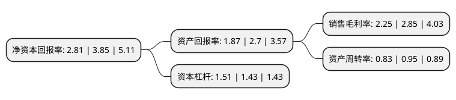

> 本页面由自动化程序生成于 2022年5月20日 01:30
> 内容可能存在错误，如有bug请提交issue至：https://github.com/Eroleice/doc-pi/issues
{.is-warning}

# 上市公司基本情况

## 基本资料

三江购物俱乐部股份有限公司（以下简称“三江购物”）成立于1995年09月22日，宁波市。于2011年03月02日在上交所主板上市。

三江购物注册资本54,767.84万元，主营业务是社区平价超市的连锁经营。以下是详细信息：

- 公司名称: 三江购物俱乐部股份有限公司
- 股票代码: 601116.SH
- 所在地: 浙江 - 宁波市
- 成立日期: 1995年09月22日
- 注册资本: 54,767.84万元
- 法定代表人: 陈念慈
- 主营业务: 主营业务是社区平价超市的连锁经营
- 公司官网: home.sanjiang.com
- 公司介绍: 公司是浙江省大型连锁超市之一，是浙江省政府重点扶持的大型连锁企业。公司始终把诚信经营作为企业的立身之本，把服务顾客作为企业发展的宗旨，立足老百姓日常生活所需，坚持“便宜、便利”的价值理念，为会员顾客带来“新鲜·实惠·每一天”的购物体验。始终如一的追求，使三江购物赢得了顾客的口碑、政府的肯定和市场的认可。公司和优秀O2O企业共同携手，进入电商O2O时代，将在电子商务、物流、零售实体店等领域，开拓全渠道销售路径，实现创新型发展。公司丰富的产品储备，再加上1小时内快速送达的优势，让用户足不出户就可以随时享受到快速、便捷的线上购物体验，向用户提供3公里范围内生鲜、超市产品等各类生活服务项目，打造生活服务一体化应用平台。

## 股东及高管情况

上市公司第一大股东为上海和安投资管理有限公司，持股194,012,012股，占比35.42%，为上市公司实际控制人。

截至2022年03月31日，上市公司的前十大股东中，共有5名自然人股东，3名机构股东，1个产品账户，1个海外主体，其中5%以上大股东共有2名。上市公司前十大股东明细如下：

> 截至2022年03月31日，上市公司前十大股东信息如下：

| 股东名称 | 持股数量（股） | 持股比例 |
| --- | --- | --- |
| 上海和安投资管理有限公司 | 194,012,012 | 35.42% |
| 杭州阿里巴巴泽泰信息技术有限公司 | 175,257,088 | 32% |
| 上海和安投资管理有限公司-2017年非公开发行可交换公司债券质押专户 | 16,433,600 | 3% |
| 田开吉 | 9,908,100 | 1.81% |
| 陈念慈 | 9,269,400 | 1.69% |
| 黄跃林 | 4,480,088 | 0.82% |
| MORGAN STANLEY & CO. INTERNATIONAL PLC. | 3,491,680 | 0.64% |
| 上海磐耀资产管理有限公司-磐耀智享定制私募证券投资基金 | 3,330,000 | 0.61% |
| 许焕平 | 1,986,059 | 0.36% |
| 田坤 | 1,700,000 | 0.31% |

## 利润表分析

上市公司2021年总收入为39.24亿元，净利润为0.88亿元，实现盈利。

## 杜邦分析

> 数据列示周期：2021年 | 2020年 | 2019年
{.is-info}

上市公司的净资产收益率在近一年有所下降，下降幅度为-27.01%，其变化情况分解如下：
- 上市公司的销售毛利率在近一年下降了-21.05%，可能是生产效率的下降、商品原材料价格上涨或商品价格的下跌所致。
- 上市公司的资产周转率在近一年下降了-12.63%，可能是源自于更慢的销售回款或库存管理效果下降。
- 上市公司的财务杠杆比率在近一年上升了5.59%，可能是增加负债扩大生产规模。

