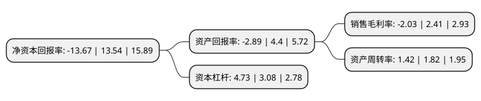

> 本页面由自动化程序生成于 2022年5月20日 01:35
> 内容可能存在错误，如有bug请提交issue至：https://github.com/Eroleice/doc-pi/issues
{.is-warning}

# 上市公司基本情况

## 基本资料

家家悦集团股份有限公司（以下简称“家家悦”）成立于1981年06月16日，威海市。于2016年12月13日在上交所主板上市。

家家悦注册资本60,840.153万元，主营业务为超市连锁经营。以下是详细信息：

- 公司名称: 家家悦集团股份有限公司
- 股票代码: 603708.SH
- 所在地: 山东 - 威海市
- 成立日期: 1981年06月16日
- 注册资本: 60,840.153万元
- 法定代表人: 王培桓
- 主营业务: 主营业务为超市连锁经营
- 公司官网: www.jiajiayue.com.cn
- 公司介绍: 公司主营业务为超市连锁经营，是一家立足于山东省内，以大卖场和综合超市为主体，以区域一体化物流为支撑，以发展现代农业生产基地和食品加工产业链为保障，以经营生鲜为特色的全供应链、多业态的综合性零售渠道商。随着公司规模的扩大带动了大批供应商的发展壮大，形成了一批稳定、持续的供应商群体。目前公司与多家厂商建立稳定的合作关系，其中与宝洁、娃哈哈、雀巢、玛氏等多家厂商保持了十年以上的良好的合作关系。公司先后获得“山东省省长质量奖”、“农业产业化国家重点龙头企业”、“改革开放三十年山东省优秀企业”、“全国农超对接工程首批试点企业”、“万村千乡工程优秀试点企业”、“中国零售业区域明星企业”、“中国零售业最佳雇主”等荣誉称号。公司坚持“顾客的需求就是我们追求的目标”的经营理念，积极采用现代营销方式，大力发展现代物流，整合利用优势资源，不断提升竞争能力，走集团化发展之路，取得了超常规、跳跃式发展。

## 股东及高管情况

上市公司第一大股东为家家悦控股集团股份有限公司，持股362,852,709股，占比59.64%，为上市公司实际控制人。

截至2022年03月31日，上市公司的前十大股东中，共有4名机构股东，5个产品账户，1个海外主体，其中5%以上大股东共有2名。上市公司前十大股东明细如下：

> 截至2022年03月31日，上市公司前十大股东信息如下：

| 股东名称 | 持股数量（股） | 持股比例 |
| --- | --- | --- |
| 家家悦控股集团股份有限公司 | 362,852,709 | 59.64% |
| 威海信悦投资管理有限公司 | 47,569,157 | 7.82% |
| 中国建设银行股份有限公司-中欧悦享生活混合型证券投资基金 | 22,799,510 | 3.75% |
| 基本养老保险基金一零零三组合 | 16,134,618 | 2.65% |
| 中国工商银行股份有限公司-中欧消费主题股票型证券投资基金 | 14,270,673 | 2.35% |
| 上海鸿之铭创业投资中心(有限合伙) | 9,590,667 | 1.58% |
| 香港中央结算有限公司(陆股通) | 3,937,964 | 0.65% |
| 中国工商银行股份有限公司-中欧品质消费股票型发起式证券投资基金 | 2,530,777 | 0.42% |
| 招商银行股份有限公司-中欧内需成长混合型证券投资基金 | 2,469,371 | 0.41% |
| 宁波弘鉴创业投资中心(有限合伙) | 1,897,250 | 0.31% |

## 利润表分析

上市公司2021年总收入为174.32亿元，净利润为-3.55亿元，**未实现盈利**。

## 杜邦分析

> 数据列示周期：2021年 | 2020年 | 2019年
{.is-info}

上市公司的净资产收益率在近一年有所下降，下降幅度为-200.96%，其变化情况分解如下：
- 上市公司的销售毛利率在近一年下降了-184.23%，可能是生产效率的下降、商品原材料价格上涨或商品价格的下跌所致。
- 上市公司的资产周转率在近一年下降了-21.98%，可能是源自于更慢的销售回款或库存管理效果下降。
- 上市公司的财务杠杆比率在近一年上升了53.57%，可能是增加负债扩大生产规模。

