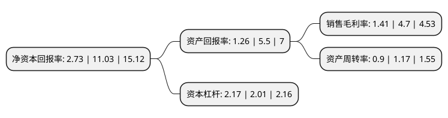

> 本页面由自动化程序生成于 2022年5月20日 01:36
> 内容可能存在错误，如有bug请提交issue至：https://github.com/Eroleice/doc-pi/issues
{.is-warning}

# 上市公司基本情况

## 基本资料

江西国光商业连锁股份有限公司（以下简称“国光连锁”）成立于2005年11月09日，吉安市。于2020年07月28日在上交所主板上市。

国光连锁注册资本49,558万元，主营业务为连锁超市，百货商场的运营业务，公司所销售产品根据具体特征可分为生鲜，食品，非食，针纺，百货五大类型。公司销售的主要产品为生鲜和食品。以下是详细信息：

- 公司名称: 江西国光商业连锁股份有限公司
- 股票代码: 605188.SH
- 所在地: 江西 - 吉安市
- 成立日期: 2005年11月09日
- 注册资本: 49,558万元
- 法定代表人: 胡金根
- 主营业务: 主营业务为连锁超市，百货商场的运营业务，公司所销售产品根据具体特征可分为生鲜，食品，非食，针纺，百货五大类型公司销售的主要产品为生鲜和食品
- 公司官网: www.jxggls.com
- 公司介绍: 公司为以生鲜、食品为核心品类的零售企业，是江西本土领先的连锁经营企业之一。自设立以来主要从事连锁超市、百货商场的运营业务。公司立足于江西省内，多年来通过深耕本地市场、持续推进门店升级转型，公司销售的主要产品为生鲜和食品，生鲜主要包括水果、水产、生肉、蔬菜、干货、熟食、面包和早点等；食品主要包括预包装食品、速冻食品、酒水饮料等。非食主要包括日化、日杂等生活用品；针纺主要包括毛巾、床上家居用品等；百货主要包括珠宝、化妆品、服饰等，公司以成为“江西省最优秀的零售商”为企业目标，通过多年植根江西形成的良好口碑、丰富的生鲜品类管理经验，形成了地区内的规模优势，保证了经营业绩的稳步提升。未来公司将不断扩大经营区域，将商品和服务拓展至江西省其他地区，公司所销售产品根据具体特征可分为生鲜、食品、非食、针纺、百货五大类型。

## 股东及高管情况

上市公司第一大股东为江西国光实业有限公司，持股252,055,934股，占比50.86%，为上市公司实际控制人。

截至2022年03月31日，上市公司的前十大股东中，共有5名自然人股东，5名机构股东，其中5%以上大股东共有3名。上市公司前十大股东明细如下：

> 截至2022年03月31日，上市公司前十大股东信息如下：

| 股东名称 | 持股数量（股） | 持股比例 |
| --- | --- | --- |
| 江西国光实业有限公司 | 252,055,934 | 50.86% |
| 胡金根 | 86,000,000 | 17.35% |
| 蒋淑兰 | 43,155,763 | 8.71% |
| 胡志超 | 21,611,695 | 4.36% |
| 胡智敏 | 14,404,576 | 2.91% |
| 胡春香 | 10,772,034 | 2.17% |
| 吉安市井开区齐兴信息咨询合伙企业(有限合伙) | 4,200,000 | 0.85% |
| 青岛运和嘉实业有限公司 | 1,101,000 | 0.22% |
| 吉安市井开区弘兴信息咨询合伙企业(有限合伙) | 1,000,000 | 0.2% |
| 吉安市井开区利兴信息咨询合伙企业(有限合伙) | 1,000,000 | 0.2% |

## 利润表分析

上市公司2021年总收入为21.42亿元，净利润为0.3亿元，实现盈利。

## 杜邦分析

> 数据列示周期：2021年 | 2020年 | 2019年
{.is-info}

上市公司的净资产收益率在近一年有所下降，下降幅度为-75.25%，其变化情况分解如下：
- 上市公司的销售毛利率在近一年下降了-70%，可能是生产效率的下降、商品原材料价格上涨或商品价格的下跌所致。
- 上市公司的资产周转率在近一年下降了-23.08%，可能是源自于更慢的销售回款或库存管理效果下降。
- 上市公司的财务杠杆比率在近一年上升了7.96%，可能是增加负债扩大生产规模。

