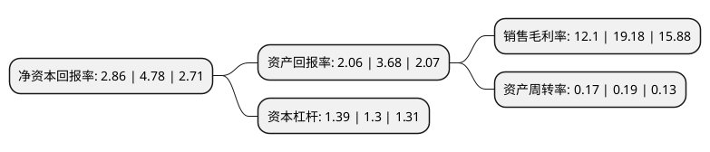

> 本页面由自动化程序生成于 2022年5月20日 01:02
> 内容可能存在错误，如有bug请提交issue至：https://github.com/Eroleice/doc-pi/issues
{.is-warning}

# 上市公司基本情况

## 基本资料

湖南投资集团股份有限公司（以下简称“湖南投资”）成立于1992年11月08日，长沙市。于1993年12月20日在深交所主板上市。

湖南投资注册资本49,921.581万元，主要业务:投资建设并收费经营公路，桥梁，投资，开发经营房地产业，承揽工程施工。以下是详细信息：

- 公司名称: 湖南投资集团股份有限公司
- 股票代码: 000548.SZ
- 所在地: 湖南 - 长沙市
- 成立日期: 1992年11月08日
- 注册资本: 49,921.581万元
- 法定代表人: 刘林平
- 主营业务: 投资建设并收费经营公路，桥梁，投资，开发经营房地产业，承揽工程施工
- 公司官网: www.hntz.com.cn
- 公司介绍: 公司是湖南省第一家上市公司，经过多年发展，公司形成了以路桥、酒店经营为基础，以房地产开发为主导的产业格局，公司着力构建主业明晰的股权投资体系和科学完善的决策体系，探索股权、土地和酒店相结合的盈利模式，成为一个投资结构优良、盈利能力强劲、持续稳健发展的现代化企业。近年以来，公司被评为“湖南省银行业协会守信用单位”、“长沙市内部审计先进单位”等荣誉称号。

## 股东及高管情况

上市公司第一大股东为长沙环路建设开发集团有限公司，持股161,306,457股，占比32.31%，为上市公司实际控制人。

截至2022年03月31日，上市公司的前十大股东中，共有7名自然人股东，1名机构股东，1个产品账户，1个海外主体，其中5%以上大股东共有1名。上市公司前十大股东明细如下：

> 截至2022年03月31日，上市公司前十大股东信息如下：

| 股东名称 | 持股数量（股） | 持股比例 |
| --- | --- | --- |
| 长沙环路建设开发集团有限公司 | 161,306,457 | 32.31% |
| 池汉雄 | 5,500,000 | 1.1% |
| 王秀平 | 5,013,516 | 1% |
| JPMORGAN CHASE BANK,NATIONAL ASSOCIATION | 2,974,952 | 0.6% |
| 王伯达 | 2,962,000 | 0.59% |
| 胡志平 | 2,816,000 | 0.56% |
| 中国民生银行股份有限公司-金元顺安元启灵活配置混合型证券投资基金 | 1,599,000 | 0.32% |
| 张红星 | 1,500,000 | 0.3% |
| 王红军 | 1,466,810 | 0.29% |
| 林耀礼 | 1,400,000 | 0.28% |

## 利润表分析

上市公司2021年总收入为4.28亿元，净利润为0.51亿元，实现盈利。

## 杜邦分析

> 数据列示周期：2021年 | 2020年 | 2019年
{.is-info}

上市公司的净资产收益率在近一年有所下降，下降幅度为-40.17%，其变化情况分解如下：
- 上市公司的销售毛利率在近一年下降了-36.91%，可能是生产效率的下降、商品原材料价格上涨或商品价格的下跌所致。
- 上市公司的资产周转率在近一年下降了-10.53%，可能是源自于更慢的销售回款或库存管理效果下降。
- 上市公司的财务杠杆比率在近一年上升了6.92%，可能是增加负债扩大生产规模。

