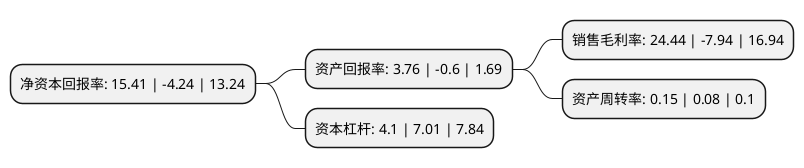

> 本页面由自动化程序生成于 2022年5月20日 01:03
> 内容可能存在错误，如有bug请提交issue至：https://github.com/Eroleice/doc-pi/issues
{.is-warning}

# 上市公司基本情况

## 基本资料

山西路桥股份有限公司（以下简称“山西路桥”）成立于1996年02月06日，临汾市。于1997年06月27日在深交所主板上市。

山西路桥注册资本146,731.02万元，主要产品:胶粘剂系列产品，苯精制系列化工产品以下是详细信息：

- 公司名称: 山西路桥股份有限公司
- 股票代码: 000755.SZ
- 所在地: 山西 - 临汾市
- 成立日期: 1996年02月06日
- 注册资本: 146,731.02万元
- 法定代表人: 李武军
- 主营业务: 主要产品:胶粘剂系列产品，苯精制系列化工产品
- 公司官网: www.sxsanwei.com
- 公司介绍: 公司主要从事精细化工产品的生产与销售，原主导产品包括：1,4—丁二醇(BDO)及其下游系列产品、聚乙烯醇(PVA)系列产品、胶粘剂系列产品、苯精制系列及其他化工产品，这些产品主要应用于化工、纺织、建筑等行业，在农药、医药、化妆品、印刷、陶瓷、电镀、纤维、增塑剂、固化剂、合成树脂和塑料等领域也有广泛运用。2017年，公司向三维华邦出售公司拥有的有机分厂、丁二分厂和配套职能部门相关的主要资产、负债，目前主导产品仅包括胶粘剂系列产品、苯精制系列化工产品。在胶粘剂系列产品方面，公司拥有引进德国汉高公司技术和关键设备，建成的国内产能较大、品种较全、质量优良、工艺控制较先进的白乳胶生产基地，也是国内具有干粉胶自主知识产权的企业之一。

## 股东及高管情况

上市公司第一大股东为山西省高速公路集团有限责任公司，持股857,266,275股，占比58.42%，为上市公司实际控制人。

截至2022年03月31日，上市公司的前十大股东中，共有3名自然人股东，7名机构股东，其中5%以上大股东共有3名。上市公司前十大股东明细如下：

> 截至2022年03月31日，上市公司前十大股东信息如下：

| 股东名称 | 持股数量（股） | 持股比例 |
| --- | --- | --- |
| 山西省高速公路集团有限责任公司 | 857,266,275 | 58.42% |
| 招商局公路网络科技控股股份有限公司 | 140,779,300 | 9.59% |
| 山西路桥建设集团有限公司 | 130,412,280 | 8.89% |
| 山西省经济建设投资集团有限公司 | 12,416,539 | 0.85% |
| 华新燃气集团有限公司 | 12,268,400 | 0.84% |
| 山西省旅游投资控股集团有限公司 | 6,000,000 | 0.41% |
| 宋常青 | 4,109,341 | 0.28% |
| 霍建平 | 4,059,785 | 0.28% |
| 徐开东 | 3,600,000 | 0.25% |
| 中国国际金融香港资产管理有限公司-客户资金2 | 2,569,916 | 0.18% |

## 利润表分析

上市公司2021年总收入为16.61亿元，净利润为4.06亿元，实现盈利。

## 杜邦分析

> 数据列示周期：2021年 | 2020年 | 2019年
{.is-info}

上市公司的净资产收益率在近一年有所下降，下降幅度为-463.44%，其变化情况分解如下：
- 上市公司的销售毛利率在近一年下降了-407.81%，可能是生产效率的下降、商品原材料价格上涨或商品价格的下跌所致。
- 上市公司的资产周转率在近一年上升了87.5%，可能是源自于更快的销售回款或库存管理效果提升。
- 上市公司的财务杠杆比率在近一年下降了-41.51%，可能是减少负债降低财务费用。

