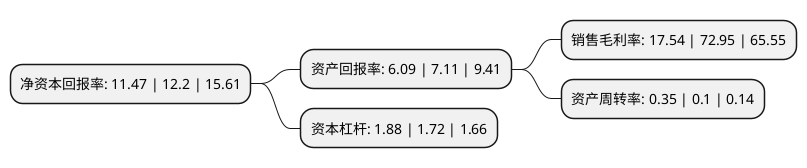

> 本页面由自动化程序生成于 2022年5月20日 01:03
> 内容可能存在错误，如有bug请提交issue至：https://github.com/Eroleice/doc-pi/issues
{.is-warning}

# 上市公司基本情况

## 基本资料

东莞发展控股股份有限公司（以下简称“东莞控股”）成立于1997年12月16日，东莞市。于1997年06月17日在深交所主板上市。

东莞控股注册资本103,951.699万元，主要业务:高速公路运营管理，融资租赁及商业保理业务以下是详细信息：

- 公司名称: 东莞发展控股股份有限公司
- 股票代码: 000828.SZ
- 所在地: 广东 - 东莞市
- 成立日期: 1997年12月16日
- 注册资本: 103,951.699万元
- 法定代表人: 王崇恩
- 主营业务: 高速公路运营管理，融资租赁及商业保理业务
- 公司官网: www.dgholdings.cn
- 公司介绍: 公司是东莞市属国有控股的上市公司，公司从事的主要业务包括高速公路运营管理、融资租赁及商业保理业务。公司的全资子公司——融通租赁从事融资租赁业务、控股子公司——宏通保理从事商业保理业务，两公司立足珠三角核心区，以基础设施、医疗教育、公共交通、节能环保等行业为重点业务领域，围绕各自产品特点，为企业提供全方位的融资解决方案。

## 股东及高管情况

上市公司第一大股东为东莞市交通投资集团有限公司，持股434,671,714股，占比41.81%，为上市公司实际控制人。

截至2022年03月31日，上市公司的前十大股东中，共有6名自然人股东，3名机构股东，1个海外主体，其中5%以上大股东共有2名。上市公司前十大股东明细如下：

> 截至2022年03月31日，上市公司前十大股东信息如下：

| 股东名称 | 持股数量（股） | 持股比例 |
| --- | --- | --- |
| 东莞市交通投资集团有限公司 | 434,671,714 | 41.81% |
| 福民发展有限公司 | 259,879,247 | 25% |
| 东莞市福民集团公司 | 31,291,633 | 3.01% |
| 袁仰龙 | 4,793,486 | 0.46% |
| 方旺华 | 4,617,463 | 0.44% |
| 香港中央结算有限公司(陆股通) | 4,614,874 | 0.44% |
| 麦容章 | 3,966,056 | 0.38% |
| 阎健 | 3,612,900 | 0.35% |
| 陈浩华 | 2,233,400 | 0.21% |
| 戴艳红 | 2,210,200 | 0.21% |

## 利润表分析

上市公司2021年总收入为53.2亿元，净利润为9.33亿元，实现盈利。

## 杜邦分析

> 数据列示周期：2021年 | 2020年 | 2019年
{.is-info}

上市公司的净资产收益率在近一年有所下降，下降幅度为-5.98%，其变化情况分解如下：
- 上市公司的销售毛利率在近一年下降了-75.96%，可能是生产效率的下降、商品原材料价格上涨或商品价格的下跌所致。
- 上市公司的资产周转率在近一年上升了250%，可能是源自于更快的销售回款或库存管理效果提升。
- 上市公司的财务杠杆比率在近一年上升了9.3%，可能是增加负债扩大生产规模。

