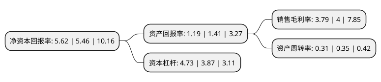

> 本页面由自动化程序生成于 2022年5月20日 01:04
> 内容可能存在错误，如有bug请提交issue至：https://github.com/Eroleice/doc-pi/issues
{.is-warning}

# 上市公司基本情况

## 基本资料

现代投资股份有限公司（以下简称“现代投资”）成立于1993年05月27日，长沙市。于1999年01月28日在深交所主板上市。

现代投资注册资本151,782.833万元，主要业务:经营高等级公路。以下是详细信息：

- 公司名称: 现代投资股份有限公司
- 股票代码: 000900.SZ
- 所在地: 湖南 - 长沙市
- 成立日期: 1993年05月27日
- 注册资本: 151,782.833万元
- 法定代表人: 马捷
- 主营业务: 经营高等级公路
- 公司官网: www.xdtz.net
- 公司介绍: 公司主营业务为高等级公路的养护维修和收费经营。核心路产长潭路和潭耒路是京珠高速沿线各省市通往粤港澳的重要通道，为湖南省经营高等级公路的重要企业。公司在稳健发展高速公路主营业务的同时，积极稳妥地开展多元化产业投资。现控股或参股的公司有湖南安迅投资发展有限公司、湖南现代投资置业发展有限公司、湖南现代投资文化传播有限公司、泰阳证券有限责任公司及湖南大有期货经纪有限责任公司等。

## 股东及高管情况

上市公司第一大股东为湖南省高速公路集团有限公司，持股412,666,971股，占比27.19%，**疑似为**上市公司实际控制人。

截至2022年03月31日，上市公司的前十大股东中，共有5名机构股东，5个产品账户，其中5%以上大股东共有3名。上市公司前十大股东明细如下：

> 未能通过持股比例判定出上市公司实际控制人（持股30%以上）
> 可能存在通过间接持股、联合持股、协议控制等方式拥有实际控制权的主体，具体请参考上市公司定期公告！
{.is-warning}

> 截至2022年03月31日，上市公司前十大股东信息如下：

| 股东名称 | 持股数量（股） | 持股比例 |
| --- | --- | --- |
| 湖南省高速公路集团有限公司 | 412,666,971 | 27.19% |
| 湖南轨道交通控股集团有限公司 | 148,743,737 | 9.8% |
| 招商局公路网络科技控股股份有限公司 | 122,050,565 | 8.04% |
| 通辽市蒙古王工贸有限公司 | 51,360,000 | 3.38% |
| 中央汇金资产管理有限责任公司 | 47,153,450 | 3.11% |
| 嘉实基金-农业银行-嘉实中证金融资产管理计划 | 13,477,994 | 0.89% |
| 广发基金-农业银行-广发中证金融资产管理计划 | 13,466,034 | 0.89% |
| 银华基金-农业银行-银华中证金融资产管理计划 | 13,446,750 | 0.89% |
| 南方基金-农业银行-南方中证金融资产管理计划 | 13,206,900 | 0.87% |
| 易方达基金-农业银行-易方达中证金融资产管理计划 | 13,157,404 | 0.87% |

## 利润表分析

上市公司2021年总收入为160.98亿元，净利润为5.97亿元，实现盈利。

## 杜邦分析

> 数据列示周期：2021年 | 2020年 | 2019年
{.is-info}

上市公司的净资产收益率在近一年有所上升，上升幅度为2.93%，其变化情况分解如下：
- 上市公司的销售毛利率在近一年下降了-5.25%，可能是生产效率的下降、商品原材料价格上涨或商品价格的下跌所致。
- 上市公司的资产周转率在近一年下降了-11.43%，可能是源自于更慢的销售回款或库存管理效果下降。
- 上市公司的财务杠杆比率在近一年上升了22.22%，可能是增加负债扩大生产规模。

