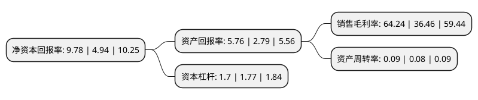

> 本页面由自动化程序生成于 2022年5月20日 01:05
> 内容可能存在错误，如有bug请提交issue至：https://github.com/Eroleice/doc-pi/issues
{.is-warning}

# 上市公司基本情况

## 基本资料

招商局公路网络科技控股股份有限公司（以下简称“招商公路”）成立于1993年12月18日，天津市。于2017年12月25日在深交所主板上市。

招商公路注册资本617,823.06万元，主营业务:公路相关的经营收费公路业务和交通科技业务。以下是详细信息：

- 公司名称: 招商局公路网络科技控股股份有限公司
- 股票代码: 001965.SZ
- 所在地: 天津 - 天津市
- 成立日期: 1993年12月18日
- 注册资本: 617,823.06万元
- 法定代表人: 白景涛
- 主营业务: 主营业务:公路相关的经营收费公路业务和交通科技业务
- 公司官网: www.cmexpressway.com
- 公司介绍: 公司是招商局集团二级企业，总部设于北京，招商公路是以招商局华建公路投资有限公司为主体整体改制设立而成。作为招商局集团公路板块企业，招商公路坚持全产业链一体化运作，主要从事经营性收费公路的投资及专业化运营管理，经营范围涵盖公路投资运营、交通科技、智慧交通、招商生态业务板块，已成长为中国投资经营里程最长、覆盖区域最广、产业链最完整的综合性公路投资运营服务商。招商公路充分发挥行业突出的投资经营能力，不断整合行业优质资源，积极创建智能交通生态圈，经过持续优化与转型，实现了业绩的长足发展，行业地位不断提升。

## 股东及高管情况

上市公司第一大股东为招商局集团有限公司，持股4,241,425,880股，占比68.65%，为上市公司实际控制人。

截至2022年03月31日，上市公司的前十大股东中，共有8名机构股东，2个产品账户，其中5%以上大股东共有3名。上市公司前十大股东明细如下：

> 截至2022年03月31日，上市公司前十大股东信息如下：

| 股东名称 | 持股数量（股） | 持股比例 |
| --- | --- | --- |
| 招商局集团有限公司 | 4,241,425,880 | 68.65% |
| 蜀道资本控股集团有限公司 | 393,700,787 | 6.37% |
| 中新互联互通投资基金管理有限公司-重庆中新壹号股权投资中心(有限合伙) | 367,454,131 | 5.95% |
| 泰康人寿保险有限责任公司-分红-个人分红-019L-FH002深 | 230,314,961 | 3.73% |
| 天津市京津塘高速公路公司 | 179,184,167 | 2.9% |
| 民信(天津)投资有限公司 | 131,233,595 | 2.12% |
| 泰康人寿保险有限责任公司-传统-普通保险产品-019L-CT001深 | 98,425,197 | 1.59% |
| 北京首发投资控股有限公司 | 81,890,951 | 1.33% |
| 芜湖信石天路投资管理合伙企业(有限合伙) | 61,999,597 | 1% |
| 泰康人寿保险有限责任公司-分红-团体分红-019L-FH001深 | 39,370,079 | 0.64% |

## 利润表分析

上市公司2021年总收入为86.26亿元，净利润为55.41亿元，实现盈利。

## 杜邦分析

> 数据列示周期：2021年 | 2020年 | 2019年
{.is-info}

上市公司的净资产收益率在近一年有所上升，上升幅度为97.98%，其变化情况分解如下：
- 上市公司的销售毛利率在近一年上升了76.19%，可能是生产效率的提升、商品原材料价格下跌或商品价格的上涨所致。
- 上市公司的资产周转率在近一年上升了12.5%，可能是源自于更快的销售回款或库存管理效果提升。
- 上市公司的财务杠杆比率在近一年下降了-3.95%，可能是减少负债降低财务费用。

