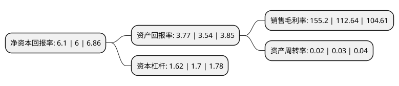

> 本页面由自动化程序生成于 2022年5月20日 01:24
> 内容可能存在错误，如有bug请提交issue至：https://github.com/Eroleice/doc-pi/issues
{.is-warning}

# 上市公司基本情况

## 基本资料

重庆路桥股份有限公司（以下简称“重庆路桥”）成立于1997年06月13日，重庆市。于1997年06月18日在上交所主板上市。

重庆路桥注册资本132,902.506万元，主要业务:路桥收费，工程建设。以下是详细信息：

- 公司名称: 重庆路桥股份有限公司
- 股票代码: 600106.SH
- 所在地: 重庆 - 重庆市
- 成立日期: 1997年06月13日
- 注册资本: 132,902.506万元
- 法定代表人: 江津
- 主营业务: 路桥收费，工程建设
- 公司官网: www.cqrb.com.cn
- 公司介绍: 公司是一家集城市路桥经营、城市基础设施建设、投资及房地产综合开发为一体的股份制企业。公司负责石板坡长江大桥、石门嘉陵江大桥、嘉华嘉陵江大桥、长寿湖旅游专用高速公路的经营管理，具有建设部颁发的市政公用工程施工总承包一级资质；房地产综合开发二级资质；市政设施维护甲级资质。成立以来，公司先后投资建设了茶园新区通江大道、嘉华嘉陵江大桥、西永软件园一期工程、长寿旅游专用高速公路和北山紫园等一批在重庆有影响的大型市政设施、公路工程和房地产开发建设项目，取得了良好的经济效益和社会信誉。公司通过嘉陵江嘉华大桥和长寿湖旅游专用高速公路两个BOT项目的建设、营运，已探索出一套以BOT模式投资建设大型基础设施项目的成功经验。BOT投资模式作为PPP投资模式的一种，公司熟悉BOT模式的运营，这对公司深入开展PPP投融资模式的各类基础设施建设项目打下了坚实基础。

## 股东及高管情况

上市公司第一大股东为重庆国际信托股份有限公司，持股198,800,171股，占比14.96%，**疑似为**上市公司实际控制人。

截至2022年03月31日，上市公司的前十大股东中，共有4名自然人股东，4名机构股东，2个产品账户，其中5%以上大股东共有2名。上市公司前十大股东明细如下：

> 未能通过持股比例判定出上市公司实际控制人（持股30%以上）
> 可能存在通过间接持股、联合持股、协议控制等方式拥有实际控制权的主体，具体请参考上市公司定期公告！
{.is-warning}

> 截至2022年03月31日，上市公司前十大股东信息如下：

| 股东名称 | 持股数量（股） | 持股比例 |
| --- | --- | --- |
| 重庆国际信托股份有限公司 | 198,800,171 | 14.96% |
| 上海临珺电子科技有限公司 | 167,392,290 | 12.6% |
| 上海慧秋投资有限公司 | 22,000,000 | 1.66% |
| 重庆国际信托股份有限公司-兴国1号集合资金信托计划 | 14,641,000 | 1.1% |
| 陈益燕 | 11,523,718 | 0.87% |
| 彭慧茹 | 10,618,836 | 0.8% |
| 国泰君安证券股份有限公司约定购回式证券交易专用证券账户 | 10,220,000 | 0.77% |
| 张塞 | 9,587,818 | 0.72% |
| 上海世兆投资管理有限公司 | 9,210,068 | 0.69% |
| 韩柯 | 8,487,916 | 0.64% |

## 利润表分析

上市公司2021年总收入为1.64亿元，净利润为2.55亿元，实现盈利。

## 杜邦分析

> 数据列示周期：2021年 | 2020年 | 2019年
{.is-info}

上市公司的净资产收益率在近一年有所上升，上升幅度为1.67%，其变化情况分解如下：
- 上市公司的销售毛利率在近一年上升了37.78%，可能是生产效率的提升、商品原材料价格下跌或商品价格的上涨所致。
- 上市公司的资产周转率在近一年下降了-33.33%，可能是源自于更慢的销售回款或库存管理效果下降。
- 上市公司的财务杠杆比率在近一年下降了-4.71%，可能是减少负债降低财务费用。

