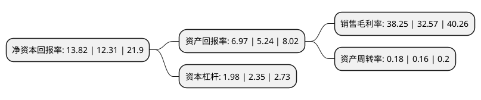

> 本页面由自动化程序生成于 2022年5月20日 01:26
> 内容可能存在错误，如有bug请提交issue至：https://github.com/Eroleice/doc-pi/issues
{.is-warning}

# 上市公司基本情况

## 基本资料

广西五洲交通股份有限公司（以下简称“五洲交通”）成立于1992年12月31日，南宁市。于2000年12月21日在上交所主板上市。

五洲交通注册资本112,563.207万元，主要业务:广西壮族自治区内公路，桥梁的建设和经营管理。以下是详细信息：

- 公司名称: 广西五洲交通股份有限公司
- 股票代码: 600368.SH
- 所在地: 广西 - 南宁市
- 成立日期: 1992年12月31日
- 注册资本: 112,563.207万元
- 法定代表人: 周异助
- 主营业务: 广西壮族自治区内公路，桥梁的建设和经营管理
- 公司官网: null
- 公司介绍: 公司主营公路的经营与管理、物流贸易、房地产开发。公司深耕公路主业，按照“简单、专注、可持续”的发展理念，集中精力做好收费公路及延伸业务，精心培育物流与地产业务，调整发展小贷金融业务。

## 股东及高管情况

上市公司第一大股东为广西交通投资集团有限公司，持股410,318,662股，占比36.45%，为上市公司实际控制人。

截至2022年03月31日，上市公司的前十大股东中，共有5名自然人股东，4名机构股东，1个海外主体，其中5%以上大股东共有2名。上市公司前十大股东明细如下：

> 截至2022年03月31日，上市公司前十大股东信息如下：

| 股东名称 | 持股数量（股） | 持股比例 |
| --- | --- | --- |
| 广西交通投资集团有限公司 | 410,318,662 | 36.45% |
| 招商局公路网络科技控股股份有限公司 | 155,967,120 | 13.86% |
| 香港中央结算有限公司(陆股通) | 32,890,551 | 2.92% |
| 华泰证券股份有限公司 | 4,790,713 | 0.43% |
| 王晓慧 | 4,181,000 | 0.37% |
| 俞雄伟 | 3,815,331 | 0.34% |
| 中国国际金融香港资产管理有限公司-客户资金2 | 3,311,100 | 0.29% |
| 彭洁芳 | 3,210,000 | 0.29% |
| 丁小宝 | 2,993,000 | 0.27% |
| 陈燕 | 2,858,185 | 0.25% |

## 利润表分析

上市公司2021年总收入为18.3亿元，净利润为7亿元，实现盈利。

## 杜邦分析

> 数据列示周期：2021年 | 2020年 | 2019年
{.is-info}

上市公司的净资产收益率在近一年有所上升，上升幅度为12.27%，其变化情况分解如下：
- 上市公司的销售毛利率在近一年上升了17.44%，可能是生产效率的提升、商品原材料价格下跌或商品价格的上涨所致。
- 上市公司的资产周转率在近一年上升了12.5%，可能是源自于更快的销售回款或库存管理效果提升。
- 上市公司的财务杠杆比率在近一年下降了-15.74%，可能是减少负债降低财务费用。

