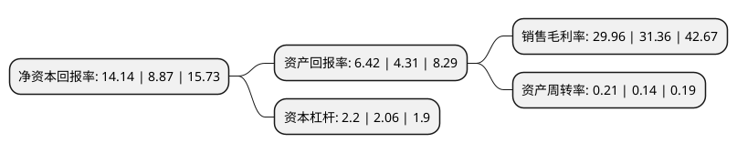

> 本页面由自动化程序生成于 2022年5月20日 01:26
> 内容可能存在错误，如有bug请提交issue至：https://github.com/Eroleice/doc-pi/issues
{.is-warning}

# 上市公司基本情况

## 基本资料

江苏宁沪高速公路股份有限公司（以下简称“宁沪高速”）成立于1992年08月01日，南京市。于2001年01月16日在上交所主板上市。

宁沪高速注册资本503,774.75万元，主要业务:沪宁高速公路江苏段，宁沪二级公路江苏段，宁连公路南京段，广靖锡澄高速公路，配套服务。以下是详细信息：

- 公司名称: 江苏宁沪高速公路股份有限公司
- 股票代码: 600377.SH
- 所在地: 江苏 - 南京市
- 成立日期: 1992年08月01日
- 注册资本: 503,774.75万元
- 法定代表人: 成晓光
- 主营业务: 沪宁高速公路江苏段，宁沪二级公路江苏段，宁连公路南京段，广靖锡澄高速公路，配套服务
- 公司官网: www.jsexpressway.com
- 公司介绍: 公司主要从事投资、建设、经营和管理沪宁高速公路江苏段及其他江苏省境内的收费路桥，并发展公路沿线的客运及其它辅助服务业。除沪宁高速公路江苏段外，公司还拥有宁沪二级公路江苏段、锡澄高速公路、广靖高速公路、宁连高速公路南京段等位于江苏省内的收费路桥全部或部分权益，是国内公路行业中资产规模最大的上市公司之一。除收费路桥业务外，公司还积极拓展相关的多元化业务领域，作为公司非主营业务的重要组成部分，沪宁高速沿线服务区的经营与开发为公司带来较为稳定的盈利贡献，初步形成了服务区餐饮、加油、汽修、广告、住宿、商品零售等业务发展体系。

## 股东及高管情况

上市公司第一大股东为江苏交通控股有限公司，持股2,742,578,825股，占比54.44%，为上市公司实际控制人。

截至2022年03月31日，上市公司的前十大股东中，共有2名机构股东，2个产品账户，6个海外主体，其中5%以上大股东共有1名。上市公司前十大股东明细如下：

> 截至2022年03月31日，上市公司前十大股东信息如下：

| 股东名称 | 持股数量（股） | 持股比例 |
| --- | --- | --- |
| 江苏交通控股有限公司 | 2,742,578,825 | 54.44% |
| Mitsubishi UFJ Financial, Group Inc. | 146,754,597 | 2.91% |
| Mitsubishi UFJ Financial Group, Inc. | 146,754,597 | 2.91% |
| BlackRock, Inc. | 132,683,158 | 2.63% |
| JPMorgan Chase & Co. | 85,117,105 | 1.69% |
| Citigroup Inc. | 73,316,392 | 1.46% |
| Newton Investment Management Limited | 61,150,309 | 1.21% |
| 招商银行股份有限公司-上证红利交易型开放式指数证券投资基金 | 30,339,564 | 0.6% |
| 中国银河资产管理有限责任公司 | 21,410,000 | 0.42% |
| 中国太平洋人寿保险股份有限公司-中国太平洋人寿股票红利型产品(寿自营)委托投资(长江养老) | 12,500,000 | 0.25% |

## 利润表分析

上市公司2021年总收入为137.92亿元，净利润为41.32亿元，实现盈利。

## 杜邦分析

> 数据列示周期：2021年 | 2020年 | 2019年
{.is-info}

上市公司的净资产收益率在近一年有所上升，上升幅度为59.41%，其变化情况分解如下：
- 上市公司的销售毛利率在近一年下降了-4.46%，可能是生产效率的下降、商品原材料价格上涨或商品价格的下跌所致。
- 上市公司的资产周转率在近一年上升了50%，可能是源自于更快的销售回款或库存管理效果提升。
- 上市公司的财务杠杆比率在近一年上升了6.8%，可能是增加负债扩大生产规模。

