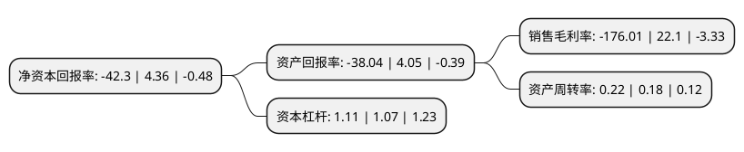

> 本页面由自动化程序生成于 2022年5月20日 01:01
> 内容可能存在错误，如有bug请提交issue至：https://github.com/Eroleice/doc-pi/issues
{.is-warning}

# 上市公司基本情况

## 基本资料

深圳国华网安科技股份有限公司（以下简称“ST国华”）成立于1986年05月05日，深圳市。于1991年01月14日在深交所主板上市。

ST国华注册资本15,600.303万元，主要业务:移动互联网游戏业务，移动应用安全服务业务以下是详细信息：

- 公司名称: 深圳国华网安科技股份有限公司
- 股票代码: 000004.SZ
- 所在地: 广东 - 深圳市
- 成立日期: 1986年05月05日
- 注册资本: 15,600.303万元
- 法定代表人: 黄翔
- 主营业务: 移动互联网游戏业务，移动应用安全服务业务
- 公司官网: www.sz000004.cn
- 公司介绍: 公司创立于1981年，1990年12月1日起在深圳证券交易所挂牌交易，是深交所首家挂牌的上市公司。上市之初，公司主营业务为汽车货运及旅客运输，兼营汽车修理、汽车配件零售等。2000年、2001年期间，公司完成全面资产重组，调整主营业务方向，剥离了原上市公司体内所有资产及负债，并注入了全新的生物指纹识别和生物制药产业。2005年，为了优化上市公司资产质量，提高盈利能力，公司新增房地产开发与销售业务，并退出生物指纹识别行业。近年来，受国家宏观政策调整及上市公司自身发展规划调整影响，为盘活公司存量资产，优化公司资产结构，推动公司转型升级，公司先后剥离了房地产开发业务和生物医药业务。基于移动互联网产业良好的市场前景，上市公司通过内生式增长与外延式发展并举的手段加快发展移动互联网业务。一方面，公司通过投资设立移动互联网游戏企业开拓移动互联网领域业务，另一方面，公司利用上市平台优势进行外延式整合，并购移动应用安全行业优质资产。目前，公司以移动互联网服务为主营业务，旗下拥有北京智游网安科技有限公司、广州国科互娱网络科技有限公司等子公司。

## 股东及高管情况

上市公司第一大股东为深圳中农大科技投资有限公司，持股23,876,848股，占比15.31%，**疑似为**上市公司实际控制人。

截至2022年03月31日，上市公司的前十大股东中，共有4名自然人股东，4名机构股东，2个产品账户，其中5%以上大股东共有5名。上市公司前十大股东明细如下：

> 未能通过持股比例判定出上市公司实际控制人（持股30%以上）
> 可能存在通过间接持股、联合持股、协议控制等方式拥有实际控制权的主体，具体请参考上市公司定期公告！
{.is-warning}

> 截至2022年03月31日，上市公司前十大股东信息如下：

| 股东名称 | 持股数量（股） | 持股比例 |
| --- | --- | --- |
| 深圳中农大科技投资有限公司 | 23,876,848 | 15.31% |
| 北京中关村并购母基金投资管理中心(有限合伙)-北京中关村并购母基金投资中心(有限合伙) | 12,330,506 | 7.9% |
| 彭瀛 | 12,233,278 | 7.84% |
| 深圳市睿鸿置业发展有限公司 | 10,551,313 | 6.76% |
| 珠海横琴普源科技合伙企业(有限合伙) | 8,815,606 | 5.65% |
| 郭训平 | 2,916,155 | 1.87% |
| 郑州众合网安信息科技有限公司 | 2,519,300 | 1.61% |
| 联通创新互联成都股权投资基金合伙企业(有限合伙) | 1,700,000 | 1.09% |
| 周松祥 | 1,434,789 | 0.92% |
| 李映彤 | 1,316,100 | 0.84% |

## 利润表分析

上市公司2021年总收入为2.88亿元，净利润为-5.09亿元，**未实现盈利**。

## 杜邦分析

> 数据列示周期：2021年 | 2020年 | 2019年
{.is-info}

上市公司的净资产收益率在近一年有所下降，下降幅度为-1070.18%，其变化情况分解如下：
- 上市公司的销售毛利率在近一年下降了-896.43%，可能是生产效率的下降、商品原材料价格上涨或商品价格的下跌所致。
- 上市公司的资产周转率在近一年上升了22.22%，可能是源自于更快的销售回款或库存管理效果提升。
- 上市公司的财务杠杆比率在近一年上升了3.74%，可能是增加负债扩大生产规模。

