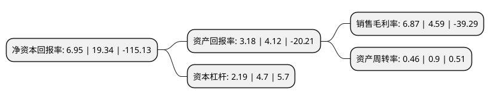

> 本页面由自动化程序生成于 2022年5月20日 01:01
> 内容可能存在错误，如有bug请提交issue至：https://github.com/Eroleice/doc-pi/issues
{.is-warning}

# 上市公司基本情况

## 基本资料

云鼎科技股份有限公司（以下简称“云鼎科技”）成立于1993年03月02日，济南市。于1996年06月27日在深交所主板上市。

云鼎科技注册资本51,093.116万元，主营业务:油品加工贸易，轮胎制造，医药制造和贵金属采选以下是详细信息：

- 公司名称: 云鼎科技股份有限公司
- 股票代码: 000409.SZ
- 所在地: 山东 - 济南市
- 成立日期: 1993年03月02日
- 注册资本: 51,093.116万元
- 法定代表人: 刘波
- 主营业务: 主营业务:油品加工贸易，轮胎制造，医药制造和贵金属采选
- 公司官网: www.yundingkeji.cn
- 公司介绍: 公司原是以生物化工产品贸易为主营业务的上市公司，公司于2013年完成重大资产重组，并于2015年实施了战略转型。非矿产业方面，公司通过产业并购，转型为多板块协作、多元化运作的集团式管理的上市公司，各非矿产业均在其行业内具有重要地位，均具有较强的可持续发展能力。矿业产业方面，公司积极进行探、采一体化改革与探索，并在探、采方面提高了专业技术，积累了丰富的市场化运作经验，同时在长期生产实践中引进和培养了一大批技术人才，专业领域涵盖地质探矿、采矿、防治水、选矿、机械、动力和土木工程等，具有较强的人才优势。公司所依托的山东省地质矿产勘查开发局，在全国地矿系统实力突出，成绩辉煌，底蕴深厚，在国内外提交与控制的资源量巨大，具有较强的资源优势。公司已成长为一家业务涵盖黑色金属采选、贵金属采选、生物医药、清洁能源、特种轮胎、房地产开发、商品贸易等多个行业的综合性、多元化集团式公司。

## 股东及高管情况

上市公司第一大股东为山东能源集团有限公司，持股85,356,551股，占比16.71%，**疑似为**上市公司实际控制人。

截至2022年03月31日，上市公司的前十大股东中，共有4名自然人股东，4名机构股东，1个产品账户，1名其他股东，其中5%以上大股东共有2名。上市公司前十大股东明细如下：

> 未能通过持股比例判定出上市公司实际控制人（持股30%以上）
> 可能存在通过间接持股、联合持股、协议控制等方式拥有实际控制权的主体，具体请参考上市公司定期公告！
{.is-warning}

> 截至2022年03月31日，上市公司前十大股东信息如下：

| 股东名称 | 持股数量（股） | 持股比例 |
| --- | --- | --- |
| 山东能源集团有限公司 | 85,356,551 | 16.71% |
| 安徽丰原集团有限公司 | 55,455,947 | 10.85% |
| 山东省国有资产投资控股有限公司 | 12,779,411 | 2.5% |
| 北京志开投资管理有限公司-志开汇融2号私募证券投资基金 | 12,082,511 | 2.36% |
| 山东省地矿测绘院 | 10,052,623 | 1.97% |
| 齐兵 | 6,312,300 | 1.24% |
| 池州市东方辰天贸易有限公司 | 2,396,226 | 0.47% |
| 毛家传 | 2,301,500 | 0.45% |
| 朱笛 | 2,100,071 | 0.41% |
| 李婷婷 | 2,065,779 | 0.4% |

## 利润表分析

上市公司2021年总收入为5.08亿元，净利润为0.34亿元，实现盈利。

## 杜邦分析

> 数据列示周期：2021年 | 2020年 | 2019年
{.is-info}

上市公司的净资产收益率在近一年有所下降，下降幅度为-64.06%，其变化情况分解如下：
- 上市公司的销售毛利率在近一年上升了49.67%，可能是生产效率的提升、商品原材料价格下跌或商品价格的上涨所致。
- 上市公司的资产周转率在近一年下降了-48.89%，可能是源自于更慢的销售回款或库存管理效果下降。
- 上市公司的财务杠杆比率在近一年下降了-53.4%，可能是减少负债降低财务费用。

