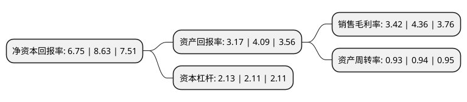

> 本页面由自动化程序生成于 2022年5月20日 01:02
> 内容可能存在错误，如有bug请提交issue至：https://github.com/Eroleice/doc-pi/issues
{.is-warning}

# 上市公司基本情况

## 基本资料

神州数码信息服务股份有限公司（以下简称“神州信息”）成立于1996年11月18日，深圳市。于1994年04月08日在深交所主板上市。

神州信息注册资本98,361.371万元，主营业务:软件与信息技术服务，ATM产品及相关软件的研发生产等。以下是详细信息：

- 公司名称: 神州数码信息服务股份有限公司
- 股票代码: 000555.SZ
- 所在地: 广东 - 深圳市
- 成立日期: 1996年11月18日
- 注册资本: 98,361.371万元
- 法定代表人: 郭为
- 主营业务: 主营业务:软件与信息技术服务，ATM产品及相关软件的研发生产等
- 公司官网: www.dcits.com
- 公司介绍: 公司作为金融科技全产业链综合服务商，拥有三十余年行业信息化建设经验，是国内信息化产业领导者和数字中国的践行者，依托深厚的自主研发能力，融合科技与业务，赋能行业数字化转型，推动中国数字化升级，支撑数字中国的使命。科技创新是持续发展的源动力。神州信息战略聚焦金融科技，以大数据、人工智能、区块链、云计算与分布式、物联网以及量子通信等新技术的应用，驱动软件及服务产品智能化迭代，助力金融机构安全合规地推进基础架构升级及业务创新；融合金融、政企、农业、运营商等行业数据及场景资源，创新金融场景，打造新的服务平台并提供运营服务，赋能金融行业数字化转型，打造产业融合新生态。数字潮起，拥抱未来！神州信息不忘数字中国的初心与使命，抓住数字化、智能化融合发展的时代机遇，在建设科技强国、布局新型基础设施、提升金融科技水平和增强金融普惠价值的过程中，以新思维推动金融创新，满足新时期发展需要，同时坚持总体国家安全观，助力经济社会发展开新局，全面发力新基建、新金融、新安全。

## 股东及高管情况

上市公司第一大股东为神州数码软件有限公司，持股389,540,110股，占比39.6%，为上市公司实际控制人。

截至2022年04月18日，上市公司的前十大股东中，共有4名自然人股东，4名机构股东，2个海外主体，其中5%以上大股东共有3名。上市公司前十大股东明细如下：

> 截至2022年04月18日，上市公司前十大股东信息如下：

| 股东名称 | 持股数量（股） | 持股比例 |
| --- | --- | --- |
| 神州数码软件有限公司 | 389,540,110 | 39.6% |
| 中新苏州工业园区创业投资有限公司 | 64,675,937 | 6.58% |
| 昆山市申昌科技有限公司 | 49,708,280 | 5.05% |
| 林芝腾讯科技有限公司 | 19,598,721 | 1.99% |
| Infinity I-China Investments(Israel),L.P. | 13,130,434 | 1.33% |
| 程艳云 | 8,465,822 | 0.86% |
| 吴冬华 | 7,635,638 | 0.78% |
| 香港中央结算有限公司(陆股通) | 5,275,957 | 0.54% |
| 王宇飞 | 3,891,381 | 0.4% |
| 贺胜龙 | 3,565,000 | 0.36% |

## 利润表分析

上市公司2021年总收入为113.55亿元，净利润为3.87亿元，实现盈利。

## 杜邦分析

> 数据列示周期：2021年 | 2020年 | 2019年
{.is-info}

上市公司的净资产收益率在近一年有所下降，下降幅度为-21.78%，其变化情况分解如下：
- 上市公司的销售毛利率在近一年下降了-21.56%，可能是生产效率的下降、商品原材料价格上涨或商品价格的下跌所致。
- 上市公司的资产周转率在近一年下降了-1.06%，可能是源自于更慢的销售回款或库存管理效果下降。
- 上市公司的财务杠杆比率在近一年上升了0.95%，可能是增加负债扩大生产规模。

