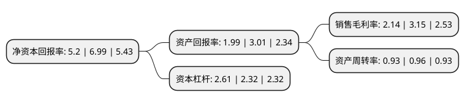

> 本页面由自动化程序生成于 2022年5月20日 01:04
> 内容可能存在错误，如有bug请提交issue至：https://github.com/Eroleice/doc-pi/issues
{.is-warning}

# 上市公司基本情况

## 基本资料

云南南天电子信息产业股份有限公司（以下简称“南天信息”）成立于1998年12月21日，昆明市。于1999年10月14日在深交所主板上市。

南天信息注册资本39,438.567万元，主要产品:银行系统用的开放式系统小型机，金融终端系统，网络产品，专业存折打印机，自动柜员机(ATM)等。以下是详细信息：

- 公司名称: 云南南天电子信息产业股份有限公司
- 股票代码: 000948.SZ
- 所在地: 云南 - 昆明市
- 成立日期: 1998年12月21日
- 注册资本: 39,438.567万元
- 法定代表人: 徐宏灿
- 主营业务: 主要产品:银行系统用的开放式系统小型机，金融终端系统，网络产品，专业存折打印机，自动柜员机(ATM)等
- 公司官网: www.nantian.com.cn
- 公司介绍: 公司以软件业务、集成服务业务、产品服务业务、智慧城市业务、创新业务等五大主营业务为主体，积极布局云业务和大数据业务，以服务为发展方向，具有几十年建设金融行业和国家部分重点行业信息化工程的丰富经验。在发展的浪潮中，南天信息不断得到业界的肯定及赞誉，获得“国家认定企业技术中心”、“高新技术企业”、“软件企业”认定，是全国“信息系统集成大型一级企业”之一，取得了“ISO9001”、“ISO20000”、“IS027001”、“ISO14001”、“OHSAS18001”、“SEI CMMI4级”、“信息安全服务(安全工程类一级)和(风险评估一级)”、“软件企业信用等级AAA级评价”、“ITSS信息技术服务运行维护标准”等资质。此外，南天信息十余年来连续入选“中国软件业务收入百强”、“中国方案商百强”，2017年，南天信息荣膺“全国电子信息行业创新企业”、“中国云计算产业领军企业”、“云帆奖云计算最具成长力企业”、“中国大数据百强企业”、“创新软件企业”、“中国十佳金融行业ISV”、“2017CLOUD500”、“卓越金融行业云服务商”等奖项。

## 股东及高管情况

上市公司第一大股东为云南省工业投资控股集团有限责任公司，持股160,006,707股，占比40.57%，为上市公司实际控制人。

截至2022年03月31日，上市公司的前十大股东中，共有7名自然人股东，3名机构股东，其中5%以上大股东共有1名。上市公司前十大股东明细如下：

> 截至2022年03月31日，上市公司前十大股东信息如下：

| 股东名称 | 持股数量（股） | 持股比例 |
| --- | --- | --- |
| 云南省工业投资控股集团有限责任公司 | 160,006,707 | 40.57% |
| 滕健 | 2,861,293 | 0.73% |
| 南天电子信息产业集团公司 | 2,488,233 | 0.63% |
| 张家碧 | 1,352,270 | 0.34% |
| 吴国太 | 936,810 | 0.24% |
| 周光华 | 812,700 | 0.21% |
| 彭明 | 803,700 | 0.2% |
| 裴佳音 | 793,200 | 0.2% |
| 翁波 | 734,700 | 0.19% |
| 品牌联盟(北京)咨询股份公司 | 730,000 | 0.19% |

## 利润表分析

上市公司2021年总收入为55.92亿元，净利润为1.19亿元，实现盈利。

## 杜邦分析

> 数据列示周期：2021年 | 2020年 | 2019年
{.is-info}

上市公司的净资产收益率在近一年有所下降，下降幅度为-25.61%，其变化情况分解如下：
- 上市公司的销售毛利率在近一年下降了-32.06%，可能是生产效率的下降、商品原材料价格上涨或商品价格的下跌所致。
- 上市公司的资产周转率在近一年下降了-3.12%，可能是源自于更慢的销售回款或库存管理效果下降。
- 上市公司的财务杠杆比率在近一年上升了12.5%，可能是增加负债扩大生产规模。

