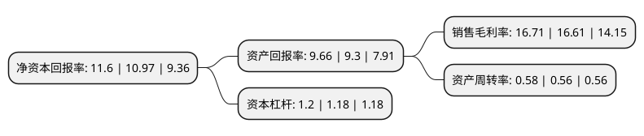

> 本页面由自动化程序生成于 2022年5月20日 01:05
> 内容可能存在错误，如有bug请提交issue至：https://github.com/Eroleice/doc-pi/issues
{.is-warning}

# 上市公司基本情况

## 基本资料

远光软件股份有限公司（以下简称“远光软件”）成立于1998年12月29日，珠海市。于2006年08月23日在深交所中小板上市。

远光软件注册资本132,298.333万元，主营业务:国内电力行业财务和管理软件的开发与销售。以下是详细信息：

- 公司名称: 远光软件股份有限公司
- 股票代码: 002063.SZ
- 所在地: 广东 - 珠海市
- 成立日期: 1998年12月29日
- 注册资本: 132,298.333万元
- 法定代表人: 陈利浩
- 主营业务: 主营业务:国内电力行业财务和管理软件的开发与销售
- 公司官网: www.ygsoft.com
- 公司介绍: 公司是国内主流的企业管理和社会服务信息系统供应商，专注大型企业管理信息化逾30年，长期为能源行业企业管理提供产品与服务。公司是国家科技部认定的“国家火炬计划重点高新技术企业”，自2003年起连续十几年被国家发改委、工信部、商务部、财政部、国家税务总局联合审定为“国家规划布局内重点软件企业”，拥有“计算机信息系统集成及服务一级资质”。在互联网+、一带一路、国企改革、智慧能源等新时代机遇下，公司凭借先进的云计算平台，创新融合物联网、移动互联、大数据、人工智能、区块链等新兴技术，精研软硬一体化整合应用技术，为能源、航天航空、高端装备、冶金冶炼、轨道交通等大型集团企业提供全面的行业解决方案和服务。公司始终坚持自主创新，生产经营的产品拥有完全自主知识产权。在技术上和市场上，公司还与国内外知名企业、机构、高校建立了密切的战略合作联盟。未来，公司将秉持“软件推动进步,创新引领未来”的理念，推动社会商业进步。

## 股东及高管情况

上市公司第一大股东为国网电子商务有限公司，持股175,315,783股，占比13.25%，**疑似为**上市公司实际控制人。

截至2022年03月31日，上市公司的前十大股东中，共有3名自然人股东，2名机构股东，4个产品账户，1个海外主体，其中5%以上大股东共有3名。上市公司前十大股东明细如下：

> 未能通过持股比例判定出上市公司实际控制人（持股30%以上）
> 可能存在通过间接持股、联合持股、协议控制等方式拥有实际控制权的主体，具体请参考上市公司定期公告！
{.is-warning}

> 截至2022年03月31日，上市公司前十大股东信息如下：

| 股东名称 | 持股数量（股） | 持股比例 |
| --- | --- | --- |
| 国网电子商务有限公司 | 175,315,783 | 13.25% |
| 陈利浩 | 131,800,829 | 9.96% |
| 国电电力发展股份有限公司 | 82,121,950 | 6.21% |
| 中国工商银行股份有限公司-华安媒体互联网混合型证券投资基金 | 15,983,570 | 1.21% |
| 魏兆琪 | 13,800,000 | 1.04% |
| 中国建设银行股份有限公司-华安沪港深外延增长灵活配置混合型证券投资基金 | 13,605,344 | 1.03% |
| 香港中央结算有限公司(陆股通) | 11,973,484 | 0.91% |
| 全国社保基金六零四组合 | 11,232,900 | 0.85% |
| 李小飞 | 10,590,000 | 0.8% |
| 中国工商银行股份有限公司-富国创新科技混合型证券投资基金 | 10,295,200 | 0.78% |

## 利润表分析

上市公司2021年总收入为19.15亿元，净利润为3.2亿元，实现盈利。

## 杜邦分析

> 数据列示周期：2021年 | 2020年 | 2019年
{.is-info}

上市公司的净资产收益率在近一年有所上升，上升幅度为5.74%，其变化情况分解如下：
- 上市公司的销售毛利率在近一年上升了0.6%，可能是生产效率的提升、商品原材料价格下跌或商品价格的上涨所致。
- 上市公司的资产周转率在近一年上升了3.57%，可能是源自于更快的销售回款或库存管理效果提升。
- 上市公司的财务杠杆比率在近一年上升了1.69%，可能是增加负债扩大生产规模。

