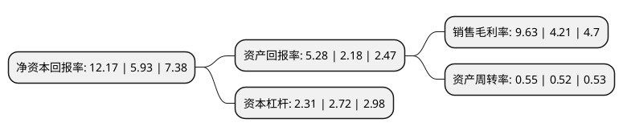

> 本页面由自动化程序生成于 2022年5月20日 01:06
> 内容可能存在错误，如有bug请提交issue至：https://github.com/Eroleice/doc-pi/issues
{.is-warning}

# 上市公司基本情况

## 基本资料

江苏金智科技股份有限公司（以下简称“金智科技”）成立于1995年11月10日，南京市。于2006年12月08日在深交所中小板上市。

金智科技注册资本40,426.494万元，主营业务:电力自动化产品研发，生产，销售和服务，同时从事高校信息化业务。以下是详细信息：

- 公司名称: 江苏金智科技股份有限公司
- 股票代码: 002090.SZ
- 所在地: 江苏 - 南京市
- 成立日期: 1995年11月10日
- 注册资本: 40,426.494万元
- 法定代表人: 贺安鹰
- 主营业务: 主营业务:电力自动化产品研发，生产，销售和服务，同时从事高校信息化业务
- 公司官网: www.wiscom.com.cn
- 公司介绍: 公司围绕智慧能源、智慧城市两大业务板块。在智慧能源业务板块，公司已经完成了电力自动化业务整个产业链的战略布局，业务包括电力产品业务、电力设计及总包业务、新能源投资运营业务三类业务。在智慧城市业务板块，公司秉承“让城市更智慧，让生活更美好”的使命，致力于中国智慧城市建设，做领先的智慧城市解决方案及服务提供商。公司的智慧城市业务包括成熟业务和创新业务。在成熟业务领域，公司提供先进可靠的平安城市、智能交通、智能建筑、智慧社区等综合解决方案并成功服务上海世博会智慧园区建设、南京青奥国家层面安保总指挥部通信指挥系统等重大项目；在创新业务领域，公司积极探索新能源应用、节能环保、合同能源管理等新方向，进一步增强智慧城市总体解决方案能力，培养新的业务增长点。

## 股东及高管情况

上市公司第一大股东为江苏金智集团有限公司，持股141,150,460股，占比34.92%，为上市公司实际控制人。

截至2022年03月31日，上市公司的前十大股东中，共有8名自然人股东，1名机构股东，1个产品账户，其中5%以上大股东共有1名。上市公司前十大股东明细如下：

> 截至2022年03月31日，上市公司前十大股东信息如下：

| 股东名称 | 持股数量（股） | 持股比例 |
| --- | --- | --- |
| 江苏金智集团有限公司 | 141,150,460 | 34.92% |
| 中国建设银行股份有限公司-中欧明睿新常态混合型证券投资基金 | 7,300,000 | 1.81% |
| 张爱琴 | 5,200,250 | 1.29% |
| 贺安鹰 | 3,147,592 | 0.78% |
| 叶留金 | 3,111,967 | 0.77% |
| 朱华明 | 3,090,090 | 0.76% |
| 郭伟 | 2,814,520 | 0.7% |
| 钱立 | 2,546,420 | 0.63% |
| 林慧 | 2,495,604 | 0.62% |
| 李明 | 2,350,000 | 0.58% |

## 利润表分析

上市公司2021年总收入为16.4亿元，净利润为1.57亿元，实现盈利。

## 杜邦分析

> 数据列示周期：2021年 | 2020年 | 2019年
{.is-info}

上市公司的净资产收益率在近一年有所上升，上升幅度为105.23%，其变化情况分解如下：
- 上市公司的销售毛利率在近一年上升了128.74%，可能是生产效率的提升、商品原材料价格下跌或商品价格的上涨所致。
- 上市公司的资产周转率在近一年上升了5.77%，可能是源自于更快的销售回款或库存管理效果提升。
- 上市公司的财务杠杆比率在近一年下降了-15.07%，可能是减少负债降低财务费用。

