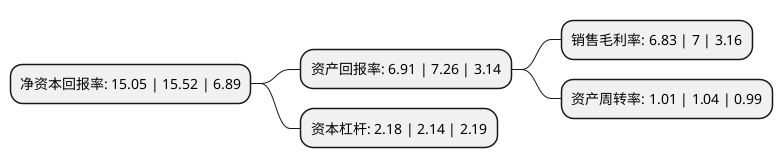

> 本页面由自动化程序生成于 2022年5月20日 01:06
> 内容可能存在错误，如有bug请提交issue至：https://github.com/Eroleice/doc-pi/issues
{.is-warning}

# 上市公司基本情况

## 基本资料

上海海得控制系统股份有限公司（以下简称“海得控制”）成立于1994年03月15日，上海市。于2007年11月16日在深交所中小板上市。

海得控制注册资本35,190.837万元，主营业务:工业自动化行业的系统集成业务与产品分销业务，主要为电力，市政及交通，机械制造行业客户提供自动化解决方案和为分销类客户提供软硬件产品服务。以下是详细信息：

- 公司名称: 上海海得控制系统股份有限公司
- 股票代码: 002184.SZ
- 所在地: 上海 - 上海市
- 成立日期: 1994年03月15日
- 注册资本: 35,190.837万元
- 法定代表人: 许泓
- 主营业务: 主营业务:工业自动化行业的系统集成业务与产品分销业务，主要为电力，市政及交通，机械制造行业客户提供自动化解决方案和为分销类客户提供软硬件产品服务
- 公司官网: www.hite.com.cn
- 公司介绍: 公司是国内工业信息化和自动化领域领先的并拥有自主核心技术的产品制造商和系统集成服务商；是上海市高新技术、“科技小巨人”、民营科技百强企业。是《电气时代》中国电气工业百强、自控及仪表行业20强企业；荣获“中国电气工业创新力10强”、“中国电气工业成长力10强”等称号；公司技术中心被市政府认定为“上海市企业技术中心”；“海得”商标荣获上海市著名商标称号。公司遵循“协同聚焦”的发展战略，依托公司日趋完善的大功率电力电子、工业自动化与信息化研发平台，致力于风电新能源、装备智能化、工业信息网络、节能降耗等领域相关产品及技术的持续研发，通过不断打造工业智能化产品和提升系统解决方案能力，持续提高大功率电力电子产品的技术先进性，为广大工业用户提供拥有自主知识产权的工业信息化与智能化的控制产品、以自主技术为核心的集成技术服务、以行业应用解决方案为特征的系统工程业务和提供一站式电气自动化及信息化产品的综合配套服务。

## 股东及高管情况

上市公司第一大股东为许泓，持股76,850,924股，占比21.84%，**疑似为**上市公司实际控制人。

截至2022年03月31日，上市公司的前十大股东中，共有9名自然人股东，1名机构股东，其中5%以上大股东共有2名。上市公司前十大股东明细如下：

> 未能通过持股比例判定出上市公司实际控制人（持股30%以上）
> 可能存在通过间接持股、联合持股、协议控制等方式拥有实际控制权的主体，具体请参考上市公司定期公告！
{.is-warning}

> 截至2022年03月31日，上市公司前十大股东信息如下：

| 股东名称 | 持股数量（股） | 持股比例 |
| --- | --- | --- |
| 许泓 | 76,850,924 | 21.84% |
| 郭孟榕 | 69,948,471 | 19.88% |
| 赵大砥 | 8,489,694 | 2.41% |
| 高旭 | 8,090,000 | 2.3% |
| 许百花 | 2,527,420 | 0.72% |
| 刘青贵 | 2,080,000 | 0.59% |
| 吴焕群 | 1,940,400 | 0.55% |
| 吴秋农 | 1,912,017 | 0.54% |
| 中国国际金融香港资产管理有限公司-客户资金 | 1,295,095 | 0.37% |
| 劳红为 | 984,568 | 0.28% |

## 利润表分析

上市公司2021年总收入为24.9亿元，净利润为1.7亿元，实现盈利。

## 杜邦分析

> 数据列示周期：2021年 | 2020年 | 2019年
{.is-info}

上市公司的净资产收益率在近一年有所下降，下降幅度为-3.03%，其变化情况分解如下：
- 上市公司的销售毛利率在近一年下降了-2.43%，可能是生产效率的下降、商品原材料价格上涨或商品价格的下跌所致。
- 上市公司的资产周转率在近一年下降了-2.88%，可能是源自于更慢的销售回款或库存管理效果下降。
- 上市公司的财务杠杆比率在近一年上升了1.87%，可能是增加负债扩大生产规模。

