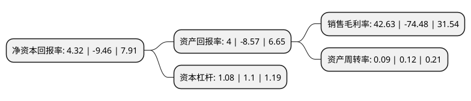

> 本页面由自动化程序生成于 2022年5月20日 01:07
> 内容可能存在错误，如有bug请提交issue至：https://github.com/Eroleice/doc-pi/issues
{.is-warning}

# 上市公司基本情况

## 基本资料

上海二三四五网络控股集团股份有限公司（以下简称“二三四五”）成立于1989年04月07日，上海市。于2007年12月12日在深交所中小板上市。

二三四五注册资本572,484.766万元，主要产品:2345浏览器，2345网址导航，2345好压等。主营业务:互联网信息服务业务，互联网金融服务业务。以下是详细信息：

- 公司名称: 上海二三四五网络控股集团股份有限公司
- 股票代码: 002195.SZ
- 所在地: 上海 - 上海市
- 成立日期: 1989年04月07日
- 注册资本: 572,484.766万元
- 法定代表人: 陈于冰
- 主营业务: 主要产品:2345浏览器，2345网址导航，2345好压等主营业务:互联网信息服务业务，互联网金融服务业务
- 公司官网: www.2345.net
- 公司介绍: 公司始终秉承“新科技改变生活”的宗旨，积极践行“互联网+金融创新”战略，凭借强大的“互联网上网入口平台”及推广优势，多年的金融软件研发及互联网运营经验，海量、精准的互联网流量资源，结合大数据分析、云计算、人工智能、区块链等新兴技术，经过多年的深耕与发展，公司已建立了面向未来的、多元化的互联网产品体系，成长潜力巨大。公司推出了具有接收用户行为数据、发布生态任务、CDN加速、云存储、分布式处理、分布式数据挖掘等云计算功能的智能终端硬件产品“章鱼星球”。公司在互联网金融领域继续致力于打造连接金融机构与小微企业及个人的金融科技平台，立足于互联网和上市公司平台的优势，积极积累人才、牌照和资金，已形成汽车消费金融、个人消费金融、商业金融三大业务方向，推出了较为完善的产品线。

## 股东及高管情况

上市公司第一大股东为韩猛，持股393,523,936股，占比6.87%，**疑似为**上市公司实际控制人。

截至2022年03月31日，上市公司的前十大股东中，共有6名自然人股东，2名机构股东，1个产品账户，1个海外主体，其中5%以上大股东共有1名。上市公司前十大股东明细如下：

> 未能通过持股比例判定出上市公司实际控制人（持股30%以上）
> 可能存在通过间接持股、联合持股、协议控制等方式拥有实际控制权的主体，具体请参考上市公司定期公告！
{.is-warning}

> 上市公司第一大股东持股不超过10%，请检查是否存在公司控制权风险！
{.is-danger}

> 截至2022年03月31日，上市公司前十大股东信息如下：

| 股东名称 | 持股数量（股） | 持股比例 |
| --- | --- | --- |
| 韩猛 | 393,523,936 | 6.87% |
| 张淑霞 | 160,400,498 | 2.8% |
| 陈于冰 | 88,898,039 | 1.55% |
| 曲水信佳科技有限公司 | 58,186,013 | 1.02% |
| 香港中央结算有限公司(陆股通) | 48,488,968 | 0.85% |
| 王细林 | 40,133,300 | 0.7% |
| 浙富控股集团股份有限公司 | 39,967,600 | 0.7% |
| 中国农业银行股份有限公司-中证500交易型开放式指数证券投资基金 | 27,231,626 | 0.48% |
| 邱伟波 | 13,388,800 | 0.23% |
| 张方正 | 13,378,100 | 0.23% |

## 利润表分析

上市公司2021年总收入为9.32亿元，净利润为3.97亿元，实现盈利。

## 杜邦分析

> 数据列示周期：2021年 | 2020年 | 2019年
{.is-info}

上市公司的净资产收益率在近一年有所下降，下降幅度为-145.67%，其变化情况分解如下：
- 上市公司的销售毛利率在近一年下降了-157.24%，可能是生产效率的下降、商品原材料价格上涨或商品价格的下跌所致。
- 上市公司的资产周转率在近一年下降了-25%，可能是源自于更慢的销售回款或库存管理效果下降。
- 上市公司的财务杠杆比率在近一年下降了-1.82%，可能是减少负债降低财务费用。

