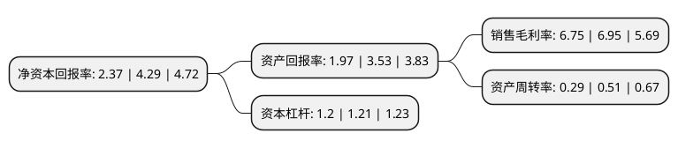

> 本页面由自动化程序生成于 2022年5月20日 01:07
> 内容可能存在错误，如有bug请提交issue至：https://github.com/Eroleice/doc-pi/issues
{.is-warning}

# 上市公司基本情况

## 基本资料

天融信科技集团股份有限公司（以下简称“天融信”）成立于1985年08月30日，汕头市。于2008年02月01日在深交所中小板上市。

天融信注册资本118,581.315万元，主要从事电力电缆，网络安全业务以下是详细信息：

- 公司名称: 天融信科技集团股份有限公司
- 股票代码: 002212.SZ
- 所在地: 广东 - 汕头市
- 成立日期: 1985年08月30日
- 注册资本: 118,581.315万元
- 法定代表人: 李雪莹
- 主营业务: 主要从事电力电缆，网络安全业务
- 公司官网: www.topsec.com.cn
- 公司介绍: 公司创始于1995年，是国内首家网络安全企业，亲历中国网络安全产业的发展历程，如今已从中国第一台自主研发防火墙的缔造者成长为中国领先的网络安全、大数据与云服务提供商。天融信始终以捍卫国家网络空间安全为己任，创新超越，致力于成为民族安全产业的领导者、领先安全技术的创造者和数字时代安全的赋能者。

## 股东及高管情况

上市公司第一大股东为郑钟南，持股84,301,969股，占比7.11%，**疑似为**上市公司实际控制人。

截至2022年03月31日，上市公司的前十大股东中，共有2名自然人股东，4名机构股东，3个产品账户，1个海外主体，其中5%以上大股东共有3名。上市公司前十大股东明细如下：

> 未能通过持股比例判定出上市公司实际控制人（持股30%以上）
> 可能存在通过间接持股、联合持股、协议控制等方式拥有实际控制权的主体，具体请参考上市公司定期公告！
{.is-warning}

> 上市公司第一大股东持股不超过10%，请检查是否存在公司控制权风险！
{.is-danger}

> 截至2022年03月31日，上市公司前十大股东信息如下：

| 股东名称 | 持股数量（股） | 持股比例 |
| --- | --- | --- |
| 郑钟南 | 84,301,969 | 7.11% |
| 香港中央结算有限公司(陆股通) | 79,313,571 | 6.69% |
| 明泰汇金资本投资有限公司 | 74,000,997 | 6.24% |
| 中电科(天津)网络信息科技合伙企业(有限合伙) | 58,000,000 | 4.89% |
| 招商银行股份有限公司-睿远成长价值混合型证券投资基金 | 30,838,746 | 2.6% |
| 章征宇 | 23,296,179 | 1.96% |
| 林芝腾讯科技有限公司 | 23,000,000 | 1.94% |
| 申万宏源证券有限公司 | 17,755,766 | 1.5% |
| 前海开源基金-广发银行-前海开源华佳源鑫资产管理计划 | 11,614,283 | 0.98% |
| 中国工商银行股份有限公司-财通资管价值成长混合型证券投资基金 | 10,560,932 | 0.89% |

## 利润表分析

上市公司2021年总收入为33.51亿元，净利润为2.26亿元，实现盈利。

## 杜邦分析

> 数据列示周期：2021年 | 2020年 | 2019年
{.is-info}

上市公司的净资产收益率在近一年有所下降，下降幅度为-44.76%，其变化情况分解如下：
- 上市公司的销售毛利率在近一年下降了-2.88%，可能是生产效率的下降、商品原材料价格上涨或商品价格的下跌所致。
- 上市公司的资产周转率在近一年下降了-43.14%，可能是源自于更慢的销售回款或库存管理效果下降。
- 上市公司的财务杠杆比率在近一年下降了-0.83%，可能是减少负债降低财务费用。

