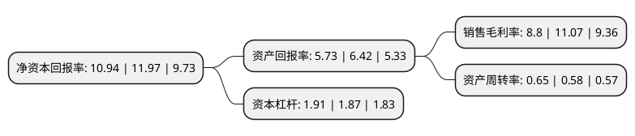

> 本页面由自动化程序生成于 2022年5月20日 01:07
> 内容可能存在错误，如有bug请提交issue至：https://github.com/Eroleice/doc-pi/issues
{.is-warning}

# 上市公司基本情况

## 基本资料

科大讯飞股份有限公司（以下简称“科大讯飞”）成立于1999年12月30日，合肥市。于2008年05月12日在深交所中小板上市。

科大讯飞注册资本232,432.525万元，主要产品:语音支撑软件，音应用软件(行业应用产品/系统)。主营业务:人工智能技术研究，软件及芯片产品开发，知识服务。以下是详细信息：

- 公司名称: 科大讯飞股份有限公司
- 股票代码: 002230.SZ
- 所在地: 安徽 - 合肥市
- 成立日期: 1999年12月30日
- 注册资本: 232,432.525万元
- 法定代表人: 刘庆峰
- 主营业务: 主要产品:语音支撑软件，音应用软件(行业应用产品/系统)主营业务:人工智能技术研究，软件及芯片产品开发，知识服务
- 公司官网: www.iflytek.com
- 公司介绍: 公司是一家专业从事智能语音及语言技术研究、软件及芯片产品开发、语音信息服务及电子政务系统集成的国家级骨干软件企业。是我国众多软件企业中为数极少掌握核心技术并拥有自主知识产权的企业之一，其语音合成核心技术代表了世界的最高水平。公司承建有首批国家新一代人工智能开放创新平台(智能语音国家人工智能开放创新平台)、语音及语言信息处理国家工程实验室以及我国在人工智能高级阶段——认知智能领域的首个国家级重点实验室等国家级重要平台。

## 股东及高管情况

上市公司第一大股东为中国移动通信有限公司，持股247,714,216股，占比10.66%，**疑似为**上市公司实际控制人。

截至2022年03月31日，上市公司的前十大股东中，共有6名自然人股东，3名机构股东，1个海外主体，其中5%以上大股东共有2名。上市公司前十大股东明细如下：

> 未能通过持股比例判定出上市公司实际控制人（持股30%以上）
> 可能存在通过间接持股、联合持股、协议控制等方式拥有实际控制权的主体，具体请参考上市公司定期公告！
{.is-warning}

> 截至2022年03月31日，上市公司前十大股东信息如下：

| 股东名称 | 持股数量（股） | 持股比例 |
| --- | --- | --- |
| 中国移动通信有限公司 | 247,714,216 | 10.66% |
| 刘庆峰 | 168,253,267 | 7.24% |
| 香港中央结算有限公司(陆股通) | 107,751,676 | 4.64% |
| 中科大资产经营有限责任公司 | 83,497,837 | 3.59% |
| 安徽言知科技有限公司 | 57,291,611 | 2.46% |
| 张炜 | 51,538,800 | 2.22% |
| 王萍 | 46,733,956 | 2.01% |
| 葛卫东 | 36,500,000 | 1.57% |
| 王仁华 | 27,781,102 | 1.2% |
| 吴晓如 | 18,033,790 | 0.78% |

## 杜邦分析

> 数据列示周期：2021年 | 2020年 | 2019年
{.is-info}

上市公司的净资产收益率在近一年有所下降，下降幅度为-8.6%，其变化情况分解如下：
- 上市公司的销售毛利率在近一年下降了-20.51%，可能是生产效率的下降、商品原材料价格上涨或商品价格的下跌所致。
- 上市公司的资产周转率在近一年上升了12.07%，可能是源自于更快的销售回款或库存管理效果提升。
- 上市公司的财务杠杆比率在近一年上升了2.14%，可能是增加负债扩大生产规模。

