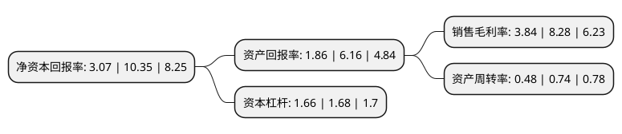

> 本页面由自动化程序生成于 2022年5月20日 01:07
> 内容可能存在错误，如有bug请提交issue至：https://github.com/Eroleice/doc-pi/issues
{.is-warning}

# 上市公司基本情况

## 基本资料

启明信息技术股份有限公司（以下简称“启明信息”）成立于2000年10月25日，长春市。于2008年05月09日在深交所中小板上市。

启明信息注册资本40,854.846万元，主要产品:企业资源计划管理系统(ERP)，产品数据管理系统(PDM)，制造执行系统(MES)，办公协同系统(OA)，销售管理系统(TDS)等。主营业务:汽车业管理软件和汽车电子产品。以下是详细信息：

- 公司名称: 启明信息技术股份有限公司
- 股票代码: 002232.SZ
- 所在地: 吉林 - 长春市
- 成立日期: 2000年10月25日
- 注册资本: 40,854.846万元
- 法定代表人: 许万才
- 主营业务: 主要产品:企业资源计划管理系统(ERP)，产品数据管理系统(PDM)，制造执行系统(MES)，办公协同系统(OA)，销售管理系统(TDS)等主营业务:汽车业管理软件和汽车电子产品
- 公司官网: www.qm.cn
- 公司介绍: 公司业务的核心是具有自主知识产权的汽车业管理软件和汽车电子产品，同时也是公司发展的基础。目前公司的汽车业管理软件解决方案已经涵盖汽车产业链，主要核心产品包括企业资源计划管理系统(ERP)、产品数据管理系统(PDM)、制造执行系统(MES)、办公协同系统(OA)、销售管理系统(TDS)等，其中启明ERP和启明cPDM已达到国内领先水平，成为行业主导软件产品。

## 股东及高管情况

上市公司第一大股东为中国第一汽车集团有限公司，持股198,854,344股，占比48.67%，为上市公司实际控制人。

截至2022年03月31日，上市公司的前十大股东中，共有6名自然人股东，3名机构股东，1个产品账户，其中5%以上大股东共有2名。上市公司前十大股东明细如下：

> 截至2022年03月31日，上市公司前十大股东信息如下：

| 股东名称 | 持股数量（股） | 持股比例 |
| --- | --- | --- |
| 中国第一汽车集团有限公司 | 198,854,344 | 48.67% |
| 长春净月高新技术产业开发区智慧城市建设发展有限公司 | 28,785,379 | 7.05% |
| 莫寒劼 | 1,045,600 | 0.26% |
| 张利明 | 639,800 | 0.16% |
| 领航投资澳洲有限公司-领航新兴市场股指基金(交易所) | 534,874 | 0.13% |
| 中信证券股份有限公司 | 522,367 | 0.13% |
| 勾玉森 | 511,000 | 0.13% |
| 胡裕生 | 492,700 | 0.12% |
| 陈晓青 | 489,400 | 0.12% |
| 唐宗兵 | 486,900 | 0.12% |

## 利润表分析

上市公司2021年总收入为10.51亿元，净利润为0.4亿元，实现盈利。

## 杜邦分析

> 数据列示周期：2021年 | 2020年 | 2019年
{.is-info}

上市公司的净资产收益率在近一年有所下降，下降幅度为-70.34%，其变化情况分解如下：
- 上市公司的销售毛利率在近一年下降了-53.62%，可能是生产效率的下降、商品原材料价格上涨或商品价格的下跌所致。
- 上市公司的资产周转率在近一年下降了-35.14%，可能是源自于更慢的销售回款或库存管理效果下降。
- 上市公司的财务杠杆比率在近一年下降了-1.19%，可能是减少负债降低财务费用。

