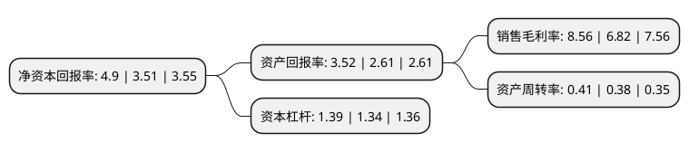

> 本页面由自动化程序生成于 2022年5月20日 01:07
> 内容可能存在错误，如有bug请提交issue至：https://github.com/Eroleice/doc-pi/issues
{.is-warning}

# 上市公司基本情况

## 基本资料

成都卫士通信息产业股份有限公司（以下简称“卫士通”）成立于1998年04月23日，成都市。于2008年08月11日在深交所中小板上市。

卫士通注册资本84,629.46万元，主要产品:密码产品，信息安全产品，安全信息系统三大信息安全产品体系。主营业务:信息安全领域的技术研究及产品开发。以下是详细信息：

- 公司名称: 成都卫士通信息产业股份有限公司
- 股票代码: 002268.SZ
- 所在地: 四川 - 成都市
- 成立日期: 1998年04月23日
- 注册资本: 84,629.46万元
- 法定代表人: 陈鑫
- 主营业务: 主要产品:密码产品，信息安全产品，安全信息系统三大信息安全产品体系主营业务:信息安全领域的技术研究及产品开发
- 公司官网: www.westone.com.cn
- 公司介绍: 公司是国内知名密码产品、网络安全产品、互联网安全运营、行业安全解决方案综合提供商，首批商密产品研发、生产、销售资质单位，首批涉密信息系统集成甲级资质单位，国内专业从事网络信息安全的上市公司，专注网络信息安全，致力打造从芯片到系统的全生命周期安全解决方案，为党政军用户、企业级用户和消费者提供专业自主的网络信息安全解决方案、产品和服务。公司自成立以来一直致力于信息安全领域的技术研究及产品开发，公司从密码技术应用持续拓展，已形成密码产品、信息安全产品、安全信息系统三大信息安全产品体系，同时，基于ISSE体系框架，为党政、央企、能源、金融等用户提供以“安全咨询、风险评估、运维与应急响应”为主要内容的信息系统全生命周期的安全集成与运营服务。

## 股东及高管情况

上市公司第一大股东为中国电子科技网络信息安全有限公司，持股278,750,040股，占比32.94%，为上市公司实际控制人。

截至2022年03月31日，上市公司的前十大股东中，共有2名自然人股东，3名机构股东，4个产品账户，1个海外主体，其中5%以上大股东共有1名。上市公司前十大股东明细如下：

> 截至2022年03月31日，上市公司前十大股东信息如下：

| 股东名称 | 持股数量（股） | 持股比例 |
| --- | --- | --- |
| 中国电子科技网络信息安全有限公司 | 278,750,040 | 32.94% |
| 香港中央结算有限公司(陆股通) | 31,562,446 | 3.73% |
| 中电科投资控股有限公司 | 25,985,229 | 3.07% |
| 皮敏蓉 | 25,300,171 | 2.99% |
| 中国工商银行股份有限公司-诺安成长混合型证券投资基金 | 19,689,777 | 2.33% |
| 梁艾 | 13,363,876 | 1.58% |
| 华融瑞通股权投资管理有限公司 | 11,392,040 | 1.35% |
| 中国建设银行股份有限公司-中欧悦享生活混合型证券投资基金 | 8,753,881 | 1.03% |
| 太平人寿保险有限公司-传统-普通保险产品-022L-CT001深 | 8,159,755 | 0.96% |
| 交通银行股份有限公司-诺安和鑫保本混合型证券投资基金 | 7,517,282 | 0.89% |

## 利润表分析

上市公司2021年总收入为27.88亿元，净利润为2.38亿元，实现盈利。

## 杜邦分析

> 数据列示周期：2021年 | 2020年 | 2019年
{.is-info}

上市公司的净资产收益率在近一年有所上升，上升幅度为39.6%，其变化情况分解如下：
- 上市公司的销售毛利率在近一年上升了25.51%，可能是生产效率的提升、商品原材料价格下跌或商品价格的上涨所致。
- 上市公司的资产周转率在近一年上升了7.89%，可能是源自于更快的销售回款或库存管理效果提升。
- 上市公司的财务杠杆比率在近一年上升了3.73%，可能是增加负债扩大生产规模。

