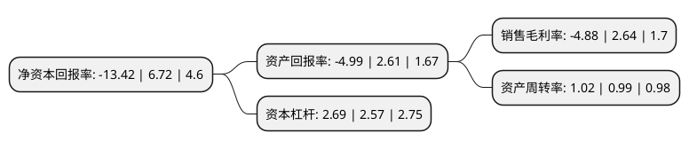

> 本页面由自动化程序生成于 2022年5月20日 01:07
> 内容可能存在错误，如有bug请提交issue至：https://github.com/Eroleice/doc-pi/issues
{.is-warning}

# 上市公司基本情况

## 基本资料

北京久其软件股份有限公司（以下简称“久其软件”）成立于1999年08月16日，北京市。于2009年08月11日在深交所中小板上市。

久其软件注册资本71,054.803万元，主要产品:管理软件和数字传播。主营业务:管理软件(电子政务和集团管控)和数字传播两大业务板块。以下是详细信息：

- 公司名称: 北京久其软件股份有限公司
- 股票代码: 002279.SZ
- 所在地: 北京 - 北京市
- 成立日期: 1999年08月16日
- 注册资本: 71,054.803万元
- 法定代表人: 赵福君
- 主营业务: 主要产品:管理软件和数字传播主营业务:管理软件(电子政务和集团管控)和数字传播两大业务板块
- 公司官网: www.jiuqi.com.cn
- 公司介绍: 公司主营业务包括管理软件(电子政务和集团管控)和数字传播两大业务板块，公司以大数据战略为指引，管理软件和数字传播业务双轮驱动，围绕业务咨询、产品技术和解决方案，全面提升B2B2C的大数据综合服务能力，构建面向政企客户的大数据生态体系，综合竞争力得以巩固和提升，经营业绩稳步增长。公司连续多年被认定为“国家规划布局内重点软件企业”，并荣获“中国大数据企业50强”(2016-2018)、“北京软件和信息服务业综合实力百强企业”(2016-2018)、“中国软件和信息服务业十大领军企业”(2016、2017)、“2018中国软件和信息技术服务综合竞争力百强”、“2017中国大数据财政领域大数据最佳解决方案”、“2017中国大数据十佳解决方案(财政大数据解决方案)”等荣誉。

## 股东及高管情况

上市公司第一大股东为北京久其科技投资有限公司，持股97,301,009股，占比13.69%，**疑似为**上市公司实际控制人。

截至2022年03月31日，上市公司的前十大股东中，共有8名自然人股东，2名机构股东，其中5%以上大股东共有3名。上市公司前十大股东明细如下：

> 未能通过持股比例判定出上市公司实际控制人（持股30%以上）
> 可能存在通过间接持股、联合持股、协议控制等方式拥有实际控制权的主体，具体请参考上市公司定期公告！
{.is-warning}

> 截至2022年03月31日，上市公司前十大股东信息如下：

| 股东名称 | 持股数量（股） | 持股比例 |
| --- | --- | --- |
| 北京久其科技投资有限公司 | 97,301,009 | 13.69% |
| 赵福君 | 78,265,507 | 11.01% |
| 董泰湘 | 47,555,062 | 6.69% |
| 欧阳曜 | 17,783,301 | 2.5% |
| 栗军 | 6,327,026 | 0.89% |
| 北京红螺食品有限公司 | 4,776,455 | 0.67% |
| 刘家豪 | 4,210,000 | 0.59% |
| 施瑞丰 | 3,542,932 | 0.5% |
| 熊科 | 3,300,000 | 0.46% |
| 李勇 | 2,885,306 | 0.41% |

## 利润表分析

上市公司2021年总收入为27.08亿元，净利润为-1.33亿元，**未实现盈利**。

## 杜邦分析

> 数据列示周期：2021年 | 2020年 | 2019年
{.is-info}

上市公司的净资产收益率在近一年有所下降，下降幅度为-299.7%，其变化情况分解如下：
- 上市公司的销售毛利率在近一年下降了-284.85%，可能是生产效率的下降、商品原材料价格上涨或商品价格的下跌所致。
- 上市公司的资产周转率在近一年上升了3.03%，可能是源自于更快的销售回款或库存管理效果提升。
- 上市公司的财务杠杆比率在近一年上升了4.67%，可能是增加负债扩大生产规模。

