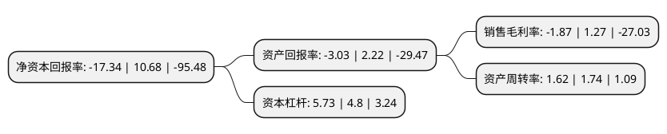

> 本页面由自动化程序生成于 2022年5月20日 01:07
> 内容可能存在错误，如有bug请提交issue至：https://github.com/Eroleice/doc-pi/issues
{.is-warning}

# 上市公司基本情况

## 基本资料

杭州联络互动信息科技股份有限公司（以下简称“联络互动”）成立于2002年07月04日，杭州市。于2009年08月21日在深交所中小板上市。

联络互动注册资本217,714.968万元，主营业务为电商，文化传媒，互联网金融，智能硬件，联络产业整合投资业务等。以下是详细信息：

- 公司名称: 杭州联络互动信息科技股份有限公司
- 股票代码: 002280.SZ
- 所在地: 浙江 - 杭州市
- 成立日期: 2002年07月04日
- 注册资本: 217,714.968万元
- 法定代表人: 何志涛
- 主营业务: 主营业务为电商，文化传媒，互联网金融，智能硬件，联络产业整合投资业务等
- 公司官网: www.lianluo.com
- 公司介绍: 公司原是一家专业从事计算机系统集成和应用软件开发的高科技公司，主要面向电力、烟草等重点行业客户。2014年公司进行重大资产重组，主营业务由原来的计算机系统集成和应用软件开发与销售、系统集成及技术支持与服务变更为移动终端操作系统、中间件平台及相关应用的研发与运营。公司曾入选国家发展改革委、工业和信息化部、商务部、国家税务总局联合审核的国家规划布局内重点软件企业。信息产业部“国家计算机系统集成壹级资质”企业、国家保密局“涉及国家秘密计算机信息系统集成乙级资质”企业。2017年，公司完成了收购Newegg、会找房、三尚传媒，完成中国数码文化集团的可转债认购、增持迪岸双赢28%股权，通过产业整合和升级，成功完成了智能硬件、电商、传媒、金融的板块布局，形成了相互协同发展的综合产业布局。

## 股东及高管情况

上市公司第一大股东为何志涛，持股384,355,987股，占比17.66%，**疑似为**上市公司实际控制人。

截至2022年03月31日，上市公司的前十大股东中，共有7名自然人股东，1名机构股东，1个产品账户，1个海外主体，其中5%以上大股东共有1名。上市公司前十大股东明细如下：

> 未能通过持股比例判定出上市公司实际控制人（持股30%以上）
> 可能存在通过间接持股、联合持股、协议控制等方式拥有实际控制权的主体，具体请参考上市公司定期公告！
{.is-warning}

> 截至2022年03月31日，上市公司前十大股东信息如下：

| 股东名称 | 持股数量（股） | 持股比例 |
| --- | --- | --- |
| 何志涛 | 384,355,987 | 17.66% |
| 王一遴 | 91,941,861 | 4.22% |
| 深圳中植产投并购投资合伙企业(有限合伙) | 66,766,977 | 3.07% |
| 上海磐耀资产管理有限公司-磐耀源岳定制1号私募证券投资基金 | 29,811,341 | 1.37% |
| E.T.XUN(Hong Kong) Holding Limited | 19,191,008 | 0.88% |
| 陈理 | 17,296,136 | 0.79% |
| 钱佳苗 | 10,900,236 | 0.5% |
| 滕学军 | 9,762,724 | 0.45% |
| 阮菊珍 | 9,023,500 | 0.41% |
| 高雁峰 | 9,000,031 | 0.41% |

## 杜邦分析

> 数据列示周期：2021年 | 2020年 | 2019年
{.is-info}

上市公司的净资产收益率在近一年有所下降，下降幅度为-262.36%，其变化情况分解如下：
- 上市公司的销售毛利率在近一年下降了-247.24%，可能是生产效率的下降、商品原材料价格上涨或商品价格的下跌所致。
- 上市公司的资产周转率在近一年下降了-6.9%，可能是源自于更慢的销售回款或库存管理效果下降。
- 上市公司的财务杠杆比率在近一年上升了19.38%，可能是增加负债扩大生产规模。

