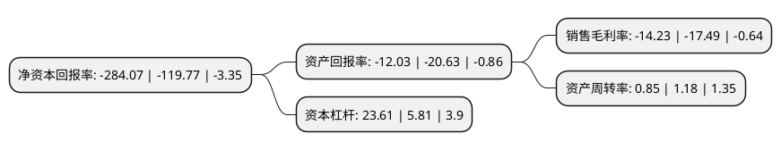

> 本页面由自动化程序生成于 2022年5月20日 01:08
> 内容可能存在错误，如有bug请提交issue至：https://github.com/Eroleice/doc-pi/issues
{.is-warning}

# 上市公司基本情况

## 基本资料

深圳亚联发展科技股份有限公司（以下简称“*ST亚联”）成立于1999年03月04日，深圳市。于2009年12月09日在深交所中小板上市。

*ST亚联注册资本39,312万元，主要产品:专网通信技术相关软硬件产品，第三方支付业务，大数据业务，金融业务。主营业务:专网通信技术解决方案业务板块，金融科技业务板块。以下是详细信息：

- 公司名称: 深圳亚联发展科技股份有限公司
- 股票代码: 002316.SZ
- 所在地: 广东 - 深圳市
- 成立日期: 1999年03月04日
- 注册资本: 39,312万元
- 法定代表人: 王永彬
- 主营业务: 主要产品:专网通信技术相关软硬件产品，第三方支付业务，大数据业务，金融业务主营业务:专网通信技术解决方案业务板块，金融科技业务板块
- 公司官网: www.asialink.com
- 公司介绍: 公司成立于1999年，2009年在深圳证券交易所上市，系国家高新技术企业。自完成对开店宝科技集团有限公司45%股权收购以来，金融科技业务对公司收入和利润的支撑优势地位明显。在金融科技领域，公司积极投身智慧化浪潮，以第三方支付为切入，综合运用科技能力、大数据能力、资源匹配能力和数字化运营能力，为中小微商户的智慧经营进行多维度赋能，推动“上云用数赋智”产业政策的落地，助力于数字化生态的实现。对于深耕二十余年的专网通信业务，公司通过不断将通信信息领域先进技术成果引入专网通信领域，致力于促进其所服务行业“智慧化”水平的提升。

## 股东及高管情况

上市公司第一大股东为大连永利商务发展有限公司，持股52,260,000股，占比13.29%，**疑似为**上市公司实际控制人。

截至2022年03月31日，上市公司的前十大股东中，共有7名自然人股东，3名机构股东，其中5%以上大股东共有4名。上市公司前十大股东明细如下：

> 未能通过持股比例判定出上市公司实际控制人（持股30%以上）
> 可能存在通过间接持股、联合持股、协议控制等方式拥有实际控制权的主体，具体请参考上市公司定期公告！
{.is-warning}

> 截至2022年03月31日，上市公司前十大股东信息如下：

| 股东名称 | 持股数量（股） | 持股比例 |
| --- | --- | --- |
| 大连永利商务发展有限公司 | 52,260,000 | 13.29% |
| 嘉兴乾德精一投资合伙企业(有限合伙) | 25,740,000 | 6.55% |
| 键桥通讯技术有限公司 | 23,990,806 | 6.1% |
| 黄喜胜 | 23,192,910 | 5.9% |
| 王雁铭 | 6,300,624 | 1.6% |
| 叶春华 | 5,990,456 | 1.52% |
| 陈南京 | 3,494,100 | 0.89% |
| 胡兰 | 2,621,871 | 0.67% |
| 张振宇 | 2,000,600 | 0.51% |
| 徐凌云 | 1,800,000 | 0.46% |

## 利润表分析

上市公司2021年总收入为19.33亿元，净利润为-2.76亿元，**未实现盈利**。

## 杜邦分析

> 数据列示周期：2021年 | 2020年 | 2019年
{.is-info}

上市公司的净资产收益率在近一年有所上升，上升幅度为137.18%，其变化情况分解如下：
- 上市公司的销售毛利率在近一年下降了-18.64%，可能是生产效率的下降、商品原材料价格上涨或商品价格的下跌所致。
- 上市公司的资产周转率在近一年下降了-27.97%，可能是源自于更慢的销售回款或库存管理效果下降。
- 上市公司的财务杠杆比率在近一年上升了306.37%，可能是增加负债扩大生产规模。

