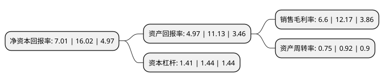

> 本页面由自动化程序生成于 2022年5月20日 01:08
> 内容可能存在错误，如有bug请提交issue至：https://github.com/Eroleice/doc-pi/issues
{.is-warning}

# 上市公司基本情况

## 基本资料

汉王科技股份有限公司（以下简称“汉王科技”）成立于1998年09月11日，北京市。于2010年03月03日在深交所中小板上市。

汉王科技注册资本24,445.465万元，从事“以模式识别为核心的智能人机交互”领域的产品(服务)开发及销售。主要产品和服务为:手写产品，OCR产品，技术授权，基于信息采集行业应用类产品，电纸书，人脸识别产品。以下是详细信息：

- 公司名称: 汉王科技股份有限公司
- 股票代码: 002362.SZ
- 所在地: 北京 - 北京市
- 成立日期: 1998年09月11日
- 注册资本: 24,445.465万元
- 法定代表人: 刘迎建
- 主营业务: 从事“以模式识别为核心的智能人机交互”领域的产品(服务)开发及销售主要产品和服务为:手写产品，OCR产品，技术授权，基于信息采集行业应用类产品，电纸书，人脸识别产品
- 公司官网: www.hanwang.com.cn
- 公司介绍: 公司是国内人工智能产业的先行者，是人脸识别、大数据、智能交互技术、产品及服务的提供商。公司以核心技术为基础，面向市场需求，已形成了以识别技术为核心的、针对不同细分市场的软硬件产品系列，既有通用产品，如e典笔、汉王电纸书、汉王笔、文本王、名片通、绘图板等，也有针对教育、金融等行业应用的文表识别解决方案；既有手写手机、OCR等多种技术授权方案，也有辅助方案实施的硬件产品，如证照识别等。公司是全球文字识别技术与智能交互产品引领者，多年来，通过不断自主创新，在手写识别、光学字符识别(OCR)、笔迹输入等领域拥有多项具有自主知识产权的核心技术，综合技术水平在国内外均处于领先地位，手写汉字识别获得国家科技进步一等奖，OCR获得国家科技进步二等奖。

## 股东及高管情况

上市公司第一大股东为刘迎建，持股48,030,838股，占比19.65%，**疑似为**上市公司实际控制人。

截至2022年03月31日，上市公司的前十大股东中，共有5名自然人股东，4名机构股东，1名其他股东，其中5%以上大股东共有3名。上市公司前十大股东明细如下：

> 未能通过持股比例判定出上市公司实际控制人（持股30%以上）
> 可能存在通过间接持股、联合持股、协议控制等方式拥有实际控制权的主体，具体请参考上市公司定期公告！
{.is-warning}

> 截至2022年03月31日，上市公司前十大股东信息如下：

| 股东名称 | 持股数量（股） | 持股比例 |
| --- | --- | --- |
| 刘迎建 | 48,030,838 | 19.65% |
| 徐冬青 | 18,536,874 | 7.58% |
| 中国科学院自动化研究所 | 12,611,564 | 5.16% |
| 河南黄河计算机系统有限公司 | 8,200,675 | 3.35% |
| 同方投资有限公司 | 4,873,926 | 1.99% |
| 邢映红 | 2,726,115 | 1.12% |
| 陆歆 | 1,569,700 | 0.64% |
| 巨能资本管理有限公司 | 1,447,178 | 0.59% |
| 杜运志 | 980,000 | 0.4% |
| 盛景云(天津)互联网信息服务有限公司 | 850,000 | 0.35% |

## 利润表分析

上市公司2021年总收入为16.13亿元，净利润为1.06亿元，实现盈利。

## 杜邦分析

> 数据列示周期：2021年 | 2020年 | 2019年
{.is-info}

上市公司的净资产收益率在近一年有所下降，下降幅度为-56.24%，其变化情况分解如下：
- 上市公司的销售毛利率在近一年下降了-45.77%，可能是生产效率的下降、商品原材料价格上涨或商品价格的下跌所致。
- 上市公司的资产周转率在近一年下降了-18.48%，可能是源自于更慢的销售回款或库存管理效果下降。
- 上市公司的财务杠杆比率在近一年下降了-2.08%，可能是减少负债降低财务费用。

