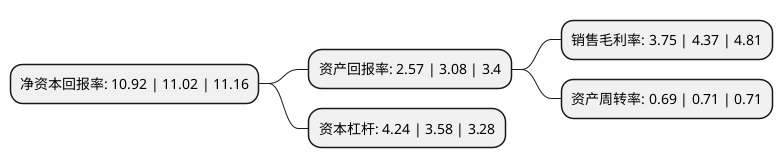

> 本页面由自动化程序生成于 2022年5月20日 01:08
> 内容可能存在错误，如有bug请提交issue至：https://github.com/Eroleice/doc-pi/issues
{.is-warning}

# 上市公司基本情况

## 基本资料

太极计算机股份有限公司（以下简称“太极股份”）成立于1987年10月10日，北京市。于2010年03月12日在深交所中小板上市。

太极股份注册资本57,965.994万元，主要产品:1，行业解决方案与服务，2，IT咨询，3，IT产品增值服务。主营业务:云服务，网络安全服务，智慧应用与服务和系统集成服务。以下是详细信息：

- 公司名称: 太极计算机股份有限公司
- 股票代码: 002368.SZ
- 所在地: 北京 - 北京市
- 成立日期: 1987年10月10日
- 注册资本: 57,965.994万元
- 法定代表人: 肖益
- 主营业务: 主要产品:1，行业解决方案与服务，2，IT咨询，3，IT产品增值服务主营业务:云服务，网络安全服务，智慧应用与服务和系统集成服务
- 公司官网: www.taiji.com.cn
- 公司介绍: 公司是国内电子政务、智慧城市和重要行业信息化的领先企业。公司主营业务为面向党政、国防、公共安全、能源、交通等行业提供安全可靠信息系统建设和云计算、大数据等相关服务，涵盖信息基础设施、业务应用、云和大数据服务、网络信息安全等综合信息技术服务。近年来，随着业务转型，公司逐步形成了新的业务结构，主要包括：云服务、网络安全服务、智慧应用与服务和系统集成服务。公司是国家科技部和中关村科技园区创新试点示范单位，连续多年被认定为国家规划布局内重点软件企业和全国软件产业收入前百家企业。

## 股东及高管情况

上市公司第一大股东为中电太极(集团)有限公司，持股178,320,355股，占比30.76%，为上市公司实际控制人。

截至2022年03月31日，上市公司的前十大股东中，共有4名自然人股东，3名机构股东，2个产品账户，1个海外主体，其中5%以上大股东共有2名。上市公司前十大股东明细如下：

> 截至2022年03月31日，上市公司前十大股东信息如下：

| 股东名称 | 持股数量（股） | 持股比例 |
| --- | --- | --- |
| 中电太极(集团)有限公司 | 178,320,355 | 30.76% |
| 华北计算技术研究所(中国电子科技集团公司第十五研究所) | 33,340,738 | 5.75% |
| 中电科投资控股有限公司 | 13,510,282 | 2.33% |
| 香港中央结算有限公司(陆股通) | 9,762,348 | 1.68% |
| 姜晓丹 | 8,393,148 | 1.45% |
| 全国社保基金四一三组合 | 8,279,960 | 1.43% |
| 黄崇付 | 7,454,979 | 1.29% |
| 南方基金稳健增值混合型养老金产品-招商银行股份有限公司 | 5,196,101 | 0.9% |
| 李萍 | 4,703,000 | 0.81% |
| 刘峥 | 2,203,386 | 0.38% |

## 利润表分析

上市公司2021年总收入为105.04亿元，净利润为3.93亿元，实现盈利。

## 杜邦分析

> 数据列示周期：2021年 | 2020年 | 2019年
{.is-info}

上市公司的净资产收益率在近一年有所下降，下降幅度为-0.91%，其变化情况分解如下：
- 上市公司的销售毛利率在近一年下降了-14.19%，可能是生产效率的下降、商品原材料价格上涨或商品价格的下跌所致。
- 上市公司的资产周转率在近一年下降了-2.82%，可能是源自于更慢的销售回款或库存管理效果下降。
- 上市公司的财务杠杆比率在近一年上升了18.44%，可能是增加负债扩大生产规模。

