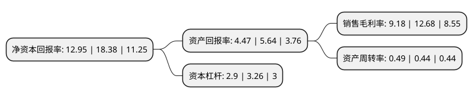

> 本页面由自动化程序生成于 2022年5月20日 01:08
> 内容可能存在错误，如有bug请提交issue至：https://github.com/Eroleice/doc-pi/issues
{.is-warning}

# 上市公司基本情况

## 基本资料

中远海运科技股份有限公司（以下简称“中远海科”）成立于1993年05月19日，上海市。于2010年05月06日在深交所中小板上市。

中远海科注册资本37,209.888万元，主要产品:智能交通，航运信息化，安防工程，港航自动化等领域的业务的产品。主营业务:智能交通，航运信息化，安防工程，港航自动化等领域的业务。以下是详细信息：

- 公司名称: 中远海运科技股份有限公司
- 股票代码: 002401.SZ
- 所在地: 上海 - 上海市
- 成立日期: 1993年05月19日
- 注册资本: 37,209.888万元
- 法定代表人: 梁岩峰
- 主营业务: 主要产品:智能交通，航运信息化，安防工程，港航自动化等领域的业务的产品主营业务:智能交通，航运信息化，安防工程，港航自动化等领域的业务
- 公司官网: tech.coscoshipping.com
- 公司介绍: 公司作为国内智能交通和交通信息化领域的开拓者之一，在智能交通领域专注深耕多年，拥有省级高速公路联网管理中心系统、ETC不停车收费系统、高速公路机电系统、特大隧道和桥梁机电系统以及城市交通管理系统等一系列解决方案，技术实力处于国内同行业领先水平。公司业务遍及全国二十个省、自治区和直辖市，累计承担智能交通系统工程和软件项目近千项，市场占有率位居全国前列。公司是国内航运信息化领域的领军企业，以中国远洋海运集团为强有力的依托，致力于航运业相关应用软件和解决方案的研发工作，为用户提供高质量、多方位、深层次的航运和物流行业解决方案和集成服务。目前，公司在船公司、代理、仓储、码头、船员管理等多个航运信息化领域拥有完整的系统解决方案和成功案例。近年来，公司积极响应国家提出的“互联网+”行动计划，大力实施“互联网+交通”、“互联网+航运”业务模式创新，开发了“易管养”公路管理养护平台和“一海通”、“四海通”航运供应链电商平台，进一步推进公司创新转型发展。

## 股东及高管情况

上市公司第一大股东为上海船舶运输科学研究所有限公司，持股181,984,400股，占比48.91%，为上市公司实际控制人。

截至2022年03月31日，上市公司的前十大股东中，共有9名自然人股东，1名机构股东，其中5%以上大股东共有1名。上市公司前十大股东明细如下：

> 截至2022年03月31日，上市公司前十大股东信息如下：

| 股东名称 | 持股数量（股） | 持股比例 |
| --- | --- | --- |
| 上海船舶运输科学研究所有限公司 | 181,984,400 | 48.91% |
| 张雪勇 | 4,434,380 | 1.19% |
| 杜运志 | 3,240,000 | 0.87% |
| 徐魏 | 2,079,779 | 0.56% |
| 金美玲 | 1,796,606 | 0.48% |
| 周群 | 1,582,150 | 0.43% |
| 冯美娟 | 1,334,460 | 0.36% |
| 蒋振军 | 1,200,000 | 0.32% |
| 梁敏 | 1,178,480 | 0.32% |
| 薄闽生 | 1,131,506 | 0.3% |

## 利润表分析

上市公司2021年总收入为17.06亿元，净利润为1.56亿元，实现盈利。

## 杜邦分析

> 数据列示周期：2021年 | 2020年 | 2019年
{.is-info}

上市公司的净资产收益率在近一年有所下降，下降幅度为-29.54%，其变化情况分解如下：
- 上市公司的销售毛利率在近一年下降了-27.6%，可能是生产效率的下降、商品原材料价格上涨或商品价格的下跌所致。
- 上市公司的资产周转率在近一年上升了11.36%，可能是源自于更快的销售回款或库存管理效果提升。
- 上市公司的财务杠杆比率在近一年下降了-11.04%，可能是减少负债降低财务费用。

