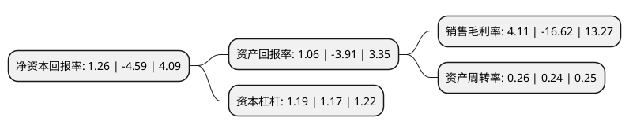

> 本页面由自动化程序生成于 2022年5月20日 01:08
> 内容可能存在错误，如有bug请提交issue至：https://github.com/Eroleice/doc-pi/issues
{.is-warning}

# 上市公司基本情况

## 基本资料

北京四维图新科技股份有限公司（以下简称“四维图新”）成立于2002年12月03日，北京市。于2010年05月18日在深交所中小板上市。

四维图新注册资本237,454.711万元，主要产品:导航电子地图产品。主营业务:导航电子地图产品的研发，生产，销售和服务。以下是详细信息：

- 公司名称: 北京四维图新科技股份有限公司
- 股票代码: 002405.SZ
- 所在地: 北京 - 北京市
- 成立日期: 2002年12月03日
- 注册资本: 237,454.711万元
- 法定代表人: 岳涛
- 主营业务: 主要产品:导航电子地图产品主营业务:导航电子地图产品的研发，生产，销售和服务
- 公司官网: www.navinfo.com
- 公司介绍: 公司是中国领先的导航地图和动态交通信息服务提供商，由国家测绘局创建的唯一专业从事测绘的国家级公司。致力于为主流汽车制造厂商、汽车电子厂商、手机生产商、便携导航设备厂商、移动通信服务商和互联网平台提供专业化、高品质的导航电子地图产品和服务。公司是中国第一、全球第五大导航电子地图厂商，公司产品和服务充分满足了汽车导航、消费电子导航、互联网和移动互联网、政府及企业应用等各行所需。2017年，公司收购杰发科技，杰发科技作为国内汽车电子芯片行业主要代表企业之一，致力于以“中国芯”来促进中国汽车产业的发展由大变强，公司成为目前国内首家面向自动驾驶在高精度地图、算法、芯片几处关键节点布局的企业。

## 股东及高管情况

上市公司第一大股东为中国四维测绘技术有限公司，持股195,278,651股，占比8.22%，**疑似为**上市公司实际控制人。

截至2022年04月29日，上市公司的前十大股东中，共有4名机构股东，5个产品账户，1个海外主体，其中5%以上大股东共有1名。上市公司前十大股东明细如下：

> 未能通过持股比例判定出上市公司实际控制人（持股30%以上）
> 可能存在通过间接持股、联合持股、协议控制等方式拥有实际控制权的主体，具体请参考上市公司定期公告！
{.is-warning}

> 上市公司第一大股东持股不超过10%，请检查是否存在公司控制权风险！
{.is-danger}

> 截至2022年04月29日，上市公司前十大股东信息如下：

| 股东名称 | 持股数量（股） | 持股比例 |
| --- | --- | --- |
| 中国四维测绘技术有限公司 | 195,278,651 | 8.22% |
| 香港中央结算有限公司(陆股通) | 118,603,639 | 4.99% |
| 深圳市腾讯产业投资基金有限公司 | 104,187,090 | 4.39% |
| 北京亦庄国际产业投资管理有限公司-北京屹唐同舟股权投资中心(有限合伙) | 80,000,000 | 3.37% |
| 易方达基金-中央汇金资产管理有限责任公司-易方达基金-汇金资管单一资产管理计划 | 65,180,925 | 2.74% |
| 中国工商银行股份有限公司-前海开源新经济灵活配置混合型证券投资基金 | 45,520,128 | 1.92% |
| 天安财产保险股份有限公司-保赢1号 | 42,693,730 | 1.8% |
| 林芝锦华投资管理有限公司 | 30,846,063 | 1.3% |
| 北京芯动能投资基金(有限合伙) | 28,490,448 | 1.2% |
| 交通银行股份有限公司-汇丰晋信低碳先锋股票型证券投资基金 | 20,003,300 | 0.84% |

## 利润表分析

上市公司2021年总收入为30.6亿元，净利润为1.25亿元，实现盈利。

## 杜邦分析

> 数据列示周期：2021年 | 2020年 | 2019年
{.is-info}

上市公司的净资产收益率在近一年有所下降，下降幅度为-127.45%，其变化情况分解如下：
- 上市公司的销售毛利率在近一年下降了-124.73%，可能是生产效率的下降、商品原材料价格上涨或商品价格的下跌所致。
- 上市公司的资产周转率在近一年上升了8.33%，可能是源自于更快的销售回款或库存管理效果提升。
- 上市公司的财务杠杆比率在近一年上升了1.71%，可能是增加负债扩大生产规模。

