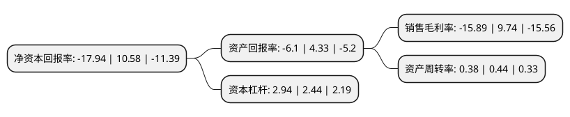

> 本页面由自动化程序生成于 2022年5月20日 01:09
> 内容可能存在错误，如有bug请提交issue至：https://github.com/Eroleice/doc-pi/issues
{.is-warning}

# 上市公司基本情况

## 基本资料

深圳达实智能股份有限公司（以下简称“达实智能”）成立于1995年03月17日，深圳市。于2010年06月03日在深交所中小板上市。

达实智能注册资本192,219.943万元，主要产品:智慧医疗，智慧交通与智慧建筑三大业务板块的创新应用。主营业务:智慧医疗，智慧交通与智慧建筑三大业务板块。以下是详细信息：

- 公司名称: 深圳达实智能股份有限公司
- 股票代码: 002421.SZ
- 所在地: 广东 - 深圳市
- 成立日期: 1995年03月17日
- 注册资本: 192,219.943万元
- 法定代表人: 刘磅
- 主营业务: 主要产品:智慧医疗，智慧交通与智慧建筑三大业务板块的创新应用主营业务:智慧医疗，智慧交通与智慧建筑三大业务板块
- 公司官网: www.chn-das.com
- 公司介绍: 公司采用最先进的云计算、物联网与大数据技术，构建统一的物联网感知层、大数据集成层与创新应用层三层技术体系。物联网感知层，通过RFID技术、云端人脸识别及车牌识别等视频识别技术、体感交互技术、移动支付技术等构建完善先进的物联网感知层。大数据集成层，基于实时大数据的智能管控技术的实时数据库dasRdb、智能建筑云管理平台IBMS等技术，打造支持多数据源共享、交换与协同大数据集成平台。创新应用层，上述统一的物联网感知层与大数据集成层，支撑创新应用层的智慧医疗、智慧交通与智慧建筑三大业务板块的创新应用。

## 股东及高管情况

上市公司第一大股东为昌都市达实投资发展有限公司，持股310,346,881股，占比16.15%，**疑似为**上市公司实际控制人。

截至2022年03月31日，上市公司的前十大股东中，共有6名自然人股东，1名机构股东，2个产品账户，1个海外主体，其中5%以上大股东共有2名。上市公司前十大股东明细如下：

> 未能通过持股比例判定出上市公司实际控制人（持股30%以上）
> 可能存在通过间接持股、联合持股、协议控制等方式拥有实际控制权的主体，具体请参考上市公司定期公告！
{.is-warning}

> 截至2022年03月31日，上市公司前十大股东信息如下：

| 股东名称 | 持股数量（股） | 持股比例 |
| --- | --- | --- |
| 昌都市达实投资发展有限公司 | 310,346,881 | 16.15% |
| 刘磅 | 134,257,031 | 6.98% |
| 深圳市投控资本有限公司-深圳投控共赢股权投资基金合伙企业(有限合伙) | 95,098,000 | 4.95% |
| 香港中央结算有限公司(陆股通) | 14,539,026 | 0.76% |
| 房志刚 | 12,938,791 | 0.67% |
| 程朋胜 | 9,229,378 | 0.48% |
| 吕枫 | 9,184,474 | 0.48% |
| 王丹宇 | 9,100,000 | 0.47% |
| 苏俊锋 | 8,658,898 | 0.45% |
| 深圳智富易投资管理有限公司-智富易9期私募证券投资基金 | 6,950,000 | 0.36% |

## 利润表分析

上市公司2021年总收入为31.63亿元，净利润为-5.03亿元，**未实现盈利**。

## 杜邦分析

> 数据列示周期：2021年 | 2020年 | 2019年
{.is-info}

上市公司的净资产收益率在近一年有所下降，下降幅度为-269.57%，其变化情况分解如下：
- 上市公司的销售毛利率在近一年下降了-263.14%，可能是生产效率的下降、商品原材料价格上涨或商品价格的下跌所致。
- 上市公司的资产周转率在近一年下降了-13.64%，可能是源自于更慢的销售回款或库存管理效果下降。
- 上市公司的财务杠杆比率在近一年上升了20.49%，可能是增加负债扩大生产规模。

