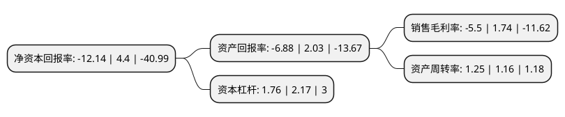

> 本页面由自动化程序生成于 2022年5月20日 01:09
> 内容可能存在错误，如有bug请提交issue至：https://github.com/Eroleice/doc-pi/issues
{.is-warning}

# 上市公司基本情况

## 基本资料

金陵华软科技股份有限公司（以下简称“华软科技”）成立于1999年01月13日，苏州市。于2010年07月20日在深交所中小板上市。

华软科技注册资本94,421.723万元，主营业务:金融科技领域，供应链管理，精细化学品等领域以下是详细信息：

- 公司名称: 金陵华软科技股份有限公司
- 股票代码: 002453.SZ
- 所在地: 江苏 - 苏州市
- 成立日期: 1999年01月13日
- 注册资本: 94,421.723万元
- 法定代表人: 沈明宏
- 主营业务: 主营业务:金融科技领域，供应链管理，精细化学品等领域
- 公司官网: www.gcstgroup.com
- 公司介绍: 公司是华软投资控股有限公司控股的上市公司，公司专业致力于原料药、中间体、精细化学品、造纸化学品、保健品、食品添加剂等产品研发、生产与销售的综合性企业。公司随后正式实施医药化工产业与金融产业并重的“双主业”发展战略，成为多元化发展的企业集团。目前，公司的业务范围主要覆盖金融科技领域、供应链管理、精细化学品等领域。金融科技业务主要是向以银行为主的金融客户提供行业整体化的信息技术规划咨询与应用软件集成化项目实施管理服务，具体包括银行IT业务咨询规划、应用架构设计、产品开发交付、项目实施管理(PMO)、运营维护等业务。公司供应链管理业务的主要产品包括贸易、商业保理、订单融资、票据结算、业务整合咨询等，依托核心企业信用，通过对围绕供应链的其他配套客户产品流、信息流、资金流的协调、整合和分析，制定针对性的服务方案，配合客户整合产业链条资源。公司精细化学品主要包括农药中间体、医药中间体、原料药、造纸化学品等传统业务。

## 股东及高管情况

上市公司第一大股东为舞福科技集团有限公司，持股311,036,703股，占比32.94%，为上市公司实际控制人。

截至2022年03月31日，上市公司的前十大股东中，共有3名自然人股东，3名机构股东，4个产品账户，其中5%以上大股东共有3名。上市公司前十大股东明细如下：

> 截至2022年03月31日，上市公司前十大股东信息如下：

| 股东名称 | 持股数量（股） | 持股比例 |
| --- | --- | --- |
| 舞福科技集团有限公司 | 311,036,703 | 32.94% |
| 八大处科技集团有限公司 | 90,539,214 | 9.59% |
| 吴细兵 | 82,353,944 | 8.72% |
| 中国建设银行股份有限公司-华商智能生活灵活配置混合型证券投资基金 | 11,455,600 | 1.21% |
| 王米红 | 9,718,800 | 1.03% |
| 浙商银行股份有限公司-华商新能源汽车混合型证券投资基金 | 8,069,102 | 0.85% |
| 涂亚杰 | 8,052,417 | 0.85% |
| 北京申得兴投资管理咨询有限公司 | 7,901,628 | 0.84% |
| 中国建设银行股份有限公司-富国低碳新经济混合型证券投资基金 | 5,259,200 | 0.56% |
| 中国工商银行股份有限公司-中欧医疗健康混合型证券投资基金 | 4,916,508 | 0.52% |

## 利润表分析

上市公司2021年总收入为39.42亿元，净利润为-2.17亿元，**未实现盈利**。

## 杜邦分析

> 数据列示周期：2021年 | 2020年 | 2019年
{.is-info}

上市公司的净资产收益率在近一年有所下降，下降幅度为-375.91%，其变化情况分解如下：
- 上市公司的销售毛利率在近一年下降了-416.09%，可能是生产效率的下降、商品原材料价格上涨或商品价格的下跌所致。
- 上市公司的资产周转率在近一年上升了7.76%，可能是源自于更快的销售回款或库存管理效果提升。
- 上市公司的财务杠杆比率在近一年下降了-18.89%，可能是减少负债降低财务费用。

