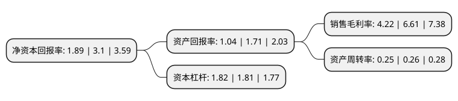

> 本页面由自动化程序生成于 2022年5月20日 01:09
> 内容可能存在错误，如有bug请提交issue至：https://github.com/Eroleice/doc-pi/issues
{.is-warning}

# 上市公司基本情况

## 基本资料

福建榕基软件股份有限公司（以下简称“榕基软件”）成立于1993年10月22日，福州市。于2010年09月15日在深交所中小板上市。

榕基软件注册资本62,220万元，主营业务为软件产品的开发与销售，计算机系统集成及技术支持与服务。主要产品为电子政务，信息安全产品，质检三电工程，协同管理。以下是详细信息：

- 公司名称: 福建榕基软件股份有限公司
- 股票代码: 002474.SZ
- 所在地: 福建 - 福州市
- 成立日期: 1993年10月22日
- 注册资本: 62,220万元
- 法定代表人: 鲁峰
- 主营业务: 主营业务为软件产品的开发与销售，计算机系统集成及技术支持与服务主要产品为电子政务，信息安全产品，质检三电工程，协同管理
- 公司官网: www.rongji.com
- 公司介绍: 公司是通用电子政务应用软件最具竞争力的企业之一，专注于发展政府、质检、军事机关、电力和电信等行业应用软件的研发、推广，及相关计算机信息系统集成和服务业务。在电子政务业务领域的历史已超过11年，能够提供一体化电子政务应用平台和整体电子政务解决方案，主要服务对象包括国内政府、质检、军事机关、电力和电信等，从事政务信息化、企业信息化建设业务和高新科技成果产品转化，先后推出了RJ-eGov政务信息化解决方案、RJ-eFlow办公自动化系统、RJ-easy电子单证系统、RJ-Netyou网络服务集成系统、RJ-iTop网络隐患扫描系统、RJ-CTI计算机电话集成系统平台等一批软件和解决方案。

## 股东及高管情况

上市公司第一大股东为鲁峰，持股113,320,740股，占比18.21%，**疑似为**上市公司实际控制人。

截至2022年03月31日，上市公司的前十大股东中，共有6名自然人股东，4个产品账户，其中5%以上大股东共有1名。上市公司前十大股东明细如下：

> 未能通过持股比例判定出上市公司实际控制人（持股30%以上）
> 可能存在通过间接持股、联合持股、协议控制等方式拥有实际控制权的主体，具体请参考上市公司定期公告！
{.is-warning}

> 截至2022年03月31日，上市公司前十大股东信息如下：

| 股东名称 | 持股数量（股） | 持股比例 |
| --- | --- | --- |
| 鲁峰 | 113,320,740 | 18.21% |
| 侯伟 | 24,197,766 | 3.89% |
| 上海烜鼎资产管理有限公司-烜鼎长红一号私募证券投资基金 | 15,695,000 | 2.52% |
| 磐厚动量(上海)资本管理有限公司-磐厚动量-汇鑫1号私募证券投资基金 | 10,700,000 | 1.72% |
| 磐厚蔚然(上海)私募基金管理有限公司-磐厚蔚然-关键点1号私募证券投资基金 | 8,000,000 | 1.29% |
| 福建榕基软件股份有限公司-第三期员工持股计划 | 7,856,200 | 1.26% |
| 赵坚 | 6,850,000 | 1.1% |
| 陈明平 | 5,396,146 | 0.87% |
| 胡燕英 | 4,009,000 | 0.64% |
| 鲁波 | 2,994,160 | 0.48% |

## 利润表分析

上市公司2021年总收入为7.17亿元，净利润为0.3亿元，实现盈利。

## 杜邦分析

> 数据列示周期：2021年 | 2020年 | 2019年
{.is-info}

上市公司的净资产收益率在近一年有所下降，下降幅度为-39.03%，其变化情况分解如下：
- 上市公司的销售毛利率在近一年下降了-36.16%，可能是生产效率的下降、商品原材料价格上涨或商品价格的下跌所致。
- 上市公司的资产周转率在近一年下降了-3.85%，可能是源自于更慢的销售回款或库存管理效果下降。
- 上市公司的财务杠杆比率在近一年上升了0.55%，可能是增加负债扩大生产规模。

