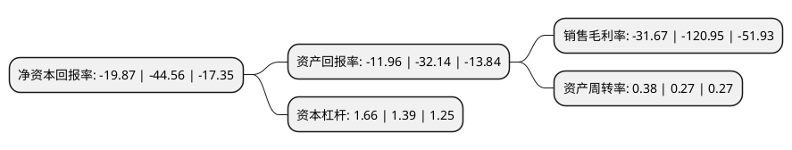

> 本页面由自动化程序生成于 2022年5月20日 01:09
> 内容可能存在错误，如有bug请提交issue至：https://github.com/Eroleice/doc-pi/issues
{.is-warning}

# 上市公司基本情况

## 基本资料

金财互联控股股份有限公司（以下简称“金财互联”）成立于1988年07月30日，盐城市。于2010年12月31日在深交所中小板上市。

金财互联注册资本77,919.818万元，主营业务涵盖了互联网财税和热处理两大业务板块。以下是详细信息：

- 公司名称: 金财互联控股股份有限公司
- 股票代码: 002530.SZ
- 所在地: 江苏 - 盐城市
- 成立日期: 1988年07月30日
- 注册资本: 77,919.818万元
- 法定代表人: 朱文明
- 主营业务: 主营业务涵盖了互联网财税和热处理两大业务板块
- 公司官网: www.fengdong.com/www.foresee.com.cn
- 公司介绍: 公司是热处理行业中领先的综合解决方案供应商，世界知名的热处理设备制造商。公司一方面积极拓展互联网财税业务，聚焦财税大数据服务，推进金税、金财、大数据三大事业板块的协同发展；另一方面继续巩固发展热处理设备制造业务，完善热处理专业服务连锁布局。公司热处理板块业务涵盖了热处理设备制造、专业热处理加工、热处理设备售后服务及热处理技术咨询服务四大块，产品广泛应用于航空航天、汽车、工程机械、轨道交通、船舶、化工机械、机械基础零部件等行业。公司提供专业系统的热处理及表面改性解决方案，为客户创造价值为宗旨，除了标准设备以外，凭借强大的工程能力，公司还能够为客户提供非标定制设备。宽广的产品线以及从设计到售后全方位的服务，使公司可以为客户提供一站式解决方案。

## 股东及高管情况

上市公司第一大股东为江苏东润金财投资管理有限公司，持股104,781,718股，占比13.45%，**疑似为**上市公司实际控制人。

截至2022年03月31日，上市公司的前十大股东中，共有6名自然人股东，1名机构股东，3名其他股东，其中5%以上大股东共有5名。上市公司前十大股东明细如下：

> 未能通过持股比例判定出上市公司实际控制人（持股30%以上）
> 可能存在通过间接持股、联合持股、协议控制等方式拥有实际控制权的主体，具体请参考上市公司定期公告！
{.is-warning}

> 截至2022年03月31日，上市公司前十大股东信息如下：

| 股东名称 | 持股数量（股） | 持股比例 |
| --- | --- | --- |
| 江苏东润金财投资管理有限公司 | 104,781,718 | 13.45% |
| 徐正军 | 84,858,730 | 10.89% |
| 东方工程株式会社 | 67,568,018 | 8.67% |
| 朱文明 | 50,562,282 | 6.49% |
| 天津市武清区财政局 | 42,627,013 | 5.47% |
| 朱建立 | 37,483,682 | 4.81% |
| 杨涛 | 15,583,963 | 2% |
| 和华株式会社 | 9,267,509 | 1.19% |
| 王金根 | 8,669,838 | 1.11% |
| 童旻雯 | 5,000,400 | 0.64% |

## 利润表分析

上市公司2021年总收入为12.01亿元，净利润为-3.81亿元，**未实现盈利**。

## 杜邦分析

> 数据列示周期：2021年 | 2020年 | 2019年
{.is-info}

上市公司的净资产收益率在近一年有所下降，下降幅度为-55.41%，其变化情况分解如下：
- 上市公司的销售毛利率在近一年下降了-73.82%，可能是生产效率的下降、商品原材料价格上涨或商品价格的下跌所致。
- 上市公司的资产周转率在近一年上升了40.74%，可能是源自于更快的销售回款或库存管理效果提升。
- 上市公司的财务杠杆比率在近一年上升了19.42%，可能是增加负债扩大生产规模。

