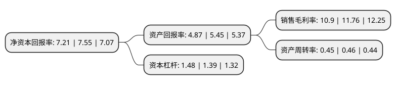

> 本页面由自动化程序生成于 2022年5月20日 01:10
> 内容可能存在错误，如有bug请提交issue至：https://github.com/Eroleice/doc-pi/issues
{.is-warning}

# 上市公司基本情况

## 基本资料

深圳市捷顺科技实业股份有限公司（以下简称“捷顺科技”）成立于1992年06月17日，深圳市。于2011年08月15日在深交所中小板上市。

捷顺科技注册资本64,933.414万元，主要产品:捷停车及捷生活APP，智慧停车场系统，智能门禁，通道闸，城市级智能一卡通系统，停车场智能管理平台，智慧商业O2O运营平台等。主营业务:(1)智慧商业，社区等行业解决方案业务;(2)智慧停车业务;(3)场景金融业务。以下是详细信息：

- 公司名称: 深圳市捷顺科技实业股份有限公司
- 股票代码: 002609.SZ
- 所在地: 广东 - 深圳市
- 成立日期: 1992年06月17日
- 注册资本: 64,933.414万元
- 法定代表人: 唐健
- 主营业务: 主要产品:捷停车及捷生活APP，智慧停车场系统，智能门禁，通道闸，城市级智能一卡通系统，停车场智能管理平台，智慧商业O2O运营平台等主营业务:(1)智慧商业，社区等行业解决方案业务;(2)智慧停车业务;(3)场景金融业务
- 公司官网: www.jieshun.cn
- 公司介绍: 公司的主营业务包括三方面：(1)智慧商业、社区等行业解决方案业务；(2)智慧停车业务；(3)场景金融业务。公司的产品线涵盖各类软硬件产品，包括捷停车及捷生活APP、智慧停车场系统、智能门禁、通道闸、城市级智能一卡通系统、停车场智能管理平台、智慧商业O2O运营平台等。各类软硬件产品之间实现充分互联、互通和第三方资源接入，具备强大的平台和数据整合能力。公司先后获得“国家级高新技术企业”、“中国安防十大品牌第一名”、“广东省著名商标”、“中国深圳百强企业”、“深圳优秀民营企业”、“深圳市纳税百强企业”等荣誉称号。

## 股东及高管情况

上市公司第一大股东为唐健，持股180,432,744股，占比27.79%，**疑似为**上市公司实际控制人。

截至2022年03月31日，上市公司的前十大股东中，共有4名自然人股东，1名机构股东，5个产品账户，其中5%以上大股东共有3名。上市公司前十大股东明细如下：

> 未能通过持股比例判定出上市公司实际控制人（持股30%以上）
> 可能存在通过间接持股、联合持股、协议控制等方式拥有实际控制权的主体，具体请参考上市公司定期公告！
{.is-warning}

> 截至2022年03月31日，上市公司前十大股东信息如下：

| 股东名称 | 持股数量（股） | 持股比例 |
| --- | --- | --- |
| 唐健 | 180,432,744 | 27.79% |
| 深圳市特区建发智慧交通投资合伙企业(有限合伙) | 83,965,017 | 12.93% |
| 刘翠英 | 73,577,283 | 11.33% |
| 蒋东濬 | 10,059,502 | 1.55% |
| 云南国际信托有限公司-云南信托·大西部丝绸之路2号集合资金信托计划 | 8,920,455 | 1.37% |
| 招商银行股份有限公司-东方阿尔法招阳混合型证券投资基金 | 6,716,933 | 1.03% |
| 中国建设银行股份有限公司-南方科技创新混合型证券投资基金 | 6,479,900 | 1% |
| 张天虚 | 6,140,264 | 0.95% |
| 中国农业银行股份有限公司-摩根士丹利华鑫优享臻选六个月持有期混合型证券投资基金 | 5,982,250 | 0.92% |
| 招商银行股份有限公司-泓德瑞兴三年持有期混合型证券投资基金 | 5,904,059 | 0.91% |

## 利润表分析

上市公司2021年总收入为15.04亿元，净利润为1.64亿元，实现盈利。

## 杜邦分析

> 数据列示周期：2021年 | 2020年 | 2019年
{.is-info}

上市公司的净资产收益率在近一年有所下降，下降幅度为-4.5%，其变化情况分解如下：
- 上市公司的销售毛利率在近一年下降了-7.31%，可能是生产效率的下降、商品原材料价格上涨或商品价格的下跌所致。
- 上市公司的资产周转率在近一年下降了-2.17%，可能是源自于更慢的销售回款或库存管理效果下降。
- 上市公司的财务杠杆比率在近一年上升了6.47%，可能是增加负债扩大生产规模。

