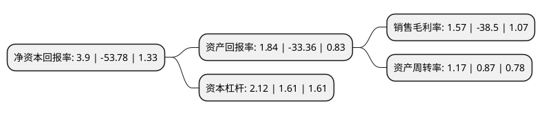

> 本页面由自动化程序生成于 2022年5月20日 01:10
> 内容可能存在错误，如有bug请提交issue至：https://github.com/Eroleice/doc-pi/issues
{.is-warning}

# 上市公司基本情况

## 基本资料

荣联科技集团股份有限公司（以下简称“荣联科技”）成立于2001年03月12日，北京市。于2011年12月20日在深交所中小板上市。

荣联科技注册资本66,725.031万元，主要产品:生物云平台产品包括生物信息分析一体机，生物数据平台，生物云集成模块，生信混合云，生物云IDC，生物云SaaS。主营业务:企业服务，物联网及生物医疗。以下是详细信息：

- 公司名称: 荣联科技集团股份有限公司
- 股票代码: 002642.SZ
- 所在地: 北京 - 北京市
- 成立日期: 2001年03月12日
- 注册资本: 66,725.031万元
- 法定代表人: 王东辉
- 主营业务: 主要产品:生物云平台产品包括生物信息分析一体机，生物数据平台，生物云集成模块，生信混合云，生物云IDC，生物云SaaS主营业务:企业服务，物联网及生物医疗
- 公司官网: www.ronglian.com
- 公司介绍: 公司是专业的信息技术公司，帮助客户实现核心业务的全面数字化转型，并以独创的数据平台和行业解决方案为行业客户赋能，支持其对各类数据资产的收集整理、价值挖掘和应用创新。在云计算领域，公司帮助客户整合已有的IT资产，实现数据中心和IT基础设施的集约化管理，引导企业级IT系统向私有云和混合云演化；在物联网领域，公司提供数据采集和接入产品，通过边缘计算和数据平台技术支持车联网、工业物联网、农业物联网的建设和运营；在大数据领域，公司提供分析引擎、数据产品以及不同行业的业务解决方案；在生命科学领域，公司为基因研究和精准医疗提供了量身定制的临床诊断分析系统、基因数据平台和生物云计算服务。

## 股东及高管情况

上市公司第一大股东为王东辉，持股80,468,358股，占比12.06%，**疑似为**上市公司实际控制人。

截至2022年05月11日，上市公司的前十大股东中，共有7名自然人股东，2名机构股东，1个产品账户，其中5%以上大股东共有3名。上市公司前十大股东明细如下：

> 未能通过持股比例判定出上市公司实际控制人（持股30%以上）
> 可能存在通过间接持股、联合持股、协议控制等方式拥有实际控制权的主体，具体请参考上市公司定期公告！
{.is-warning}

> 截至2022年05月11日，上市公司前十大股东信息如下：

| 股东名称 | 持股数量（股） | 持股比例 |
| --- | --- | --- |
| 王东辉 | 80,468,358 | 12.06% |
| 王东辉 | 80,468,358 | 12.06% |
| 山东经达科技产业发展有限公司 | 40,148,219 | 6.017% |
| 吴敏 | 31,297,803 | 4.69% |
| 长江证券(上海)资产管理有限公司 | 26,883,000 | 4.03% |
| 杨巧观 | 9,244,200 | 1.39% |
| 上海珠池资产管理有限公司-珠池健康产业母基金1号 | 3,738,783 | 0.56% |
| 江颖 | 2,930,000 | 0.44% |
| 顾长柏 | 2,822,900 | 0.42% |
| 董龙 | 2,600,100 | 0.39% |

## 利润表分析

上市公司2021年总收入为35.82亿元，净利润为0.56亿元，实现盈利。

## 杜邦分析

> 数据列示周期：2021年 | 2020年 | 2019年
{.is-info}

上市公司的净资产收益率在近一年有所下降，下降幅度为-107.25%，其变化情况分解如下：
- 上市公司的销售毛利率在近一年下降了-104.08%，可能是生产效率的下降、商品原材料价格上涨或商品价格的下跌所致。
- 上市公司的资产周转率在近一年上升了34.48%，可能是源自于更快的销售回款或库存管理效果提升。
- 上市公司的财务杠杆比率在近一年上升了31.68%，可能是增加负债扩大生产规模。

