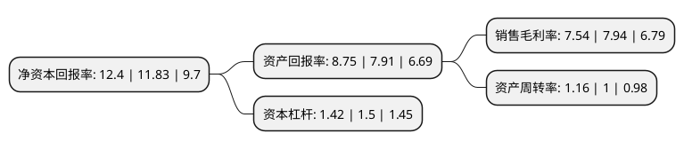

> 本页面由自动化程序生成于 2022年5月20日 01:11
> 内容可能存在错误，如有bug请提交issue至：https://github.com/Eroleice/doc-pi/issues
{.is-warning}

# 上市公司基本情况

## 基本资料

博彦科技股份有限公司（以下简称“博彦科技”）成立于1995年04月17日，北京市。于2012年01月06日在深交所中小板上市。

博彦科技注册资本59,166.485万元，主要业务涵盖产品及解决方案，研发工程服务和IT运营维护以下是详细信息：

- 公司名称: 博彦科技股份有限公司
- 股票代码: 002649.SZ
- 所在地: 北京 - 北京市
- 成立日期: 1995年04月17日
- 注册资本: 59,166.485万元
- 法定代表人: 王斌
- 主营业务: 主要业务涵盖产品及解决方案，研发工程服务和IT运营维护
- 公司官网: www.beyondsoft.com
- 公司介绍: 公司是一家面向全球的IT咨询、产品、解决方案与服务提供商，成立于1995年，总部位于中国北京，并在中国、美国、西班牙、日本、印度、新加坡和马来西亚等7个国家设有40余家分支机构、研发基地或交付中心。博彦科技依托自身强大的研发与创新能力，广泛采用基于物联网、大数据、云计算、人工智能和移动互联等新兴技术，为高科技、金融、互联网、地产、交通、汽车、零售、能源、制造、航空、电信、媒体、旅游等行业客户提供丰富的解决方案及产品。公司遵循严格的质量和安全标准，实施严密的安全措施，拥有成熟可靠的管理和开发流程，并获得CMMI3、ISO20000、ISO9001、ISO27001、ISO14001、OHSAS18001等一系列资质认证。

## 股东及高管情况

上市公司第一大股东为王斌，持股48,754,316股，占比8.24%，**疑似为**上市公司实际控制人。

截至2022年03月31日，上市公司的前十大股东中，共有7名自然人股东，2个产品账户，1个海外主体，其中5%以上大股东共有3名。上市公司前十大股东明细如下：

> 未能通过持股比例判定出上市公司实际控制人（持股30%以上）
> 可能存在通过间接持股、联合持股、协议控制等方式拥有实际控制权的主体，具体请参考上市公司定期公告！
{.is-warning}

> 上市公司第一大股东持股不超过10%，请检查是否存在公司控制权风险！
{.is-danger}

> 截至2022年03月31日，上市公司前十大股东信息如下：

| 股东名称 | 持股数量（股） | 持股比例 |
| --- | --- | --- |
| 王斌 | 48,754,316 | 8.24% |
| 张荣军 | 35,860,983 | 6.06% |
| 马强 | 35,159,210 | 5.94% |
| GONG YAOBIN GEORGE | 19,088,831 | 3.23% |
| 梁润升 | 6,051,825 | 1.02% |
| 孙慧正 | 3,971,200 | 0.67% |
| 罗斌 | 3,901,800 | 0.66% |
| 嘉实基业长青股票型养老金产品-中国工商银行股份有限公司 | 2,946,100 | 0.5% |
| 符翠玲 | 2,770,000 | 0.47% |
| 中国工商银行股份有限公司-长安成长优选混合型证券投资基金 | 2,699,970 | 0.46% |

## 利润表分析

上市公司2021年总收入为55.32亿元，净利润为4.17亿元，实现盈利。

## 杜邦分析

> 数据列示周期：2021年 | 2020年 | 2019年
{.is-info}

上市公司的净资产收益率在近一年有所上升，上升幅度为4.82%，其变化情况分解如下：
- 上市公司的销售毛利率在近一年下降了-5.04%，可能是生产效率的下降、商品原材料价格上涨或商品价格的下跌所致。
- 上市公司的资产周转率在近一年上升了16%，可能是源自于更快的销售回款或库存管理效果提升。
- 上市公司的财务杠杆比率在近一年下降了-5.33%，可能是减少负债降低财务费用。

