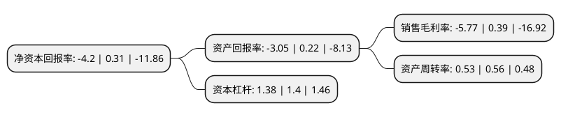

> 本页面由自动化程序生成于 2022年5月20日 01:11
> 内容可能存在错误，如有bug请提交issue至：https://github.com/Eroleice/doc-pi/issues
{.is-warning}

# 上市公司基本情况

## 基本资料

北京中科金财科技股份有限公司（以下简称“中科金财”）成立于2003年12月10日，北京市。于2012年02月28日在深交所中小板上市。

中科金财注册资本33,757.669万元，主要产品:银行整体解决方案，数据中心综合服务。主营业务:智能银行整体解决方案和数据中心综合服务，人工智能，大数据，云服务，区块链等科技创新业务。以下是详细信息：

- 公司名称: 北京中科金财科技股份有限公司
- 股票代码: 002657.SZ
- 所在地: 北京 - 北京市
- 成立日期: 2003年12月10日
- 注册资本: 33,757.669万元
- 法定代表人: 朱烨东
- 主营业务: 主要产品:银行整体解决方案，数据中心综合服务主营业务:智能银行整体解决方案和数据中心综合服务，人工智能，大数据，云服务，区块链等科技创新业务
- 公司官网: www.sinodata.net.cn
- 公司介绍: 公司坚持以金融科技综合服务为核心的发展战略，立足于中小银行转型的需求，以智能银行整体解决方案和数据中心综合服务为基础，深入推进人工智能、大数据、云服务、区块链等科技创新业务。公司在金融科技领域深化转型，稳扎稳打。银行网点解决方案领域优势不断提升，设计和推出的定位于智能化、轻型化、互联网化的智慧网点解决方案服务，已达到国内领先水平；实施零售业务能力改造的试点支行已开业运营，显著提升银行客户的零售业务业绩。互联网银行云平台方面，已与多家银行达成了共享直销银行平台建设运营合作协议。公司已基本具备金融科技全业务链的服务能力。

## 股东及高管情况

上市公司第一大股东为沈飒，持股50,392,918股，占比14.93%，**疑似为**上市公司实际控制人。

截至2022年03月31日，上市公司的前十大股东中，共有7名自然人股东，3名机构股东，其中5%以上大股东共有1名。上市公司前十大股东明细如下：

> 未能通过持股比例判定出上市公司实际控制人（持股30%以上）
> 可能存在通过间接持股、联合持股、协议控制等方式拥有实际控制权的主体，具体请参考上市公司定期公告！
{.is-warning}

> 截至2022年03月31日，上市公司前十大股东信息如下：

| 股东名称 | 持股数量（股） | 持股比例 |
| --- | --- | --- |
| 沈飒 | 50,392,918 | 14.93% |
| 天津滨河数据信息技术有限公司 | 5,333,610 | 1.58% |
| 青岛城投金融控股集团有限公司 | 4,696,937 | 1.39% |
| 刘咏思 | 4,420,361 | 1.31% |
| 朱烨东 | 3,264,533 | 0.97% |
| 席燕平 | 3,222,995 | 0.95% |
| 刘开同 | 3,089,100 | 0.92% |
| 杨承宏 | 2,933,960 | 0.87% |
| 华融国际信托有限责任公司 | 2,754,007 | 0.82% |
| 张广清 | 2,190,039 | 0.65% |

## 利润表分析

上市公司2021年总收入为16.06亿元，净利润为-0.93亿元，**未实现盈利**。

## 杜邦分析

> 数据列示周期：2021年 | 2020年 | 2019年
{.is-info}

上市公司的净资产收益率在近一年有所下降，下降幅度为-1454.84%，其变化情况分解如下：
- 上市公司的销售毛利率在近一年下降了-1579.49%，可能是生产效率的下降、商品原材料价格上涨或商品价格的下跌所致。
- 上市公司的资产周转率在近一年下降了-5.36%，可能是源自于更慢的销售回款或库存管理效果下降。
- 上市公司的财务杠杆比率在近一年下降了-1.43%，可能是减少负债降低财务费用。

