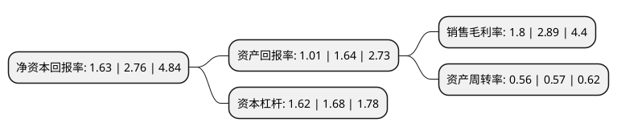

> 本页面由自动化程序生成于 2022年5月20日 01:12
> 内容可能存在错误，如有bug请提交issue至：https://github.com/Eroleice/doc-pi/issues
{.is-warning}

# 上市公司基本情况

## 基本资料

北京真视通科技股份有限公司（以下简称“真视通”）成立于2000年05月22日，北京市。于2015年06月29日在深交所中小板上市。

真视通注册资本20,976.41万元，主要产品:多媒体视讯系统等。主营业务:信息技术与多媒体视讯综合解决方案和服务。以下是详细信息：

- 公司名称: 北京真视通科技股份有限公司
- 股票代码: 002771.SZ
- 所在地: 北京 - 北京市
- 成立日期: 2000年05月22日
- 注册资本: 20,976.41万元
- 法定代表人: 何小波
- 主营业务: 主要产品:多媒体视讯系统等主营业务:信息技术与多媒体视讯综合解决方案和服务
- 公司官网: www.bjzst.cn
- 公司介绍: 公司是国内领先的多媒体视讯综合解决方案提供商，是拥有信息系统集成一级资质、音视频工程特级资质及建筑智能化工程设计与施工等多项资质的国家级高新技术企业。公司主要面向能源、政府、金融、交通、教育等领域的大中型客户提供领先的多媒体视讯综合解决方案，以满足用户对多媒体视讯系统的个性化需求为目标，提供的全方位服务，包括咨询、设计、研发、集成和服务等。成立以来，公司成功地为数以百计的重要客户提供了多媒体视讯综合解决方案，尤其是在能源、政府、金融等重点领域积累了丰富的客户资源。公司建立了以北京为总部，辐射全国的营销服务网络，实行区域管理，分别在广州、上海、武汉、山东、青岛、成都、内蒙、昆明、西安、广西、石家庄、沈阳、长春、兰州、天津、新疆、湖南、福州、西宁等设有分公司和办事处。

## 股东及高管情况

上市公司第一大股东为王国红，持股30,626,396股，占比14.6%，**疑似为**上市公司实际控制人。

截至2022年04月08日，上市公司的前十大股东中，共有8名自然人股东，2名机构股东，其中5%以上大股东共有6名。上市公司前十大股东明细如下：

> 未能通过持股比例判定出上市公司实际控制人（持股30%以上）
> 可能存在通过间接持股、联合持股、协议控制等方式拥有实际控制权的主体，具体请参考上市公司定期公告！
{.is-warning}

> 截至2022年04月08日，上市公司前十大股东信息如下：

| 股东名称 | 持股数量（股） | 持股比例 |
| --- | --- | --- |
| 王国红 | 30,626,396 | 14.6% |
| 王国红 | 30,626,396 | 14.6% |
| 苏州隆越控股有限公司 | 24,720,000 | 11.78% |
| 马亚 | 22,985,064 | 10.96% |
| 胡小周 | 20,072,710 | 9.57% |
| 苏州隆越控股有限公司 | 10,920,000 | 5.21% |
| 陈瑞良 | 8,192,444 | 3.91% |
| 吴岚 | 6,156,032 | 2.93% |
| 林泽添 | 4,200,010 | 2% |
| 夏海威 | 814,500 | 0.39% |

## 利润表分析

上市公司2021年总收入为6.41亿元，净利润为0.11亿元，实现盈利。

## 杜邦分析

> 数据列示周期：2021年 | 2020年 | 2019年
{.is-info}

上市公司的净资产收益率在近一年有所下降，下降幅度为-40.94%，其变化情况分解如下：
- 上市公司的销售毛利率在近一年下降了-37.72%，可能是生产效率的下降、商品原材料价格上涨或商品价格的下跌所致。
- 上市公司的资产周转率在近一年下降了-1.75%，可能是源自于更慢的销售回款或库存管理效果下降。
- 上市公司的财务杠杆比率在近一年下降了-3.57%，可能是减少负债降低财务费用。

