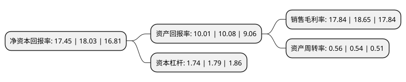

> 本页面由自动化程序生成于 2022年5月20日 01:12
> 内容可能存在错误，如有bug请提交issue至：https://github.com/Eroleice/doc-pi/issues
{.is-warning}

# 上市公司基本情况

## 基本资料

四川久远银海软件股份有限公司（以下简称“久远银海”）成立于2008年11月24日，成都市。于2015年12月31日在深交所中小板上市。

久远银海注册资本31,402.388万元，主要产品:医疗健康与医疗保障，数字政务与智慧城市，智慧院所与军民融合，技术平台软件。主营业务:围绕医疗健康与医疗保障，数字政务与智慧城市，智慧院所与军民融合三大战略板块，提供信息化解决方案及咨询服务，自主知识产权软件产品，系统集成服务，运维服务，互联网运营服务及大数据服务。以下是详细信息：

- 公司名称: 四川久远银海软件股份有限公司
- 股票代码: 002777.SZ
- 所在地: 四川 - 成都市
- 成立日期: 2008年11月24日
- 注册资本: 31,402.388万元
- 法定代表人: 连春华
- 主营业务: 主要产品:医疗健康与医疗保障，数字政务与智慧城市，智慧院所与军民融合，技术平台软件主营业务:围绕医疗健康与医疗保障，数字政务与智慧城市，智慧院所与军民融合三大战略板块，提供信息化解决方案及咨询服务，自主知识产权软件产品，系统集成服务，运维服务，互联网运营服务及大数据服务
- 公司官网: www.yinhai.com
- 公司介绍: 公司是民生与国防信息化及大数据应用服务提供商，围绕医疗健康与医疗保障、数字政务与智慧城市、智慧院所与军民融合三大战略板块，提供信息化解决方案及咨询服务、自主知识产权软件产品、系统集成服务、运维服务、互联网运营服务及大数据服务。公司是人社部社会保险管理信息系统核心平台一、二、三版的主研单位，是人社部行业信息化建设的战略合作伙伴及部颁标准制定参与者。久远银海的产品及解决方案覆盖人社行业各领域，市场覆盖全国10余个省(自治区、直辖市)。

## 股东及高管情况

上市公司第一大股东为四川久远投资控股集团有限公司，持股82,546,464股，占比26.29%，**疑似为**上市公司实际控制人。

截至2022年03月31日，上市公司的前十大股东中，共有3名自然人股东，3名机构股东，4个产品账户，其中5%以上大股东共有3名。上市公司前十大股东明细如下：

> 未能通过持股比例判定出上市公司实际控制人（持股30%以上）
> 可能存在通过间接持股、联合持股、协议控制等方式拥有实际控制权的主体，具体请参考上市公司定期公告！
{.is-warning}

> 截至2022年03月31日，上市公司前十大股东信息如下：

| 股东名称 | 持股数量（股） | 持股比例 |
| --- | --- | --- |
| 四川久远投资控股集团有限公司 | 82,546,464 | 26.29% |
| 四川科学城锐锋集团有限责任公司 | 37,755,536 | 12.02% |
| 中国平安人寿保险股份有限公司-分红-个险分红 | 17,674,063 | 5.63% |
| 东方证券股份有限公司-中庚价值先锋股票型证券投资基金 | 14,915,603 | 4.75% |
| 李长明 | 6,000,011 | 1.91% |
| 李慧霞 | 4,719,159 | 1.5% |
| 光大永明资管-兴业银行-光大永明资产聚财121号定向资产管理产品 | 4,484,465 | 1.43% |
| 广发证券资管-工商银行-广发恒定24号久远银海定向增发集合资产管理计划 | 4,454,527 | 1.42% |
| 王卒 | 3,629,900 | 1.16% |
| 中国工商银行股份有限公司-富国创新科技混合型证券投资基金 | 2,759,320 | 0.88% |

## 利润表分析

上市公司2021年总收入为13.05亿元，净利润为2.33亿元，实现盈利。

## 杜邦分析

> 数据列示周期：2021年 | 2020年 | 2019年
{.is-info}

上市公司的净资产收益率在近一年有所下降，下降幅度为-3.22%，其变化情况分解如下：
- 上市公司的销售毛利率在近一年下降了-4.34%，可能是生产效率的下降、商品原材料价格上涨或商品价格的下跌所致。
- 上市公司的资产周转率在近一年上升了3.7%，可能是源自于更快的销售回款或库存管理效果提升。
- 上市公司的财务杠杆比率在近一年下降了-2.79%，可能是减少负债降低财务费用。

