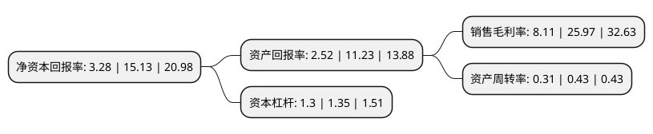

> 本页面由自动化程序生成于 2022年5月20日 01:13
> 内容可能存在错误，如有bug请提交issue至：https://github.com/Eroleice/doc-pi/issues
{.is-warning}

# 上市公司基本情况

## 基本资料

深圳市中新赛克科技股份有限公司（以下简称“中新赛克”）成立于2003年02月08日，深圳市。于2017年11月21日在深交所中小板上市。

中新赛克注册资本17,307.021万元，主营业务:网络可视化基础架构，网络内容安全等产品的研发，生产和销售，以及相关产品的安装，调试和培训等技术服务。主营产品包括宽带互联网数据汇聚分发管理产品，移动接入网数据采集分析产品和网络内容安全产品等。以下是详细信息：

- 公司名称: 深圳市中新赛克科技股份有限公司
- 股票代码: 002912.SZ
- 所在地: 广东 - 深圳市
- 成立日期: 2003年02月08日
- 注册资本: 17,307.021万元
- 法定代表人: 李守宇
- 主营业务: 主营业务:网络可视化基础架构，网络内容安全等产品的研发，生产和销售，以及相关产品的安装，调试和培训等技术服务主营产品包括宽带互联网数据汇聚分发管理产品，移动接入网数据采集分析产品和网络内容安全产品等
- 公司官网: www.sinovatio.com
- 公司介绍: 公司致力于信息网络的智能管理与安全防护，通过数据类通讯产品的定制服务及相关增值业务的开发，为安全领域的整体解决方案供应商。秉承数据通讯技术的软硬件基础，中新赛克专注于大容量智能网卡及分流设备、无线增值业务、宽带增值业务的研发和市场拓展，为运营商和行业用户提供成熟的通信安全保障解决方案和一站式的服务。国内市场，中新赛克已有完整的销售及服务体系，与运营商及网络安全市场重点客户建立长期稳定的战略合作关系，深入客户实现零距离开发和服务。海外市场，中新赛克在多个国家及地区有分支机构，提供从商务策划至本地化项目支持的一站式服务。

## 股东及高管情况

上市公司第一大股东为深圳市创新投资集团有限公司，持股45,527,040股，占比26.31%，**疑似为**上市公司实际控制人。

截至2022年04月01日，上市公司的前十大股东中，共有2名自然人股东，7名机构股东，1个产品账户，其中5%以上大股东共有5名。上市公司前十大股东明细如下：

> 未能通过持股比例判定出上市公司实际控制人（持股30%以上）
> 可能存在通过间接持股、联合持股、协议控制等方式拥有实际控制权的主体，具体请参考上市公司定期公告！
{.is-warning}

> 截至2022年04月01日，上市公司前十大股东信息如下：

| 股东名称 | 持股数量（股） | 持股比例 |
| --- | --- | --- |
| 深圳市创新投资集团有限公司 | 45,527,040 | 26.31% |
| 深圳市创新投资集团有限公司 | 45,527,040 | 26.31% |
| 凌东胜 | 11,346,219 | 6.56% |
| 凌东胜 | 11,346,219 | 6.56% |
| 上海创芸企业管理咨询合伙企业(有限合伙) | 9,405,600 | 5.43% |
| 广东红土创业投资有限公司 | 7,113,600 | 4.11% |
| 上海众诀企业管理咨询合伙企业(有限合伙) | 3,658,700 | 2.11% |
| 交通银行股份有限公司-汇丰晋信低碳先锋股票型证券投资基金 | 3,330,918 | 1.92% |
| 厦门市美亚柏科信息股份有限公司 | 3,068,318 | 1.77% |
| 南京红土创业投资有限公司 | 2,736,000 | 1.58% |

## 利润表分析

上市公司2021年总收入为6.93亿元，净利润为0.56亿元，实现盈利。

## 杜邦分析

> 数据列示周期：2021年 | 2020年 | 2019年
{.is-info}

上市公司的净资产收益率在近一年有所下降，下降幅度为-78.32%，其变化情况分解如下：
- 上市公司的销售毛利率在近一年下降了-68.77%，可能是生产效率的下降、商品原材料价格上涨或商品价格的下跌所致。
- 上市公司的资产周转率在近一年下降了-27.91%，可能是源自于更慢的销售回款或库存管理效果下降。
- 上市公司的财务杠杆比率在近一年下降了-3.7%，可能是减少负债降低财务费用。

