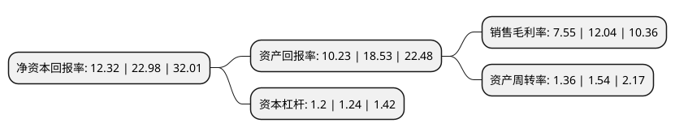

> 本页面由自动化程序生成于 2022年5月20日 01:13
> 内容可能存在错误，如有bug请提交issue至：https://github.com/Eroleice/doc-pi/issues
{.is-warning}

# 上市公司基本情况

## 基本资料

京北方信息技术股份有限公司（以下简称“京北方”）成立于2009年12月16日，北京市。于2020年05月07日在深交所中小板上市。

京北方注册资本22,492.733万元，主营业务以信息技术为核心，主要向以银行为主的金融机构提供信息技术服务和业务流程外包服务。以下是详细信息：

- 公司名称: 京北方信息技术股份有限公司
- 股票代码: 002987.SZ
- 所在地: 北京 - 北京市
- 成立日期: 2009年12月16日
- 注册资本: 22,492.733万元
- 法定代表人: 费振勇
- 主营业务: 主营业务以信息技术为核心，主要向以银行为主的金融机构提供信息技术服务和业务流程外包服务
- 公司官网: www.northkingbpo.net
- 公司介绍: 公司是一家致力于为国内外金融机构客户提供信息技术服务(ITO)及业务流程外包服务(BPO)的公司，信息技术为核心，主要向以银行为主的金融机构提供信息技术服务和业务流程外包服务。公司前述两大业务板块协同发展、深度融合，形成相对完整的金融外包服务供应链。经过多年的发展，公司现已成为中国规模最大、人数最多、资质最全、客户最广泛的国内金融业务流程外包服务提供商之一。多年来，公司致力于成为国内领先的金融IT综合服务提供商。公司是国家高新技术企业、中关村高新技术企业，设有北京市企业技术中心、企业博士后工作站，同时获得增值电信业务经营许可(呼叫中心业务)。公司重视项目运营和管理体系建设，已通过ISO9001质量管理体系认证、ISO27001信息安全管理体系认证、ISO20000信息技术服务管理体系认证、ISO14001环境管理体系认证、ISO18001职业健康安全管理体系认证和ISO22301业务连续性管理体系认证，通过软件能力成熟度模型集成CMMI5级认证。公司掌握多项金融信息化行业核心技术，拥有13项国家发明专利和84项具有自主知识产权的软件著作权，具备高质量的全时全国交付和连续服务能力。

## 股东及高管情况

上市公司第一大股东为拉萨永道投资管理有限责任公司，持股115,755,822股，占比51.46%，为上市公司实际控制人。

截至2022年03月31日，上市公司的前十大股东中，共有1名自然人股东，3名机构股东，5个产品账户，1个海外主体，其中5%以上大股东共有2名。上市公司前十大股东明细如下：

> 截至2022年03月31日，上市公司前十大股东信息如下：

| 股东名称 | 持股数量（股） | 持股比例 |
| --- | --- | --- |
| 拉萨永道投资管理有限责任公司 | 115,755,822 | 51.46% |
| 和道(天津)企业管理合伙企业(有限合伙) | 15,318,156 | 6.81% |
| 上海同预管理咨询有限责任公司 | 9,996,000 | 4.44% |
| 青岛海丝创新股权投资基金企业(有限合伙) | 4,236,020 | 1.88% |
| 上海浦东发展银行股份有限公司-中欧创新未来18个月封闭运作混合型证券投资基金 | 3,359,199 | 1.49% |
| 香港中央结算有限公司(陆股通) | 2,474,829 | 1.1% |
| 信泰人寿保险股份有限公司-传统产品 | 2,472,650 | 1.1% |
| 中国建设银行股份有限公司-中欧电子信息产业沪港深股票型证券投资基金 | 1,948,987 | 0.87% |
| 中国建设银行股份有限公司-融通互联网传媒灵活配置混合型证券投资基金 | 850,000 | 0.38% |
| 曹萍 | 720,500 | 0.32% |

## 杜邦分析

> 数据列示周期：2021年 | 2020年 | 2019年
{.is-info}

上市公司的净资产收益率在近一年有所下降，下降幅度为-46.39%，其变化情况分解如下：
- 上市公司的销售毛利率在近一年下降了-37.29%，可能是生产效率的下降、商品原材料价格上涨或商品价格的下跌所致。
- 上市公司的资产周转率在近一年下降了-11.69%，可能是源自于更慢的销售回款或库存管理效果下降。
- 上市公司的财务杠杆比率在近一年下降了-3.23%，可能是减少负债降低财务费用。

