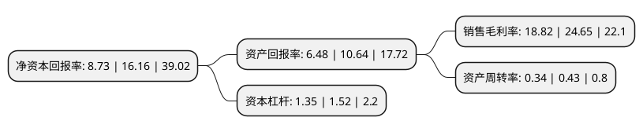

> 本页面由自动化程序生成于 2022年5月20日 01:13
> 内容可能存在错误，如有bug请提交issue至：https://github.com/Eroleice/doc-pi/issues
{.is-warning}

# 上市公司基本情况

## 基本资料

北京竞业达数码科技股份有限公司（以下简称“竞业达”）成立于1997年10月17日，北京市。于2020年09月22日在深交所中小板上市。

竞业达注册资本10,600万元，主营业务为面向教育信息化，城市轨道交通安防和智慧城市领域提供行业信息化产品和解决方案的研发，生产，销售和服务。主要产品包括教育考试考务管理与服务平台以及网上巡查，应急指挥，身份认证，作弊防控等教育考试考务信息化系统产品和包含“考教统筹，新高考，智慧教育”三大板块的智慧教育整体解决方案。以下是详细信息：

- 公司名称: 北京竞业达数码科技股份有限公司
- 股票代码: 003005.SZ
- 所在地: 北京 - 北京市
- 成立日期: 1997年10月17日
- 注册资本: 10,600万元
- 法定代表人: 钱瑞
- 主营业务: 主营业务为面向教育信息化，城市轨道交通安防和智慧城市领域提供行业信息化产品和解决方案的研发，生产，销售和服务主要产品包括教育考试考务管理与服务平台以及网上巡查，应急指挥，身份认证，作弊防控等教育考试考务信息化系统产品和包含“考教统筹，新高考，智慧教育”三大板块的智慧教育整体解决方案
- 公司官网: www.jyd.com.cn
- 公司介绍: 公司成立以来一直致力于自主创新，依托对视音频、数据处理、人工智能和物联网等相关技术的研究和开发，深入业务场景，把握用户需求和行业发展趋势，推出了一系列具有自主知识产权、自主品牌的行业信息化产品和解决方案。公司主营业务为面向教育信息化、城市轨道交通安防和智慧城市领域提供行业信息化产品和解决方案的研发、生产、销售和服务。公司致力于自主创新，重视自主知识产权保护。截至2018年末，公司拥有260项软件著作权、21项专利。2017年8月，公司获北京市门头沟区人民政府颁发的科学技术进步奖。

## 股东及高管情况

上市公司第一大股东为钱瑞，持股31,025,000股，占比29.27%，**疑似为**上市公司实际控制人。

截至2022年03月31日，上市公司的前十大股东中，共有7名自然人股东，2名机构股东，1个产品账户，其中5%以上大股东共有3名。上市公司前十大股东明细如下：

> 未能通过持股比例判定出上市公司实际控制人（持股30%以上）
> 可能存在通过间接持股、联合持股、协议控制等方式拥有实际控制权的主体，具体请参考上市公司定期公告！
{.is-warning}

> 截至2022年03月31日，上市公司前十大股东信息如下：

| 股东名称 | 持股数量（股） | 持股比例 |
| --- | --- | --- |
| 钱瑞 | 31,025,000 | 29.27% |
| 江源东 | 27,375,000 | 25.83% |
| 张爱军 | 10,950,000 | 10.33% |
| 曹伟 | 3,650,000 | 3.44% |
| 北京竞业达瑞盈科技咨询中心(有限合伙) | 3,256,500 | 3.07% |
| 北京竞业达瑞丰科技咨询中心(有限合伙) | 2,703,700 | 2.55% |
| 韩笑 | 469,900 | 0.44% |
| 许磊 | 435,000 | 0.41% |
| 中国银行股份有限公司-博时中证全球中国教育主题交易型开放式指数证券投资基金(QDII) | 210,300 | 0.2% |
| 郭永钢 | 194,300 | 0.18% |

## 利润表分析

上市公司2021年总收入为6.57亿元，净利润为1.23亿元，实现盈利。

## 杜邦分析

> 数据列示周期：2021年 | 2020年 | 2019年
{.is-info}

上市公司的净资产收益率在近一年有所下降，下降幅度为-45.98%，其变化情况分解如下：
- 上市公司的销售毛利率在近一年下降了-23.65%，可能是生产效率的下降、商品原材料价格上涨或商品价格的下跌所致。
- 上市公司的资产周转率在近一年下降了-20.93%，可能是源自于更慢的销售回款或库存管理效果下降。
- 上市公司的财务杠杆比率在近一年下降了-11.18%，可能是减少负债降低财务费用。

