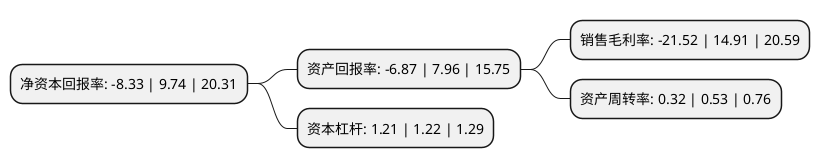

> 本页面由自动化程序生成于 2022年5月20日 01:13
> 内容可能存在错误，如有bug请提交issue至：https://github.com/Eroleice/doc-pi/issues
{.is-warning}

# 上市公司基本情况

## 基本资料

北京直真科技股份有限公司（以下简称“直真科技”）成立于2008年11月28日，北京市。于2020年09月23日在深交所中小板上市。

直真科技注册资本10,400万元，主营业务为信息通信技术(ICT)运营管理领域的软件开发，技术服务，系统集成以及第三方软硬件销售业务。以下是详细信息：

- 公司名称: 北京直真科技股份有限公司
- 股票代码: 003007.SZ
- 所在地: 北京 - 北京市
- 成立日期: 2008年11月28日
- 注册资本: 10,400万元
- 法定代表人: 袁隽
- 主营业务: 主营业务为信息通信技术(ICT)运营管理领域的软件开发，技术服务，系统集成以及第三方软硬件销售业务
- 公司官网: www.zznode.com
- 公司介绍: 公司专注于为国内电信运营商和大型企业客户的信息网络和IT基础设施提供运营支撑系统(OSS)全面解决方案，主要包括网络管理支撑系统及服务运营支撑系统两大系列产品，涵盖咨询、规划、设计、开发、测试、维护、运营等全周期专业技术服务，协助用户对其设备、网络、业务、客户以及相关的IT基础设施等进行综合管理与服务。多年来，公司采取技术能力平台化、组件化和产品化的策略，围绕用户需求进行技术创新，运用云计算、大数据和人工智能等技术手段，帮助用户应对市场变化，提高运营效率，提升服务质量，增强核心竞争力。同时，公司积极拓展新的业务领域，在以运营支撑系统为核心业务的基础上，进一步研发具有自主知识产权的企业经营管理支撑系列产品，逐步延伸至管理支撑系统(MSS)业务领域。公司是高新技术企业、国家规划布局内重点软件企业、国家火炬计划软件产业基地骨干企业、北京软件和信息服务业综合实力百强企业、北京市诚信系统集成企业、中关村信用培养双百工程百家最具影响力信用企业。此外，公司被认定为北京市“下一代光传输网络”工程实验室、北京市级企业科技研究开发机构和中国软件行业协会企业信用AAA级单位。

## 股东及高管情况

上市公司第一大股东为王飞雪，持股24,906,513股，占比23.95%，**疑似为**上市公司实际控制人。

截至2022年03月31日，上市公司的前十大股东中，共有6名自然人股东，3个产品账户，1个海外主体，其中5%以上大股东共有3名。上市公司前十大股东明细如下：

> 未能通过持股比例判定出上市公司实际控制人（持股30%以上）
> 可能存在通过间接持股、联合持股、协议控制等方式拥有实际控制权的主体，具体请参考上市公司定期公告！
{.is-warning}

> 截至2022年03月31日，上市公司前十大股东信息如下：

| 股东名称 | 持股数量（股） | 持股比例 |
| --- | --- | --- |
| 王飞雪 | 24,906,513 | 23.95% |
| 金建林 | 22,778,852 | 21.9% |
| 袁隽 | 16,197,605 | 15.57% |
| 武汉昭融汇利投资管理有限责任公司-昭融善犇1号私募证券投资基金 | 2,077,373 | 2% |
| 彭琳明 | 1,650,215 | 1.59% |
| 中移创新产业基金(深圳)合伙企业(有限合伙) | 1,621,250 | 1.56% |
| 王德杰 | 1,612,587 | 1.55% |
| 北京直真科技股份有限公司回购专用证券账户 | 600,000 | 0.58% |
| 李光明 | 445,000 | 0.43% |
| UBS   AG | 283,365 | 0.27% |

## 利润表分析

上市公司2021年总收入为3.34亿元，净利润为-0.72亿元，**未实现盈利**。

## 杜邦分析

> 数据列示周期：2021年 | 2020年 | 2019年
{.is-info}

上市公司的净资产收益率在近一年有所下降，下降幅度为-185.52%，其变化情况分解如下：
- 上市公司的销售毛利率在近一年下降了-244.33%，可能是生产效率的下降、商品原材料价格上涨或商品价格的下跌所致。
- 上市公司的资产周转率在近一年下降了-39.62%，可能是源自于更慢的销售回款或库存管理效果下降。
- 上市公司的财务杠杆比率在近一年下降了-0.82%，可能是减少负债降低财务费用。

