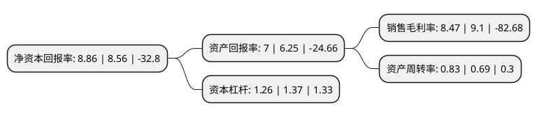

> 本页面由自动化程序生成于 2022年5月20日 01:14
> 内容可能存在错误，如有bug请提交issue至：https://github.com/Eroleice/doc-pi/issues
{.is-warning}

# 上市公司基本情况

## 基本资料

北京神州泰岳软件股份有限公司（以下简称“神州泰岳”）成立于2001年05月18日，北京市。于2009年10月30日在深交所创业板上市。

神州泰岳注册资本196,109.198万元，主要产品:“智享云”业务创新共享服务云平台，“睿达控”大数据风控平台，中文信息(深度)处理开发创新平台。主营业务:人工智能/大数据领域，物联网通信领域。以下是详细信息：

- 公司名称: 北京神州泰岳软件股份有限公司
- 股票代码: 300002.SZ
- 所在地: 北京 - 北京市
- 成立日期: 2001年05月18日
- 注册资本: 196,109.198万元
- 法定代表人: 冒大卫
- 主营业务: 主要产品:“智享云”业务创新共享服务云平台，“睿达控”大数据风控平台，中文信息(深度)处理开发创新平台主营业务:人工智能/大数据领域，物联网通信领域
- 公司官网: www.ultrapower.com.cn
- 公司介绍: 公司在人工智能与大数据方向，专注于自然语言处理和大数据技术的研发与应用，已成为国内本领域的技术创新重镇，在基础研究、平台建设、行业应用三个层面形成了核心竞争力和市场影响力。在物联网与通信方向，公司运用独创设计和先进工艺，将物联网芯片嵌入到通信电缆中，打造了集无线通信、物联网传感、精准定位、安防监控、敌我识别等多种功能于一身的物联网通信产品——智慧线，该产品被北京市纳入二十大颠覆性技术储备库。基于智慧线技术的“智慧墙入侵探测系统”、“城市综合管廊安防通信一体化系统”、“Nu-WiFi无线通信系统”等多种行业解决方案在智慧周界、智慧管廊、智慧核电、智慧边防及其它场景中广泛应用。ICT运营管理是公司传统优势业务，近年来，公司在ICT运营管理系统中引入自然语言处理、机器学习、融合通信等前沿技术，形成了全新的全栈智能运营管理平台，实现了ICT运营管理从自动化到智能化的飞跃。

## 股东及高管情况

上市公司第一大股东为李力，持股172,191,092股，占比8.78%，**疑似为**上市公司实际控制人。

截至2022年04月29日，上市公司的前十大股东中，共有6名自然人股东，3个产品账户，1个海外主体，其中5%以上大股东共有1名。上市公司前十大股东明细如下：

> 未能通过持股比例判定出上市公司实际控制人（持股30%以上）
> 可能存在通过间接持股、联合持股、协议控制等方式拥有实际控制权的主体，具体请参考上市公司定期公告！
{.is-warning}

> 上市公司第一大股东持股不超过10%，请检查是否存在公司控制权风险！
{.is-danger}

> 截至2022年04月29日，上市公司前十大股东信息如下：

| 股东名称 | 持股数量（股） | 持股比例 |
| --- | --- | --- |
| 李力 | 172,191,092 | 8.78% |
| 安梅 | 74,613,952 | 3.8% |
| 王宁 | 71,789,644 | 3.66% |
| 上海宽渡资产管理有限公司-宽渡星宇1号私募证券投资基金 | 27,174,600 | 1.39% |
| 北京神州泰岳软件股份有限公司-2021年员工持股计划 | 25,947,942 | 1.32% |
| 中国工商银行股份有限公司-广发中证传媒交易型开放式指数证券投资基金 | 21,281,932 | 1.09% |
| 杜志军 | 20,363,006 | 1.04% |
| 香港中央结算有限公司(陆股通) | 18,292,713 | 0.93% |
| 郑珍 | 18,086,767 | 0.92% |
| 刘宗辉 | 17,317,928 | 0.88% |

## 利润表分析

上市公司2021年总收入为43.14亿元，净利润为3.65亿元，实现盈利。

## 杜邦分析

> 数据列示周期：2021年 | 2020年 | 2019年
{.is-info}

上市公司的净资产收益率在近一年有所上升，上升幅度为3.5%，其变化情况分解如下：
- 上市公司的销售毛利率在近一年下降了-6.92%，可能是生产效率的下降、商品原材料价格上涨或商品价格的下跌所致。
- 上市公司的资产周转率在近一年上升了20.29%，可能是源自于更快的销售回款或库存管理效果提升。
- 上市公司的财务杠杆比率在近一年下降了-8.03%，可能是减少负债降低财务费用。

