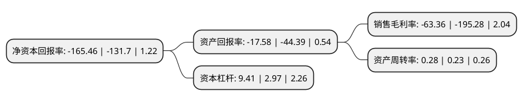

> 本页面由自动化程序生成于 2022年5月20日 01:14
> 内容可能存在错误，如有bug请提交issue至：https://github.com/Eroleice/doc-pi/issues
{.is-warning}

# 上市公司基本情况

## 基本资料

豆神教育科技(北京)股份有限公司（以下简称“豆神教育”）成立于1999年01月08日，北京市。于2009年10月30日在深交所创业板上市。

豆神教育注册资本86,832.465万元，主要产品:区域教育云，智慧校园顶层设计，校本课程及核心学科应用;信息安全产品，平台，服务及解决方案。主营业务:教育与信息安全两大业务。以下是详细信息：

- 公司名称: 豆神教育科技(北京)股份有限公司
- 股票代码: 300010.SZ
- 所在地: 北京 - 北京市
- 成立日期: 1999年01月08日
- 注册资本: 86,832.465万元
- 法定代表人: 窦昕
- 主营业务: 主要产品:区域教育云，智慧校园顶层设计，校本课程及核心学科应用;信息安全产品，平台，服务及解决方案主营业务:教育与信息安全两大业务
- 公司官网: www.lanxum.com
- 公司介绍: 公司主营教育与信息安全两大业务，公司计划分拆信息安全业务相关资产，就相关事项公司已与交易对方达成初步意向，未来公司将聚焦教育业务，致力打造教育科技集团。在智慧教育领域，公司业务包括区域教育云、智慧校园顶层设计、校本课程及核心学科应用服务等。公司智慧教育业务已逐步走向教育与IT的深度融合，通过校本课程、核心学科应用服务等教育内容的引领，构建一个业务覆盖全国，触角伸到每个学校的教育科技服务网络。公司信息安全以“保卫数据安全，护航国计民生”为愿景，顺应国家信息安全及自主可控的大趋势，以数据全生命周期安全管控为基础，为行业用户提供安全解决方案，打造自主可控、安全可信、高效可用的信息系统。围绕战略发展方向，在数据安全，工控安全，和自主可控三个领域的应用，提供信息安全产品、平台、服务及解决方案。

## 股东及高管情况

上市公司第一大股东为池燕明，持股80,926,110股，占比9.32%，**疑似为**上市公司实际控制人。

截至2022年03月31日，上市公司的前十大股东中，共有9名自然人股东，1个产品账户，其中5%以上大股东共有2名。上市公司前十大股东明细如下：

> 未能通过持股比例判定出上市公司实际控制人（持股30%以上）
> 可能存在通过间接持股、联合持股、协议控制等方式拥有实际控制权的主体，具体请参考上市公司定期公告！
{.is-warning}

> 上市公司第一大股东持股不超过10%，请检查是否存在公司控制权风险！
{.is-danger}

> 截至2022年03月31日，上市公司前十大股东信息如下：

| 股东名称 | 持股数量（股） | 持股比例 |
| --- | --- | --- |
| 池燕明 | 80,926,110 | 9.32% |
| 窦昕 | 78,873,028 | 9.08% |
| 商华忠 | 13,374,062 | 1.54% |
| 王邦文 | 10,704,639 | 1.23% |
| 赵志军 | 10,000,000 | 1.15% |
| 张敏 | 8,159,422 | 0.94% |
| 付卫平 | 7,274,779 | 0.84% |
| 中国银行股份有限公司-博时中证全球中国教育主题交易型开放式指数证券投资基金(QDII) | 4,306,000 | 0.5% |
| 赵淑萍 | 4,147,100 | 0.48% |
| 叶世贤 | 3,229,900 | 0.37% |

## 利润表分析

上市公司2021年总收入为11.22亿元，净利润为-7.11亿元，**未实现盈利**。

## 杜邦分析

> 数据列示周期：2021年 | 2020年 | 2019年
{.is-info}

上市公司的净资产收益率在近一年有所上升，上升幅度为25.63%，其变化情况分解如下：
- 上市公司的销售毛利率在近一年下降了-67.55%，可能是生产效率的下降、商品原材料价格上涨或商品价格的下跌所致。
- 上市公司的资产周转率在近一年上升了21.74%，可能是源自于更快的销售回款或库存管理效果提升。
- 上市公司的财务杠杆比率在近一年上升了216.84%，可能是增加负债扩大生产规模。

