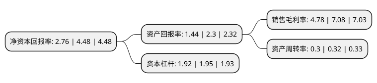

> 本页面由自动化程序生成于 2022年5月20日 01:14
> 内容可能存在错误，如有bug请提交issue至：https://github.com/Eroleice/doc-pi/issues
{.is-warning}

# 上市公司基本情况

## 基本资料

银江技术股份有限公司（以下简称“银江技术”）成立于1992年11月13日，杭州市。于2009年10月30日在深交所创业板上市。

银江技术注册资本65,578.909万元，主要产品:计算机信息服务系统集成，智能交通系统开发工程及产品，医疗信息系统开发化工程，计算机系统集成，建筑智能化工程，教育信息化系统开发环保信息工程，建筑智能化工程，工业自控设备;安全技术防范工程设计，施工，维护维修。主营业务:技术开发，技术服务，成果转让，设计:计算机系统集成，交通智能化工程及产品，医疗信息化工程及产品，建筑智能化工程及产品，环境信息化工程及产品，能源智能化工程及产品，教育信息化工程及产品，工业自动化工程及产品，电力，电子工程及产品，机电工程及产品;安全技术防范工程的设计，施工，维护;软件开发。以下是详细信息：

- 公司名称: 银江技术股份有限公司
- 股票代码: 300020.SZ
- 所在地: 浙江 - 杭州市
- 成立日期: 1992年11月13日
- 注册资本: 65,578.909万元
- 法定代表人: 王腾
- 主营业务: 主要产品:计算机信息服务系统集成，智能交通系统开发工程及产品，医疗信息系统开发化工程，计算机系统集成，建筑智能化工程，教育信息化系统开发环保信息工程，建筑智能化工程，工业自控设备;安全技术防范工程设计，施工，维护维修主营业务:技术开发，技术服务，成果转让，设计:计算机系统集成，交通智能化工程及产品，医疗信息化工程及产品，建筑智能化工程及产品，环境信息化工程及产品，能源智能化工程及产品，教育信息化工程及产品，工业自动化工程及产品，电力，电子工程及产品，机电工程及产品;安全技术防范工程的设计，施工，维护;软件开发
- 公司官网: www.enjoyor.net
- 公司介绍: 公司是一家从事给交通、医疗、建筑等行业用户提供智能化技术应用服务的高新企业，自成立以来，以“引领智能技术未来”为企业服务理念，通过对“智能识别、移动计算、数据融合”等信息技术的自主应用开发，提供城市交通智能化、医疗信息化和建筑智能化领域的行业解决方案。工程产品包括城市交通智能化、医疗信息化和建筑智能化三类。“银江视频监控存储与管理系统”获得“中国优秀软件产品”称号；“基于UNIX平台的视频监控与管理系统”、“BRT嵌入式优先控制系统”获得浙江省科学技术二等奖。研制开发的“面向BRT的嵌入式优先信号控制器”获得“国家火炬计划”立项、“BRT嵌入式优先信号控制系统”获国家“科技型中小企业技术创新基金”。

## 股东及高管情况

上市公司第一大股东为银江科技集团有限公司，持股90,448,007股，占比13.7922%，**疑似为**上市公司实际控制人。

截至2022年05月09日，上市公司的前十大股东中，共有8名自然人股东，2名机构股东，其中5%以上大股东共有1名。上市公司前十大股东明细如下：

> 未能通过持股比例判定出上市公司实际控制人（持股30%以上）
> 可能存在通过间接持股、联合持股、协议控制等方式拥有实际控制权的主体，具体请参考上市公司定期公告！
{.is-warning}

> 截至2022年05月09日，上市公司前十大股东信息如下：

| 股东名称 | 持股数量（股） | 持股比例 |
| --- | --- | --- |
| 银江科技集团有限公司 | 90,448,007 | 13.7922% |
| 浙江浙商证券资产管理有限公司 | 27,813,840 | 4.24% |
| 陈文生 | 22,430,365 | 3.42% |
| 王际勇 | 5,055,068 | 0.77% |
| 张明华 | 4,559,901 | 0.7% |
| 李昀 | 2,800,000 | 0.43% |
| 陈福元 | 2,240,000 | 0.34% |
| 钱小鸿 | 2,055,460 | 0.31% |
| 吴克平 | 1,749,998 | 0.27% |
| 刘健 | 1,656,760 | 0.25% |

## 利润表分析

上市公司2021年总收入为19.99亿元，净利润为0.95亿元，实现盈利。

## 杜邦分析

> 数据列示周期：2021年 | 2020年 | 2019年
{.is-info}

上市公司的净资产收益率在近一年有所下降，下降幅度为-38.39%，其变化情况分解如下：
- 上市公司的销售毛利率在近一年下降了-32.49%，可能是生产效率的下降、商品原材料价格上涨或商品价格的下跌所致。
- 上市公司的资产周转率在近一年下降了-6.25%，可能是源自于更慢的销售回款或库存管理效果下降。
- 上市公司的财务杠杆比率在近一年下降了-1.54%，可能是减少负债降低财务费用。

