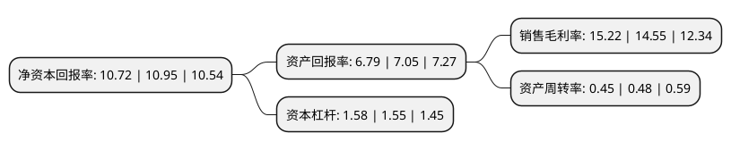

> 本页面由自动化程序生成于 2022年5月20日 01:14
> 内容可能存在错误，如有bug请提交issue至：https://github.com/Eroleice/doc-pi/issues
{.is-warning}

# 上市公司基本情况

## 基本资料

北京超图软件股份有限公司（以下简称“超图软件”）成立于1997年06月18日，北京市。于2009年12月25日在深交所创业板上市。

超图软件注册资本48,955.006万元，主要产品:地理信息系统平台软件。主营业务:地理信息系统软件(GIS)及解决方案的研发，销售和相关服务。以下是详细信息：

- 公司名称: 北京超图软件股份有限公司
- 股票代码: 300036.SZ
- 所在地: 北京 - 北京市
- 成立日期: 1997年06月18日
- 注册资本: 48,955.006万元
- 法定代表人: 宋关福
- 主营业务: 主要产品:地理信息系统平台软件主营业务:地理信息系统软件(GIS)及解决方案的研发，销售和相关服务
- 公司官网: www.supermap.com.cn\www.supermap.com
- 公司介绍: 公司是亚洲领先的地理信息系统平台软件企业，从事地理信息系统软件的研究、开发、推广和服务，是我国GIS行业最具技术实力的企业。主营业务贯穿GIS软件产业链的三个组成部分，在国内GIS软件行业保持优势竞争地位，国产GIS基础平台软件市场份额第一。研发的GIS基础平台软件具有良好的通用性，既可直接销售给最终用户，也可销售给增值开发商。GIS基础软件是公司的核心业务。SuperMap GIS系列软件是公司自主研发的、具有完全自主知识产权的GIS基础软件产品线；其商业模式为通过与各行业应用开发商进行合作，为政府和大型企业等最终客户提供解决方案。

## 股东及高管情况

上市公司第一大股东为钟耳顺，持股50,542,080股，占比10.32%，**疑似为**上市公司实际控制人。

截至2022年03月31日，上市公司的前十大股东中，共有3名自然人股东，3名机构股东，3个海外主体，1名其他股东，其中5%以上大股东共有2名。上市公司前十大股东明细如下：

> 未能通过持股比例判定出上市公司实际控制人（持股30%以上）
> 可能存在通过间接持股、联合持股、协议控制等方式拥有实际控制权的主体，具体请参考上市公司定期公告！
{.is-warning}

> 截至2022年03月31日，上市公司前十大股东信息如下：

| 股东名称 | 持股数量（股） | 持股比例 |
| --- | --- | --- |
| 钟耳顺 | 50,542,080 | 10.32% |
| 香港中央结算有限公司(陆股通) | 46,760,550 | 9.55% |
| 宋关福 | 21,213,440 | 4.33% |
| 中国科学院地理科学与资源研究所 | 20,740,700 | 4.24% |
| 孙在宏 | 7,305,679 | 1.49% |
| 上海云鑫创业投资有限公司 | 6,666,666 | 1.36% |
| MERRILL LYNCH INTERNATIONAL | 5,359,291 | 1.09% |
| 国泰君安证券股份有限公司 | 4,730,090 | 0.97% |
| 中信证券股份有限公司 | 4,701,240 | 0.96% |
| 高华-汇丰-GOLDMAN, SACHS & CO.LLC | 4,534,250 | 0.93% |

## 利润表分析

上市公司2021年总收入为18.75亿元，净利润为2.85亿元，实现盈利。

## 杜邦分析

> 数据列示周期：2021年 | 2020年 | 2019年
{.is-info}

上市公司的净资产收益率在近一年有所下降，下降幅度为-2.1%，其变化情况分解如下：
- 上市公司的销售毛利率在近一年上升了4.6%，可能是生产效率的提升、商品原材料价格下跌或商品价格的上涨所致。
- 上市公司的资产周转率在近一年下降了-6.25%，可能是源自于更慢的销售回款或库存管理效果下降。
- 上市公司的财务杠杆比率在近一年上升了1.94%，可能是增加负债扩大生产规模。

