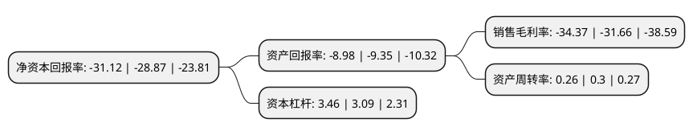

> 本页面由自动化程序生成于 2022年5月20日 01:14
> 内容可能存在错误，如有bug请提交issue至：https://github.com/Eroleice/doc-pi/issues
{.is-warning}

# 上市公司基本情况

## 基本资料

深圳市赛为智能股份有限公司（以下简称“*ST赛为”）成立于1997年02月27日，深圳市。于2010年01月20日在深交所创业板上市。

*ST赛为注册资本77,016.123万元，主要产品:城市轨道交通智能化系统解决方案，建筑智能化系统解决方案，高速铁信息化数字化系统。主营业务:“智慧城市”，“大数据”，“人工智能”，“文化教育”。以下是详细信息：

- 公司名称: 深圳市赛为智能股份有限公司
- 股票代码: 300044.SZ
- 所在地: 广东 - 深圳市
- 成立日期: 1997年02月27日
- 注册资本: 77,016.123万元
- 法定代表人: 周勇
- 主营业务: 主要产品:城市轨道交通智能化系统解决方案，建筑智能化系统解决方案，高速铁信息化数字化系统主营业务:“智慧城市”，“大数据”，“人工智能”，“文化教育”
- 公司官网: www.szsunwin.com
- 公司介绍: 公司主营业务主要包括“智慧城市”、“大数据”、“人工智能”、“文化教育”。公司作为国内专业的智慧城市投资、建设、运营综合服务商，致力于智慧城市顶层设计及建设运营服务模式，为智慧城市行业用户提供智慧交通、智慧建筑、智慧医疗、智慧教育、大数据等行业整体解决方案、大数据运营服务。赛为智能定位于“大数据中心投资、建设及运营整体方案服务商”。人工智能是依托公司在人工智能领域深耕二十余载研发积累，开展自主研发以及与国内外知名院校、科研单位合作共同开发，主要包括服务机器人、四足机器人、巡检机器人、无人机、无人机平台、人脸识别和智能视频分析。公司以开心人信息现有业务为基础，以现有经营管理人员为团队，向文化以及智慧城市后台数据服务方向拓展，逐步打造智慧城市互动娱乐生态。

## 股东及高管情况

上市公司第一大股东为周勇，持股97,459,633股，占比12.65%，**疑似为**上市公司实际控制人。

截至2022年03月31日，上市公司的前十大股东中，共有9名自然人股东，1个产品账户，其中5%以上大股东共有1名。上市公司前十大股东明细如下：

> 未能通过持股比例判定出上市公司实际控制人（持股30%以上）
> 可能存在通过间接持股、联合持股、协议控制等方式拥有实际控制权的主体，具体请参考上市公司定期公告！
{.is-warning}

> 截至2022年03月31日，上市公司前十大股东信息如下：

| 股东名称 | 持股数量（股） | 持股比例 |
| --- | --- | --- |
| 周勇 | 97,459,633 | 12.65% |
| 周新宏 | 25,427,200 | 3.3% |
| 泰达宏利基金-浦发银行-厦门信托-厦门信托-财富共赢21号单一资金信托 | 12,341,907 | 1.6% |
| 封其华 | 8,099,765 | 1.05% |
| 宁群仪 | 3,479,687 | 0.45% |
| 黄蔚 | 3,387,700 | 0.44% |
| 李杰 | 3,200,000 | 0.42% |
| 黄启平 | 3,169,100 | 0.41% |
| 林惠明 | 3,153,200 | 0.41% |
| 江玲夫 | 2,991,300 | 0.39% |

## 利润表分析

上市公司2021年总收入为10.32亿元，净利润为-3.55亿元，**未实现盈利**。

## 杜邦分析

> 数据列示周期：2021年 | 2020年 | 2019年
{.is-info}

上市公司的净资产收益率在近一年有所上升，上升幅度为7.79%，其变化情况分解如下：
- 上市公司的销售毛利率在近一年上升了8.56%，可能是生产效率的提升、商品原材料价格下跌或商品价格的上涨所致。
- 上市公司的资产周转率在近一年下降了-13.33%，可能是源自于更慢的销售回款或库存管理效果下降。
- 上市公司的财务杠杆比率在近一年上升了11.97%，可能是增加负债扩大生产规模。

