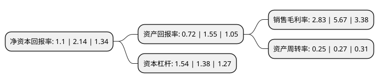

> 本页面由自动化程序生成于 2022年5月20日 01:14
> 内容可能存在错误，如有bug请提交issue至：https://github.com/Eroleice/doc-pi/issues
{.is-warning}

# 上市公司基本情况

## 基本资料

华平信息技术股份有限公司（以下简称“华平股份”）成立于2003年09月22日，上海市。于2010年04月27日在深交所创业板上市。

华平股份注册资本53,389.29万元，主要产品:视频会议系统，视频监控指挥系统和行业解决方案。主营业务:以视音频通讯产品和图像智能化集成应用的研发设计为核心，为用户提供视频会议，应急指挥，智慧城市(安防监控，平安城市，智能交通等)，在线教育，视频呼叫中心等可视化应用解决方案。以下是详细信息：

- 公司名称: 华平信息技术股份有限公司
- 股票代码: 300074.SZ
- 所在地: 上海 - 上海市
- 成立日期: 2003年09月22日
- 注册资本: 53,389.29万元
- 法定代表人: 吕文辉
- 主营业务: 主要产品:视频会议系统，视频监控指挥系统和行业解决方案主营业务:以视音频通讯产品和图像智能化集成应用的研发设计为核心，为用户提供视频会议，应急指挥，智慧城市(安防监控，平安城市，智能交通等)，在线教育，视频呼叫中心等可视化应用解决方案
- 公司官网: www.avcon.com.cn
- 公司介绍: 公司是国内领先的视讯产品与应用提供商，致力于通过视讯+技术的行业化创新应用，推进各行业业务模式的革新和人们生活智能化水平的提升。公司以视音频通讯产品和图像智能化集成应用的研发设计为核心，为用户提供视频会议、应急指挥、智慧城市(安防监控、平安城市、智能交通等)、在线教育、智慧医疗、视频银行等智慧化解决方案。公司高度重视自主研发和创新能力的培养，多个自主研发的产品和科技成果项目分别获得国家科学技术进步奖二等奖、国家重点新产品、国家火炬计划项目、国家重大科技专项认定，并被授予国家规划布局内重点软件企业、国家火炬计划重点高新技术企业、上海市著名商标等荣誉称号。

## 股东及高管情况

上市公司第一大股东为智汇科技投资(深圳)有限公司，持股83,061,778股，占比15.56%，**疑似为**上市公司实际控制人。

截至2022年05月16日，上市公司的前十大股东中，共有8名自然人股东，2名机构股东，其中5%以上大股东共有2名。上市公司前十大股东明细如下：

> 未能通过持股比例判定出上市公司实际控制人（持股30%以上）
> 可能存在通过间接持股、联合持股、协议控制等方式拥有实际控制权的主体，具体请参考上市公司定期公告！
{.is-warning}

> 截至2022年05月16日，上市公司前十大股东信息如下：

| 股东名称 | 持股数量（股） | 持股比例 |
| --- | --- | --- |
| 智汇科技投资(深圳)有限公司 | 83,061,778 | 15.56% |
| 智汇科技投资(深圳)有限公司 | 83,061,778 | 15.56% |
| 葛英霞 | 5,666,000 | 1.06% |
| 王红军 | 3,112,900 | 0.58% |
| 戴文萍 | 3,078,000 | 0.58% |
| 翟厚亮 | 1,801,400 | 0.34% |
| UBSAG | 1,629,456 | 0.31% |
| 杨艳玲 | 1,600,000 | 0.3% |
| 姜雪 | 1,529,900 | 0.29% |
| 项琬淇 | 1,321,800 | 0.25% |

## 利润表分析

上市公司2021年总收入为4.48亿元，净利润为0.12亿元，实现盈利。

## 杜邦分析

> 数据列示周期：2021年 | 2020年 | 2019年
{.is-info}

上市公司的净资产收益率在近一年有所下降，下降幅度为-48.6%，其变化情况分解如下：
- 上市公司的销售毛利率在近一年下降了-50.09%，可能是生产效率的下降、商品原材料价格上涨或商品价格的下跌所致。
- 上市公司的资产周转率在近一年下降了-7.41%，可能是源自于更慢的销售回款或库存管理效果下降。
- 上市公司的财务杠杆比率在近一年上升了11.59%，可能是增加负债扩大生产规模。

